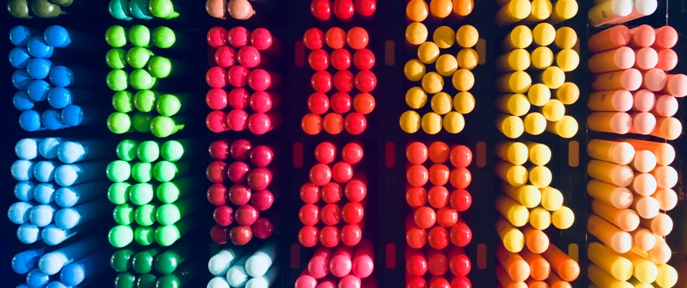

### 정의

`Array.prototype.sort( )` : sort( ) 메서드는 배열의 요소를 적절한 위치에 정렬한 후 그 배열을 반환합니다.<br>기본 정렬 순서는 문자열의 유니코드 코드 포인트 를 따릅니다.<br>
[ 유니코드의 첫부분은 아스키 코드와 똑같기 때문에, 영문자나 숫자의 "유니코드 번호"는 사실상 "아스키 코드 번호"와 동일합니다. 그러나 한글/한자 등의 유니코드 번호는, 아스키 코드와 서로 무관하고 독자적입니다. ]

---

### 구문

`arr.sort([compareFunction])`

- 매개변수 - compareFunction 
  정렬 순서를 정의하는 함수. 이를 생략하면 배열은 각 요소의 문자열 변환에 따라 각 문자의 유니코드 코드 포인트 값에 따라 정렬 됩니다.
- 반환 값 - 정렬한 배열,  원 배열이 정렬되는 것에 유의하세요. 복사본이 만들어지는 것이 아닙니다. (mutable)

* compareFunction이 제공되지 않으면 요소를 문자열로 변환하고 유니코드 코드 포인트 순서 (아스키 코드) 로 문자열을 비교하여 정렬됩니다.

> 예를 들어 "바나나"는 "체리" 앞에 옵니다. <br> 숫자 정렬에서는 9가 80보다 앞에 오지만, 숫자는 문자열로 변환되기 때문에 "80" 은 유니 코드 순서에서 "9" 앞에 옵니다.

> <b>compareFunction이 제공 되면 배열 요소는 compare 함수의 반환 값에 따라 정렬됩니다.</b>
>
> > <br>a와 b가 비교되는 두 요소라면
>
> - compareFunction(a, b)이 0보다 작은 경우(음수), a를 b보다 낮은 색인으로 정렬합니다. <br>
>   쉽게 말하면 a가 b보다 작으니까 a가 b보다 먼저(왼쪽에) 옵니다.
> - compareFunction(a, b)이 0을 반환하면(0), a와 b를 서로에 대해 변경하지 않고 모든 다른 요소에 대해 정렬합니다.<br>
> - compareFunction(a, b)이 0보다 큰 경우(양수), b를 a보다 낮은 인덱스로 소트 합니다. a 가 b보다 크니까 b가 a보다 먼저 겠죠?<br>
> - compareFunction(a, b)은 요소 a와 b의 특정 쌍이 두 개의 인수로 주어질 때 항상 동일한 값을 반환해야 합니다. 일치하지 않는 결과가 반환되면 정렬 순서는 정의되지 않습니다.
>   <br> <b>sort 메소드는 return 값이 음수(작거나), 양수(크거나), 0인지에 따라서 순서를 정합니다</b>

---

### 선택정렬(Selection Sort)

> 코드와 연결해서 생각하기. 왜 / 언제 를 고려하기.

😚"Hello Coding 그림으로 개념을 이해하는 알고리즘"을 정리한 내용 입니다.

- 컴퓨터에 음악이 많이 저장되어 있다고 가정하겠습니다. 가수별로 몇 곡이 들었는지 기록되어 있습니다.
  <br>
  <br>

  | 가수            | 재생 횟수 |
  | :-------------- | :-------- |
  | IU              | 9800      |
  | Maroon 5        | 5         |
  | DAVICHI         | 56        |
  | Mandy Moore     | 720       |
  | Imagine Dragons | 3000      |
  | Anne Marie      | 61        |
  | Hisaishi Joe    | 2800      |

- 이 목록을 가장 많이 들은 것 부터 적게 들은 순서로 정렬하여 가장 좋아하는 가수 순위를 알고 싶다면 어떻게 해야 할까요?

  > 한가지 방법은 리스트의 모든 항목을 살펴보고 가장 많이 재생된 가수를 찾아서 새로운 리스트에 기록하는 것 입니다.
  > <br> 이는 즉 n개의 항목을 n번 확인하는 반복을 해야합니다. O(n x n)시간, <b>O(n^2)</b> 시간이 걸립니다.

- 선택정렬은 정렬되지 않은 데이터들에 대해 가장 작은 데이터(또는 가장 큰 데이터)를 찾아 가장 앞(뒤)의 데이터와 교환해나가는 방식 입니다.

```js
const selectionSort = arr => {
  let minIndex;
  let temp;

  // 가수 데이터가 담긴 배열 전체를 돕니다.
  for (let i = 0; i < arr.length - 1; i++) {
    minIndex = i; // 맨 처음부터 확인합니다.
    for (let j = i + 1; j < arr.length; j++) {
      // 최소값 위치를 찾습니다.
      if (arr[j] < arr[minIndex]) {
        minIndex = j;
      }
    }
    temp = arr[minIndex]; // 최소값을 저장합니다.
    arr[minIndex] = arr[i];
    arr[i] = temp;
  }
  return arr;
};
```

---

### 퀵정렬(Quick Sort)


---

<center>

Reference <br>
[Hello Coding 그림으로 개념을 이해하는 알고리즘](http://www.kyobobook.co.kr/product/detailViewKor.laf?ejkGb=KOR&mallGb=KOR&barcode=9788968483547&orderClick=LAG&Kc=)

</center>
