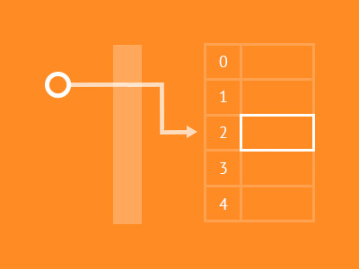

#### Hash Tables

자바스크립트의 해시테이블은 C++ 이나 JAVA와는 다른 특징이 있습니다.

- 먼저, 3개의 속성을 갖는 Hash Table Class를 생성하겠습니다.<br>
  -- 3가지 속성은 아래와 같이 구성됩니다.<br> 1. 초기 해시 테이블을 얼마나 크게 구성할지를 나타내는 값 2. 현재 SIZE를 지속저으로 Tracking 하는 값. 3. Key 와 Value를 저장할 배열

      ```js
      function HashTable(){
          this.SIZE = 16;
          this.currentSize = 0;
          this.storage = new Array(this.SIZE);
      }
      ```

<center>

Reference <br>
[HashTableResize](https://medium.com/@sooeung2/hash-table-in-javascript-d213057711c2)

</center>
