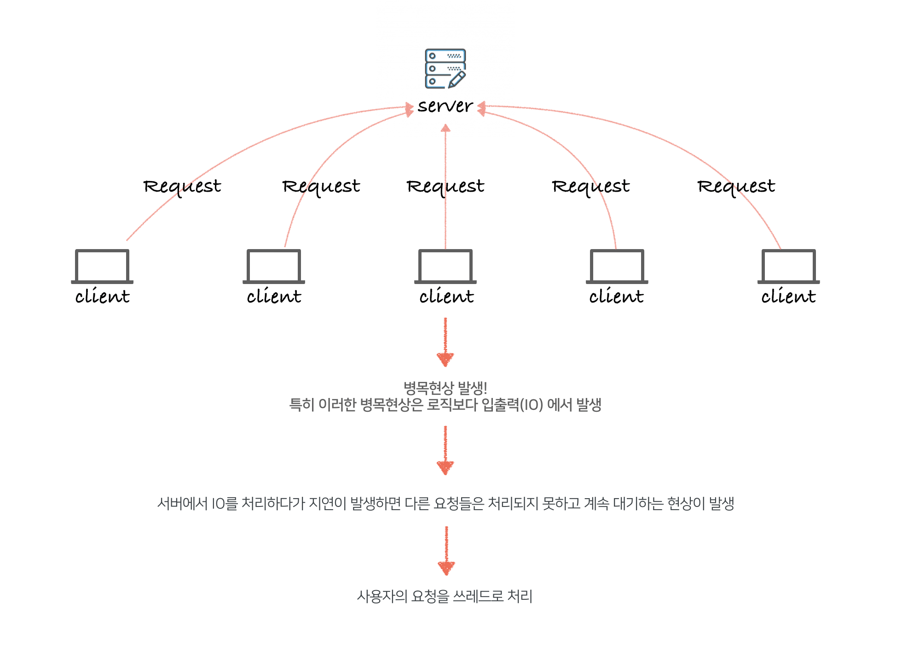
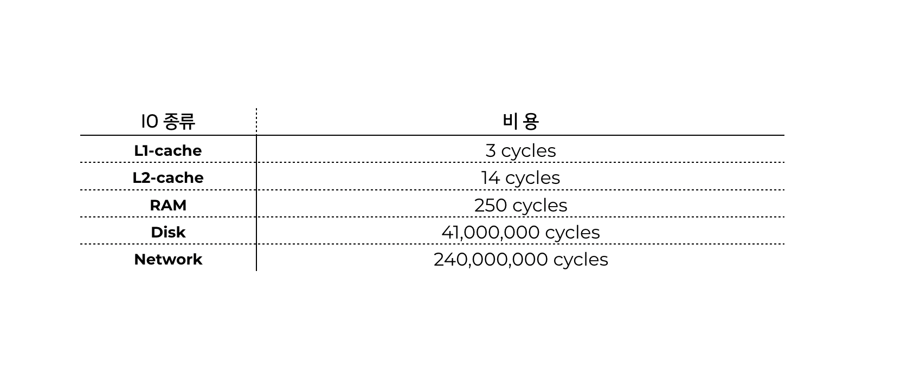
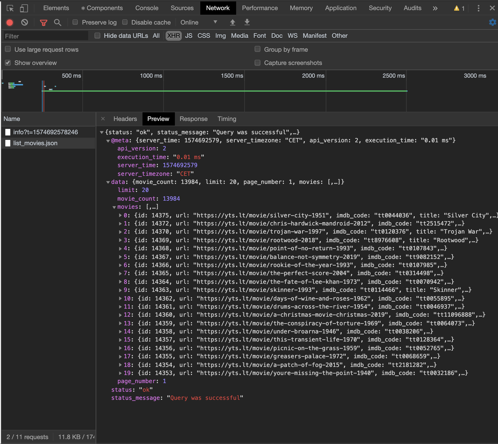

### Multi Thread

[Thread](https://developer-channing.com/ko/blog/2019/11/08/channing)

---




하나의 서버에 수 많은 클라이언트의 요청이 발생하게 되면 병목현상이 발생하게 됩니다. 이 **병목현상**은 로직보다 **입출력(IO)**에서 발생하게 되죠. 따라서 서버에서 IO를 처리하다 지연이 발생하게 되면 다른 요청들을 처리하지 못하고 계속 대기하는 현상이 발생합니다. 이를 해결하기 위해 자바(스프링) 같은 언어는 **멀티쓰레드** 를 이용해 사용자의 요청을 처리하기 위해 클라이언트 요청 마다 쓰레드를 발생시킵니다. 이 말은 동시 접속자 수가 많을 수록 Thread가 많이 발생한다는 의미이며 그만큼 메모리 자원도 많이 소모한다는 의미입니다. 그러나 서버의 자원은 제한되어 있으므로 일정 수 이상의 Thread는 발생시킬 수 없습니다

---

### 비동기가 필요한 때

원하는 데이터를 서버로부터 받아오는 경우, 서버로부터 데이터를 받아와서 해당 데이터를 처리해야 하므로, 데이터를 받아오는 코드는 전체 코드중의 최상단에 위치 할 것입니다. 그런데 만약 비동기적 처리를 하지않고 동기적으로 처리를 한다면 서버로부터 데이터를 받아오는 코드의 실행이 완전히 끝난 뒤에 이후의 코드를 처리할 것 입니다.
받아오는 데이터의 크기가 작고 적다면 상관없을 수 있지만, 만약 받아오는 데이터의 크기가 크고 많다면 모든 데이터의 수신을 완료한 다음에야 나머지 코드를 실행할 수 있으므로 데이터를 받아오는 동안 프로그램은 사실상 멈춰있는 것과 다름없습니다. 이러한 사용자의 불편을 없애기 위해 데이터의 수신과 기다려야하는 코드를 비동기적으로 처리하는 것 입니다.
실제 프로젝트에서 DB나 API를 통해서 유저 데이터를 얻어오는 경우, 필연적으로 이러한 latency가 발생하게 됩니다.

- 그렇다면 비동기로 코드를 작성하는 부분에 대해서 서버에서 응답을 받는 모든 부분에 대해서 비동기로 처리하여도 상관없는지?<br>

  > I/O나 Network를 통해서 데이터를 얻는 경우가 대표적인데, CPU에 의해서 실행되는 코드 입장에서는 엄청나게 긴 지연 시간으로 여겨지기 때문에 Non-blocking 코드를 지향하는 자바스크립트에서는 비동기 처리가 필수적입니다.

- 다시 말하면, 비동기 처리를 전적으로 개발자가 구현한다면 비동기 처리 되는 부분에 있어서 동기적으로 처리하는 부분 사이의 간극이 없는지?
  > Node 애플리케이션 개발자가 처리 로직을 비동기로 하지 않고 동기방식으로 구성한다면 Node를 잘못 활용하는 결과를 낳을 수 있습니다. 따라서 Node 애플리케이션은 가능한 한 전부 비동기로 처리해야 하며 Node 개발자는 비동기 프로그래밍 방식에 익숙해져야 할 필요가 있습니다.

---

### Single Thread

- 먼저 JS 엔진.. JavaScript는 싱글스레드 사용하는 언어입니다.

* 싱글스레드의 단점

  - 콜스택 안에 많은 처리 시간이 걸리는 함수 호출이 있을 때 발생할 수 있는 일 입니다.
    > 브라우저는 콜스택에 실행할 함수가 있는 동안 다른 일을 할 수 없습니다(Blocked). 이 상태에서 브라우저는 렌더링을 할 수 도 없고 다른 코드를 수행할 수 도 없습니다.
    > 이는 큰 문제를 야기할 수 있는데, 브라우저가 콜스택 내에 처리하 테스크가 너무 많아지기 시작하면 한참 동안 반응을 하지 않을 수 있다는 점 입니다. 이때 브라우저는 에러를 발생시켜 해당 페이지를 닫을 것인지 물어볼 것 입니다.

---

### 자바스크립트 프로그램의 구성요소

프로그램은 여러개의 구성요소로 되어있는 경우가 많으며, 그 중 하나만 '지금' 실행되고 나머지는 '나중에' 실행됩니다. 이러한 구성 요소들 중 가장 흔한 것은 함수 입니다. **자바스크립트**는 '지금' 완료할 수 없는 작업을 비동기적으로 수행 합니다. '나중' 이란 표현을 사용하지 않는 이유는 꼭 '지금'의 바로 다음이거나 시간 상으로 뒤에 일어나는 것을 말하는것이 아니기 때문입니다.

```js
// ajax(..) is some arbitrary Ajax function given by a library
var response = ajax('https://example.com/api');

console.log(response);
// `response` won't have the response
```

비동기 함수가 결과를 반환하기를 '기다릴 수 있는' 간단한 방식은 '콜백'함수를 이용하는 것 입니다.

```js
ajax('https://example.com/api', function(response) {
  console.log(response); // `response` is now available
});
```

- Ajax 요청이 아닌 다른 코드의 비동기적 수행으로는 `setTimeout(callback, milliseconds)` 함수가 있습니다.

```js
function first() {
  console.log('first');
}
function second() {
  console.log('second');
}
function third() {
  console.log('third');
}
first();
setTimeout(second, 1000); // Invoke `second` after 1000ms
third();

>> 출력값 입니다.
first
third
second
```

JS 엔진은 특정 타이밍에 특정 코드를 실행해주는 일 이외에는 특별한 일을 해준 것은 없습니다. 실제로 JS엔진은 고립되어서 수행되는 것이 아닌 호스팅 환경내에서 수행됩니다. 대부분의 개발자들에게는 Node.js 이거나 웹 브라우저 일 것입니다.

---

### Call Back


콜백에 대하여 설명해 보겠습니다. 저희는 함수를 만들 수 있습니다. 그래서 위 처럼 A라는 함수와 B라는 함수를 만들었습니다. <br> 그런데
저는 B함수를 A함수가 실행된 이후에 실행 하고 싶습니다. 함수는 특징이 있습니다. return을 통해 반환 되었을때 함수실행이 끝난다는 특징입니다. 이를 통해서 우리는 함수 실행의 순서를 정해줄 수 있습니다.

```js
function foo(b) {
  let a = 5;
  return a + b;
}

function bar(x) {
  let y = 3;
  return foo(x * y);
}

console.log(bar(3));
```

실행 흐름은 이렇습니다.
bar함수를 먼저 실행하고 foo함수를 실행하는 코드 입니다. <br>
먼저 함수를 콘솔에서 `bar(3)` 로 함수를 호출합니다. 그러면 bar 함수가 실행되고, bar 함수는 x 매개변수로 3을 받은뒤 `foo(x*y)`를 return하고 종료됩니다. 리턴과 동시에 foo 함수가 호출되며, foo함수는 a+b 값을 리턴 하며 함수가 종료됩니다.

콜백은 대표적인 비동기 로직 입니다.

<hr />

### FETCH

**Fetch** 는 사전적 의미로 <b>꺼내오다 / 가지고 오다</b> 라는 뜻을 갖고 있습니다. 말 그대로 클라이언트에서 서버로부터 리소스를 가져 온다 라고 생각하면 될 것 같습니다. **Fetch API** 는 디폴트로 GET 메서드를 사용합니다.
Fetch API 는 네트워크 통신을 포함한 리소스 취득을 위한 인터페이스가 정의되어 있습니다.

<b>기본 개념 과 사용 방법</b>

Fetch API를 이용하면 Request와 Response와 같은 HTTP의 파이프라인을 구성하는 요소를 조작하는 것 이 가능합니다. 또한 **fetch( )** 메소드를 이용하는 것으로 비동기 네트워크 통신을 알기 쉽게 기술할 수 있습니다.

이전에 **XMLHttpRequest**에서 제공하고 있던 기능을 Fetch는 **Service Workers** 같은 기술로 간단히 이용하는 것이 가능해졌습니다. 또한 **COR**나 **HTTP 확장**같은 HTTP에 관련한 개념을 모아 정의하고 있습니다.

fetch( )로부터 반환되는 Promise객체는 HTTP error 상태를 reject 하지 않습니다. 대신 ok 상태가 false인 resolve가 반환되며, 네트워크 장애나 요청이 완료되지 못한 상태에는 reject가 반환됩니다.

보통 fetch는 쿠키를 보내거나 받지 않습니다. 사이트에서 사용자 세션을 유지 관리해야하는 경우 인증되지 않는 요청이 발생합니다. 쿠키를 전송하기 위해서는 자격증명(credentials) 옵션을 반드시 설정해야 합니다. 기본 자격증명(credentials) 정책이 same-origin 으로 변경되었습니다. 파이어폭스는 61.0b13 이후 변경되었습니다.

```js
fetch('http://example.com/movies.json')
  .then(function(response) {
    return response.json();
    // response는 JSON 타입이 아닙니다. 우리는 JSON 데이터를 받기 원하기 때문에 json() 메서드를 사용해서 변환 합니다.
  })
  .then(function(myJson) {
    console.log(JSON.stringify(myJson));
  });
```

네트워크 JSON 파일을 가져 와서 콘솔에 출력합니다. 사용 흐름은 인수 한개( 가져올 리소스의 경로 )를 가져오고 응답을 포함하는 약속 ( Response 개체 )을 반환하는 것 입니다.

fetch 를 통해 얻은 response 는 JSON 타입이 아닙니다. 이를 JSON 타입으로 받기위해 우리가 사용할 수 있는 메서드에는 몇 가지가 존재합니다.

- clone() - As the method implies this method creates a clone of the response.
- redirect() - This method creates a new response but with a different URL.
- arrayBuffer() - In here we return a promise that resolves with an ArrayBuffer.
- formData() - Also returns a promise but one that resolves with FormData object.
- blob() - This is one resolves with a Blob.
- text() - In this case it resolves with a string.
- json() - Lastly we have the method to that resolves the promise with JSON.

---

### Response Metadata

```js
fetch('users.json').then(function(response) {
  console.log(response.headers.get('Content-Type'));
  console.log(response.headers.get('Date'));
  console.log(response.status);
  console.log(response.statusText);
  console.log(response.type);
  console.log(response.url);
});
```

---

### Fecth API 요청과 응답

클라이언트에서 fetch api를 통해서 특정 리소스에 대한 요청을 하면 서버에서는 이를 토대로 응답을 주게 되는데, 응답에 걸리는 시간이 수초 에서 수시간 까지 예측할 수 없는 범위내에 일어날 수 있기 때문에, 응답을 마냥 기다리는 것이 아닌 **비동기 처리**를 위해 then을 사용합니다.

> ( 제 생각입니다.. )<br>
> 서버(Node / Express)는 클라이언트의 요청에 대한 응답을 해야합니다.<br>
> 클라이언트는 get / post 같이 HTTP requset를 보냅니다.
> 이때 Fetch API는 요청을 보다 편하게 해줍니다.<br>
> Fetch API 는 Promise 객체를 반환합니다.
> 서버와의 소통 특성상 응답이 언제 올지 모르기 때문에 비동기 처리가 필요합니다.


---

### Fetch API 와 Express


- Server

```js
import express from 'express';
import bodyParser from 'body-parser';

const app = express();

app.use(bodyParser.json());
app.post('/api/courses', (requset, response) => {
  response.json(requset.body);
});
```

- Client

```js
fetch('/api/courses', {
  method: 'POST',
  body: JSON.stringify({ hi: 'hello' }),
  headers: new Headers({ 'Content-Type': 'application/json' })
});
```

> 코드에서 보이듯이 클라이언트 혼자서는 서버에 접근할 수 없습니다. 실제 프로젝트때 코드 구현시 서버 쪽에서 API 문서를 만들어서 클라이언트로 전달하고, 클라이언트는 해당하는 엔드포인트 또는 [API](https://developer-channing.com/ko/blog/2019/10/22/channing)로 요청을 하는 코드를 구현했으며, 백엔드는 그에 맞는 요청 및 응답을 처리하기 위해 라우팅 세팅을 했습니다.

<hr />

### AXIOS


> axios 는 그림과 같이 사용할 수 있습니다. fetch 와 기능은 같습니다.
> 코드에서는 예제로 영화 데이터를 사용하는데요, 12번째 라인코드를 보면 영화 API를 axios로 get요청을 보냅니다. 그럼 네트워크를 확인해보겠습니다.

<br>
<br>



> 이렇게 우리가 원하는 데이터를 엔드포인트를 통해서 받아오는걸 볼 수 있습니다. 하지만!
> 클라이언트에서 서버로 요청한 데이터를 받아오는 과정에는 시간이 걸립니다. 얼마가 걸릴지 모르기 때문에 저희는 응답을 기다릴 필요가 있습니다. 이러한 과정을 비동기 라고 표현합니다. 기다리기 위해서 위 코드 처럼 async/await 이라는 친구를 사용 합니다.

---

### Promise

“A promise is an object that may produce a single value some time in the future” 프로미스는 비동기 처리를 위해 사용되는 객체 입니다. Promise는 세가지 상태 Fulfilled, Rejected, Pending 중 한가지를 갖습니다.

Promise 객체는 `Promise` 생성자를 통해 만듭니다.

```js
const promiseObj = new Promise((res, rej) => {
  setTimeout(() => {
    console.log('5초를 기다립니다.');
    res('Welcome');
  }, 5000);
});
```

res 는 resolve를 줄여서 쓴 겁니다. Promise는 resolve의 인자로 받은 데이터를 반환 합니다.
Promise를 통해 받은 결과값에 대하여 추가적인 작업을 하려면 `then` 메소드를 사용합니다.
`then`메소드도 Promise객체를 반환 합니다.

```js
promiseObj
  .then(res => {
    return res + 'then';
  })
  .then(res => {
    console.log(res);
  });
```

당연하게도 axios에서 Promise를 사용할 수 있습니다.

```js
const axios = require('axios');
const url = 'https://blahblah.com';

axios.get(`${url}...`).then(res => {
  console.log('axios를 통해 해당 api를 가져 옵니다');
  return res;
});
```

위 코드는 작동예시를 보여준 코드 입니다. axios는 Promise 객체를 반환 하겠죠? resolve를 리턴함으로써 Pending 상태였던 Promise객체를 Fulfilled된 상태로 변환합니다.

---

### ASYNC/AWAIT

ES7에서 나온 ASYNC/AWAIT을 알아보겠습니다.
사람은 일반적으로 로직을 구성할때 동기적으로 구현합니다. 일의 순서대로 접근합니다.
비동기 로직은 일반적인 사고와 다른 사고방향 입니다. A가 끝나기를 기다리지 않고 그전에 B를 실행하고.. 이러한 사고의 복잡성?과 가독성 을 해결해 줄 수 있는 녀석이 ASYNC/AWAIT 입니다.

ASYNC/AWAIT은 동기적 사고로 구현하는 비동기 로직 입니다.
일반적인 함수에 `async`를 붙이면 비동기 함수가 됩니다. 비동기 함수는 Promise 객체를 반환합니다. Promise 와의 차이는 `await` 키워드가 있습니다. await 키워드 뒤에 오는 Promise가 값이 넘어올때까지 비동기 함수의 실행을 중단 시킵니다.

---

<center>
Reference <br>

[비동기 프로그래밍의 이해](http://www.nextree.co.kr/p7292/)<br>
[MDN-FETCH](https://developer.mozilla.org/ko/docs/Web/API/Fetch_API)<br>
[ASYNC](https://engineering.huiseoul.com/%EC%9E%90%EB%B0%94%EC%8A%A4%ED%81%AC%EB%A6%BD%ED%8A%B8%EB%8A%94-%EC%96%B4%EB%96%BB%EA%B2%8C-%EC%9E%91%EB%8F%99%ED%95%98%EB%8A%94%EA%B0%80-%EC%9D%B4%EB%B2%A4%ED%8A%B8-%EB%A3%A8%ED%94%84%EC%99%80-%EB%B9%84%EB%8F%99%EA%B8%B0-%ED%94%84%EB%A1%9C%EA%B7%B8%EB%9E%98%EB%B0%8D%EC%9D%98-%EB%B6%80%EC%83%81-async-await%EC%9D%84-%EC%9D%B4%EC%9A%A9%ED%95%9C-%EC%BD%94%EB%94%A9-%ED%8C%81-%EB%8B%A4%EC%84%AF-%EA%B0%80%EC%A7%80-df65ffb4e7e)<br>
[async/await](https://perfectacle.github.io/2017/01/25/ES6-ajax-with-fetch/)<br>
[비동기 파이선](https://mingrammer.com/translation-asynchronous-python/#%EB%B9%84%EB%8F%99%EA%B8%B0-async-%EC%99%80-%EB%8C%80%EA%B8%B0-await)

</center>
