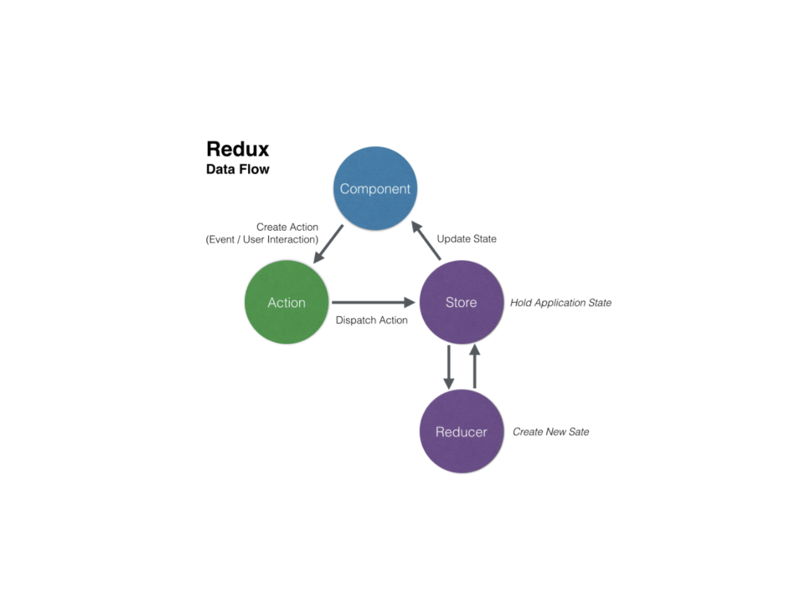

---

<center>

### STRUCTURE

</center>

<br>
<br>



리덕스는 상태관리를 컴포넌트 밖에서 합니다.
앱의 상태 전부는 하나의 **스토어(store)**안에 있는 객체트리에 저장됩니다.
**상태 트리를 변경**하는 유일한 **방법**은 무엇이 일어날지 서술하는 객체인 **액션(action)**을 보내는 것 뿐입니다.
액션이 상태 트리를 어떻게 변경할지 명시하기 위해 여러분은 **리듀서(reducers)**를 작성해야 합니다

---

### Store

하나의 객체를 직렬화(serialize) 해서 서버와 클라이언트가 프로그램의 전체 상태값을 주고 받을 수 있습니다. 하나의 객체에 프로그램의 전체 상태값을 저장합니다.
상태값은 오직 액션 객체에 의해서만 변경됩니다. ( state에 직접 접근 / 이용은 절대 불가능 합니다. ) reducer 함수를 통해서 공급해야 합니다.

---

### Action

**상태에 어떠한 변화**가 **필요**하게 될 땐, 우리는 **action**이란 것을 발생 시킵니다. 액션은 객체형태로 애플리케이션에서 스토어로 보내는 데이터 묶음 입니다. `store.dispatch()`를 통해서 보냅니다. ( 액션을 전달하는 과정을 dispatch라고 합니다 )

> 단순하게 생각하면, 스토어는 컴포넌트 밖에 있고, 우리는 스토어 에서 상태관리를 합니다. <br>그럼 변한 상태를 스토어에 어떻게 알려줘야 할까요? 이를 위한 기능이 action입니다.

액션은 **type**을 반드시 가져야 합니다.

---

### Reducer

리듀서는 스토어에 존재합니다. 상태 변화를 알려주는 액션을 리듀서가 받아 처리하여 새 상태를 스토어에 저장합니다.<br>
reducer는 이전 상태값과, 액션 객체를 입력으로 받아서 새로운 상태값을 만드는 순수 함수 입니다. `(state, action) => nextState`<br> 현재 state값과 액션을 이용해서 nextState 즉 state를 변경 시킵니다.

---

### Dispatch

store에 있는 data를 업데이트, 상태값을 수정 할 때 사용되는 메소드로 인수로는 action을 받습니다.

---

### Subscribe

연결되어 있는 해당 컴포넌트에서 스토어의 데이터의 변경이 있을시 바로 반영 시킵니다. state를 변경시키기 위해선 action이 dispatch 되야 합니다.

---

### start with Redux

```js
npm i --save redux
```

---

<center>

Reference <br>
[redux](https://redux.js.org/introduction/getting-started) <br>
[redux_gitbook](https://lunit.gitbook.io/redux-in-korean/basics/actions)

</center>
