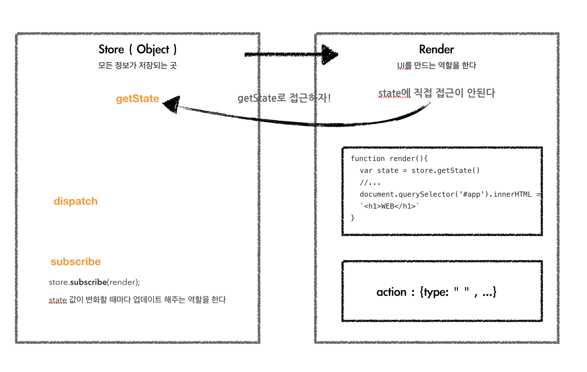
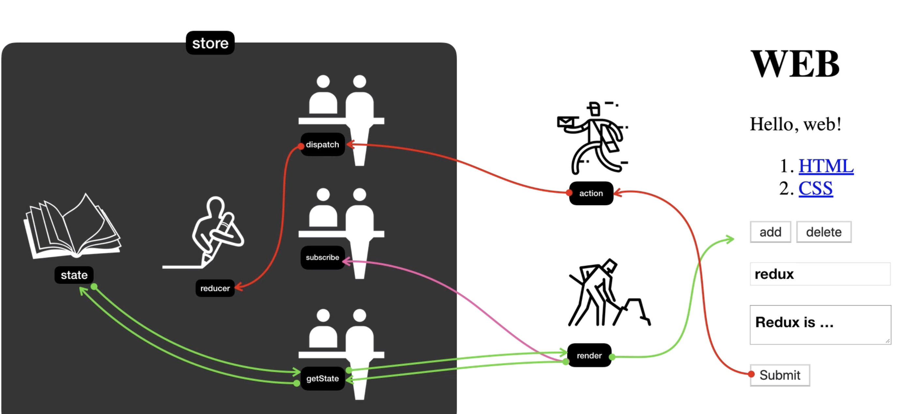

---

#### Redux

 
 

 

---

앱의 상태 전부는 하나의 **스토어(store)**안에 있는 객체트리에 저장됩니다.
**상태 트리를 변경**하는 유일한 **방법**은 무엇이 일어날지 서술하는 객체인 **액션(action)**을 보내는 것 뿐입니다.
액션이 상태 트리를 어떻게 변경할지 명시하기 위해 여러분은 **리듀서(reducers)**를 작성해야 합니다

#### Store

하나의 객체를 직렬화(serialize) 해서 서버와 클라이언트가 프로그램의 전체 상태값을 주고 받을 수 있습니다. 하나의 객체에 프로그램의 전체 상태값을 저장합니다.
상태값은 오직 액션 객체에 의해서만 변경됩니다. ( state에 직접 접근 / 이용은 절대 불가능 합니다. ) reducer 함수를 통해서 공급해야 합니다.

#### action

**상태에 어떠한 변화**가 **필요**하게 될 땐, 우리는 **action**이란 것을 발생 시킵니다.

#### reducer

reducer는 이전 상태값과, 액션 객체를 입력으로 받아서 새로운 상태값을 만드는 순수 함수. (state, action) => nextState  현재 state값과 액션을 이용해서 nextState 즉 state를 변경 시킵니다.

#### dispatch

store에 있는 data를 업데이트, 상태값을 수정 할 때 사용되는 메소드로 인수로는 action을 받습니다.

#### subscribe

연결되어 있는 해당 컴포넌트에서 스토어의 데이터의 변경이 있을시 바로 반영 시킵니다. state를 변경시키기 위해선 action이 dispatch 되야 합니다.

---

#### ---

#### ERROR | ISSUE

> <b> - </b>

Reference  
[redux]()  

