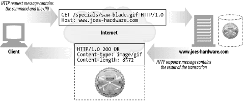
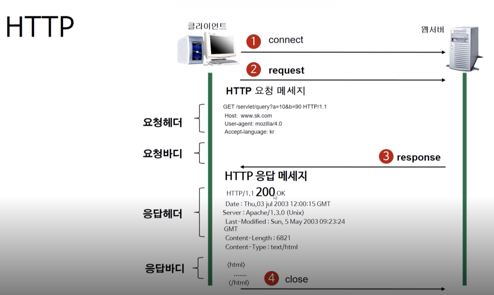

### HTTP Protocol

사람과 사람이 전화 통화를 하기 위해서도 몇 가지 규약이 필요합니다. 
서로 알아들을 수 있는 말을 사용해야 하며, 한쪽이 말할 때 다른 쪽에서는 들어야 합니다. 또한, 전화 연결이 끊어지면 대화를 할 수가 없습니다.
**웹 브라우저**와 **웹 서버** 간에도 서로 통신하기 위해서는 **규약**이 필요합니다.
**이때 필요한 규약이 HTTP 입니다.** **HTTP** 는 웹에서 브라우저와 서버간에 데이터를 주고받기 위한 방식 입니다. 
HTTP는 어떤 종류의 데이터든 전송이 가능합니다.( 동영상, 이미지, 문서 등 )

### 웹의 작동 방식

World Wide Web이 인터넷의 전부가 아닙니다. 
하나의 컴퓨터에는 여러가지 서버가 동작할 수 있고 각각의 서버는 포트라는 값으로 구분되어 집니다. 
웹은 80번 / 이메일은 25번 / FTP는 21번 인터넷은 한마디로 네트워크들의 네트워크 입니다. 이러한 인터넷은 TCP/IP 라는 약속으로 연결되어 있습니다.

### HTTP 작동방식

HTTP는 서버 / 클라이언트 모델을 따릅니다.
**클라이언트**가 **요청**을 **서버**에게 보내면 **서버**는 **클라이언트**에게 **응답**을 보내게 됩니다.

**장점**

- 불특정 다수를 대상으로 하는 서비스에 적합합니다. 
- 클라이언트와 서버가 계속 연결된 형태가 아니기 때문에 클라이언트와 서버 간의 최대 연결수 보다 훨씬 많은 요청과 응답을 처리할 수 있습니다.

**단점** 

- 연결을 끊어버리기 때문에, 클라이언트의 이전 상황을 알 수가 없습니다. (쇼핑몰 에서 쇼핑을 한뒤 결제를 하려고 했는데 무엇을 쇼핑했는지 모릅니다.) 
- 위와 같은 특징을 무상태(Stateless) 라고 말합니다. 
  이러한 특징 때문에 정보를 유지하기 위해서 [Cookie](https://aenglee.netlify.com/posts/cookiesession/)와 같은 기술이 등장하게 되었습니다.

### HTTP Request & HTTP Response

HTTP 프로토콜로 데이터를 주고받기 위해서는 요청(Request)을 보내고 응답(Response)을 받아야 합니다.

### 트랜잭션

클라이언트의 요청과 서버의 응답의 쌍을 하나의 트랜잭션이라고 한다.

### URL

- 웹상에서 문서와 다른 자원들 이미지, 문서 등의 위치를 나타내기 위해 사용합니다.
- 서버에 자원을 요청하기 위해 입력하는 영문 주소 혹은 경로 입니다.

### HTTP 요청 메서드

**URL을 이용하면 서버에 특정 데이터를 요청할 수 있습니다.** 요청한 데이터에 특정 일을 수행하고 싶으면 HTTP 요청 메서드를 이용합니다. 

- 요청 URI: 요청하는 자원의 위치를 명시합니다.  

- GET : 존재하는 자원에 대한 요청 (SELECT) 
- POST : 새로운 자원을 생성 (INSERT) 
- PUT : 존재하는 자원에 대한 변경 (UPDATE) 
- DELETE : 존재하는 자원에 대한 삭제 (DELETE) 
- HEAD : 서버 헤더 정보를 획득. GET과 비슷하나 Response Body를 반환하지 않습니다.  해당 자원이 존재하는지 혹은 서버에 문제가 없는지를 확인하기 위해서 사용합니다. 
- OPTIONS : 서버 옵션들을 확인하기 위한 요청. CORS에서 사용합니다. 
- TRACE : 클라이언트의 요청을 그대로 반환합니다. 예컨데 echo 서비스로 서버 상태를 확인하기 위한 목적으로 주로 사용합니다.

### HTTP 상태 코드

HTTP Status Code는 서버에서 설정해주는 응답(Response) 정보.
이 상태 코드로 에러 처리를 할 수 있습니다.

### HTTP GET / POST Method

#### GET Method

GET is used to request data from a specified resource.
GET is one of the most common HTTP methods.

#### POST Method

POST is used to send data to a server to create/update a resource.

#### STRUCTURE

#### JSON

- HTTP 요청에 대한 응답 시 데이터를 표현하는 포맷 중 하나입니다.
- 자바스크립트를 기반으로 한 데이터 정의 포맷으로 시작합니다.
- 객체를 배열 형태로 표현 가능합니다.
- 상대적으로 XML보다 가볍습니다.
- JSON 해석시 여러 종류의 라이브러리 지원합니다.

Reference  
[HTTP](https://www.edwith.org/boostcourse-web/lecture/16661/)  
[HTTP 완벽가이드](https://feel5ny.github.io/2019/08/18/HTTP_003_04/) 
[HTTP 완벽가이드 책](http://www.kyobobook.co.kr/product/detailViewKor.laf?ejkGb=KOR&mallGb=KOR&barcode=9788966261208&orderClick=LEa&Kc=)

