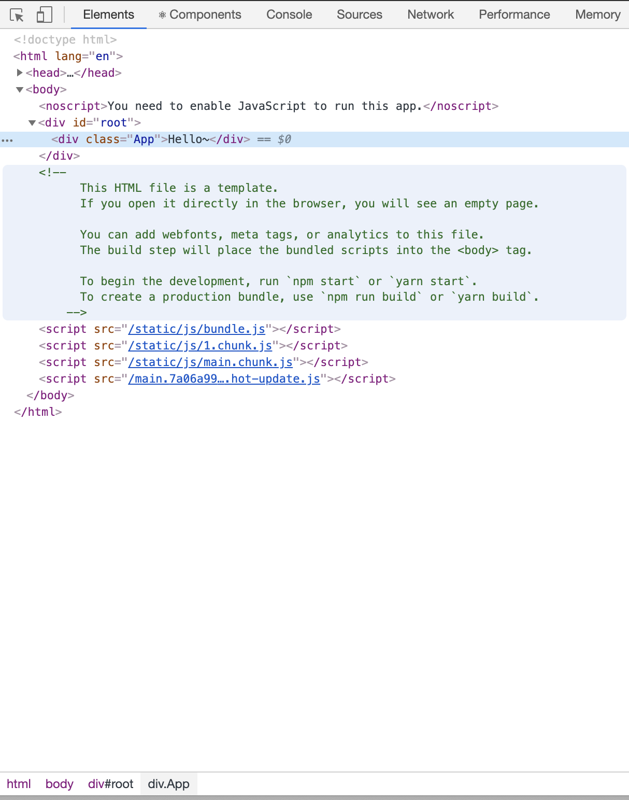

<br>

<center>

코드는 [노마드](https://academy.nomadcoders.co/courses/216871/lectures/10881288) 를 참고하였습니다.<br>
[2019.11.23 토요일 ~ 수정 중]

</center>

## REACT

리액트는 페이스북에서 개발하고 관리하는 UI 라이브러리 입니다. 라이브러리 이기 때문에 전반적인 시스템을 개발자가 직접 구축해야 합니다.

초심자에게는 진입장벽이 높기 때문에 CRA 가 존재합니다.
CRA (create-react-app)는 여러개의 패키지를 조합해서 자동으로 리액트 개발환경을 구축 해줍니다.

### 리액트 를 사용하는 이유

- UI를 자동으로 업데이트 해줍니다.
  > DOM을 직접 건드리지 않습니다. 리액트는 Virtual DOM을 통해서 UI를 업데이트 합니다.

### 리액트 개발 환경 구축하기

하나의 웹 애플리케이션을 만들기 위해서는 테스트 시스템, 빌드 시스템, 라우팅 시스템 둥 UI 외에도 신경 써야할 부분이 많습니다. CRA를 사용하지 않고 직접 구축하기 위해서는 바벨과 웹팩에 대한 이해가 필요합니다.

---

### CRA

create-react-app 으로 개발환경을 구축 합니다.
초기 생성된 파일이 여러개 존재하는데, `index.html` | `index.js` | `package.json` 파일을 제외한 나머지 파일은 삭제해도 됩니다. index 파일들은 빌드시 예약된 파일이름으로 지워서는 안됩니다. <br>
`index.js`로 연결된 모든 JS파일과 CSS파일은 `src폴더` 밑에 있어야 합니다.
src폴더 밖의 파일은 `import` 되지 않습니다.<br>
css 파일 이나 이미지 / 폰트 파일은 모두 src 폴더 밑에서 import를 사용해서 포함시키는게 좋습니다.

> 브라우저 캐싱 효과

---

### 리액트 작동원리

CRA로 리액트 프로젝트를 생성하면 초기에 `src 폴더` 에 파일이 몇 개 존재하고, `public 폴더`에도 파일이 존재합니다. `index.js / index.html` 파일을 제외하고는 삭제해도 상관 없습니다. 대략적인 작동원리는 위에서 짧게 말한 Virtual DOM이 변화를 감지해서 그 부분 부분 만을 업데이트 하는 건데요, 이를 파일로 보게되면 아래와 같습니다.

src의 `index.js`파일에는 아래와 같은 코드가 작성되어있습니다.<br>
`ReactDOM.render(<App />, document.getElementById("root"));`
이는 ReactDOM이 html의 'root' Id에 <App> 파일을 렌더링 한다는 뜻 입니다.

그러면 다음으로 public폴더의 `index.html`을 보겠습니다.

```js

<!DOCTYPE html>
<html lang="en">
  <head>
    <meta charset="utf-8" />
    <link rel="icon" href="%PUBLIC_URL%/favicon.ico" />
    <meta name="viewport" content="width=device-width, initial-scale=1" />
    <meta name="theme-color" content="#000000" />
    <meta
      name="description"
      content="Web site created using create-react-app"
    />
    <link rel="apple-touch-icon" href="logo192.png" />
    <link rel="manifest" href="%PUBLIC_URL%/manifest.json" />
    <title>React App</title>
  </head>
  <body>
    <noscript>You need to enable JavaScript to run this app.</noscript>
    <div id="root"></div>
  </body>
</html>

```

주석을 다 지우고 나면 위와 같은 html 구조가 보일겁니다. `body 태그`를 보게 되면, `<div id="root">` 가 보입니다.<br> 바로 **App** 파일이 렌더링 되는 부분이 이곳 입니다.
리액트는 html 해당 태그에 자동으로 렌더링을 해줍니다.

---

### COMPONENT

리액트는 컴포넌트로 이루어져 있습니다. CRA로 생성한뒤, 불필요한 부분을 제거한 `App.js` 내부를 살펴보면 코드가 아래와 같습니다.<br> `App()`이 컴포넌트가 됩니다.

```js
import React from 'react';

function App() {
  return <div className="App">Hello</div>;
}

export default App;
```

리액트는 컴포넌트를 생성해서 프론트단을 구현하는데요, 우리가 생성한 컴포넌트는 아래와 같이 `index.html`에 들어가게 됩니다.



Virtual DOM으로 작동하기 때문에 실제 HTML 파일은 변화가 없습니다.
사진에서 볼 수 있듯이 `<div id="root">` 내부에 우리가 App() 컴포넌트에 return내부에 정의한 태그가 그대로 들어가는걸 볼 수 있습니다!<br>
그런데 React 를 보면 문법이 조금 특이합니다. `<App />` 이라던가 `{ }` 내부에 변수 등을 넘긴다던가 합니다. 이런 문법을 **JSX**라고 하는데요.<br> Javascript와 HTML을 융합해주는 겁니다.

<center>

--

</center>

컴포넌트를 구성하고 렌더링을 위해서 ReactDOM에 컴포넌트를 추가해야 겠다! 라는 생각이 들 수 도 있는데요.

```js
>index.js 파일

import React from "react";
import ReactDOM from "react-dom";
import App from "./App";

ReactDOM.render(<App />, document.getElementById("root"));

```

여기서 `ReactDOM.render(<App /> <New />, document.getElementById("root"));` 이런식으로 사용하고 싶을 수 있습니다. <br>하지만 이 코드는 에러를 일으킵니다.<br>
왜냐하면 React application 은 Component 하나만 렌더링 해야하기 때문입니다.
따라서 내가 만든 컴포넌트를 사용하기 위해서는 `<App />` 내부에 컴포넌트를 추가해서 렌더링 하면 됩니다.
App 에 새로운 컴포넌트 를 추가해서 렌더링 해보면, React는 컴포넌트를 읽어 평범한 HTML 파일로 만듭니다.<br>
다른 곳에서 컴포넌트를 사용하고 싶다면 Import / Export 하면 됩니다.

#### 그러면 컴포넌트를 왜 쓸까요?

- 재사용성 때문 입니다.
  > 말이 어려워 보입니다. 예를 들어보겠습니다.

```js
import React from 'react';

// Food 컴포넌트
function Food() {
  return <h1>Foooood</h1>;
}

// App 컴포넌트
function App() {
  return <div className="App">Hello</div>;
}

export default App;
```

이렇게 두가지 컴포넌트가 존재합니다. 저는 Food 컴포넌트를 이용해서 음식 메뉴를 10번 출력하고 싶습니다.

```js
import React from 'react';

// Food 컴포넌트
function Food() {
  return <h1>Foooood</h1>;
}

// App 컴포넌트
function App() {
  return (
    <div className="App">
      <Food />
      <Food />
      <Food />
      <Food />
      <Food />
      <Food />
      <Food />
      <Food />
      <Food />
      <Food />
    </div>;
  )
}

export default App;
```

그냥 봐도 너무 별롭니다. DRY(Don't Repeat Yourself)! 를 지켜줍니다. => 그러면 어떻게 해야 재사용 할 수 있을까요? <br>이를 위해서 `props`라는 녀석이 존재합니다.

---

#### props

> props를 콘솔로 찍어보면 객체 형태로 출력 됩니다.

```js
import React from 'react';

// Food 컴포넌트
function Food(props) {
  // props 는 App 에서 넘겨준 { menu: "EGG" } 객체가 됩니다.
  console.log(props)
  return <h1>Foooood</h1>;
}


// ES6 방법으로 넘겨 받는 방법
function Food({menu}) {
  // 이렇게 하면 props.menu (value)만을 넘겨 받습니다.
  console.log({menu})
  return <h1>Foooood</h1>;
}


// App 컴포넌트
function App() {
  return (
    <div className="App">
    // Food 컴포넌트에 객체를 만들어주는데 Key 값으로 menu 를 / Value로 "EGG"를 갖는 객체를 넘겨줍니다.
      <Food menu="EGG" />
    </div>;
  )
}

export default App;
```

<center>

아직 props를 사용한다고 하더라도 재사용성과는 거리가 멀어보입니다.
<br>

</center>

```js
import React from 'react';
import PropTypes from 'prop-types';

function Food({ menu, picture, rating }) {
  return (
    <div>
      <h2>I like {menu}!</h2>
      <h4>{rating} / 5.0</h4>
      
    </div>
  );
}

Food.propTypes = {};

const foodILike = [
  {
    id: 1,
    name: 'Kimchi',
    image:
      'http://aeriskitchen.com/wp-content/uploads/2008/09/kimchi_bokkeumbap_02-.jpg',
    ratings: 5.0
  },
  {
    id: 2,
    name: 'Samgyeopsal',
    image:
      'https://3.bp.blogspot.com/-hKwIBxIVcQw/WfsewX3fhJI/AAAAAAAAALk/yHxnxFXcfx4ZKSfHS_RQNKjw3bAC03AnACLcBGAs/s400/DSC07624.jpg',
    ratings: 4.3
  },
  {
    id: 3,
    name: 'Bibimbap',
    image:
      'http://cdn-image.myrecipes.com/sites/default/files/styles/4_3_horizontal_-_1200x900/public/image/recipes/ck/12/03/bibimbop-ck-x.jpg?itok=RoXlp6Xb',
    ratings: 3.0
  },
  {
    id: 4,
    name: 'Doncasu',
    image:
      'https://s3-media3.fl.yelpcdn.com/bphoto/7F9eTTQ_yxaWIRytAu5feA/ls.jpg',
    ratings: 2.5
  },
  {
    id: 5,
    name: 'Kimbap',
    image:
      'http://cdn2.koreanbapsang.com/wp-content/uploads/2012/05/DSC_1238r-e1454170512295.jpg',
    ratings: 1.9
  }
];

function App() {
  return (
    <div className="App">
      {foodILike.map(dish => (
        <Food
          key={dish.id}
          menu={dish.name}
          picture={dish.image}
          rating={dish.ratings}
        />
      ))}
    </div>
  );
}

export default App;
```

코드가 매우 길어졌습니다. DATA에 해당하는 부분이나 / 컴포넌트 등을 분리 하지 않아서 그렇습니다. 후에 리팩토링 하면서 정리하면 코드가 짧아지고 가독성이 좋아질겁니다.

코드를 살펴보겠습니다. 데이터만 모아놓은 `foodILike` 의 경우 메뉴 이름과 이미지 가 JSON 타입으로 저장되어 있습니다.
<br>우리는 App()에서 prop을 내릴 수 있습니다. App 컴포넌트를 보면 `foodILike` 데이터를 mapping 하여 내부 데이터를 Food 컴포넌트 에 넣습니다. Food는 props로 App에서 넘긴 데이터를 사용할 수 있습니다.
`<Food menu={dish.name} picture={dish.image} />` 는 결국 이런 모양이 될겁니다.

```js
// Food Component
Food {
  key: 1,
  menu: kimchi,
  picture: image의 source, // 이미지 파일이 나오겠죠
  rating: 4.9
}
```

따라서 Food 컴포넌트를 단 한번만 사용해서 props로 넘겨 받은 menu, picture, rating 등 을 반환하여 렌더링 해줄 수 있습니다.

<center>

--

</center>

이렇게 props를 내리다 보면 헷갈립니다. <b>props 가 내가 원하는 props인지를 체크해 주면 좀 더 편리할것 같습니다.</b>
`npm i prop-types`를 통해 prop-types를 설치합니다.

```js
Food.propTypes = {
  menu: PropTypes.string.isRequired,
  picture: PropTypes.string.isRequired,
  rating: PropTypes.number.isRequired
};
```

`propTypes`는 코드에서 위 처럼 사용할 수 있습니다. 위 와 같이 등록해 줌으로써, 콘솔상에서 타입에러 라던가, prop key 값이 없다 등의 에러를 표시해줍니다.

---

#### state

> state는 변하는 데이터, 존재하지 않다가 생기고 다시 사라지는 그런 데이터 종류 입니다. 이렇게 말하니 모호합니다.<br> dynamic data 라고도 합니다.

state를 쓰기 위해서는 fuction으로 정의한 컴포넌트를 class 형태로 변경해야 합니다.

```js
// Class Component를 만들어 보겠습니다.
// 사실 react extension 을 설치하면 snippet을 통해 손쉽게 생성할 수 있습니다.
rcc 이 단 세글자로 말이죠! 무튼 작성해보겠습니다.

import React, { Component } from "react";


export default class App extends Component {
  state = {

  }
  render() {
    return (
      <div>
        <h1>I'm a class</h1>
      </div>
    );
  }
}

```

코드를 보게되면 App 컴포넌트는 React.Component를 extend / 상속 받습니다.
react는 자동적으로 class component의 render method를 실행합니다.

##### 그러면 왜 클래스로 만드는 건가요?

> state 때문 입니다. state 는 객체 이고, 객체기 때문에 component의 data를 넣을 공간이 존재합니다. 그리고 이 데이턴는 변화합니다.

---

### 빌드

---

### 테스트

---

### eject

---

### Code Splitting

코드 분할은 사용자에게 필요한 양의 코드만 내려 줄 수 있다. 코드를 분할하지 않으면 전체 코드를 한번에 내려줘 첫 페이지가 뜨는 시간이 오래 걸린다.
동적 임포트를 통해서 분할한다.

```js
import React, { Component } from 'react';

class TodoList extends Component {
  state = {
    todos: []
  };

  onClick = () => {
    // onClick으로 이벤트를 호출하면 비동기로 Todo 모듈을 가져옵니다.
    import('./Todo.js').then(({ Todo }) => {
      // 동적 임포트는 Promise를 반환 합니다.
      const { todos } = this.state;
      const position = todos.length + 1;
      const newTodo = <Todo key={position} title={`할 일 ${position}`} />;
      this.setState({ todos: [...todos, newTodo] });
    });
  };

  render() {
    const { todos } = this.state;
    return (
      <div>
        <button onClick={this.onClick}>할 일 추가</button>
        {todos}
      </div>
    );
  }
}

export default TodoList;
```

---

### 환경 변수 사용하기

---

### CSS

---

### 단일 페이지 어플리케이션 만들기(SPA)

단일페이지 애플리케이션은 최초 요청시 서버에서 첫 페이지를 처리하고 이후의 라우팅은 클라이언트에서 처리하는 웹 애플리케이션 입니다.
전통적인 방식의 웹 페이지는 페이지를 전환할때 마다 렌더링 결과를 서버에서 받기 때문에 화면이 깜빡 거렸었습니다. SPA는 페이지 전환 렌더링을 클라이언트에서 처리하기 때문에 자연스럽게 동작합니다.

- 브라우저 히스토리 API

  > - JS에서 브라우저로 페이지 전환요청을 보낼 수 있습니다. <br>
  > - 브라우저의 뒤로 가기 와 같은 사용자의 페이지 전환 요청을 JS에서 처리할 수 있어야 합니다.<br> ( 두 과정 모두 브라우저는 서버로 요청을 보내지 않습니다. )<br><br> 이러한 조건을 만족하는 브라우저 API는 `pushState`, `replaceState` 함수와 `popstate` 이벤트 입니다.

- react-router-dom
  > 브라우저 히스토리 API를 활용하여 라우팅 처리를 구현할 수 있지만 신경써야할 부분이 많습니다. `react-router-dom`을 활용합니다. <br>(내부적으로 브라우저 히스토리 API를 사용합니다.)

---

<hr />

<center>

Reference <br>
[react](https://ko.reactjs.org/docs/react-component.html)<br>
[실전 리액트 프로그래밍](http://book.interpark.com/product/BookDisplay.do?_method=detail&sc.prdNo=308722586&gclid=Cj0KCQiAq97uBRCwARIsADTziyYXgPG4TOcakdMytOcXHMRPm0vFapky32IvMRayJaKomTp8-GYsERYaAjpnEALw_wcB)<br>
[노마드](https://academy.nomadcoders.co/courses/216871/lectures/10881288)

</center>
