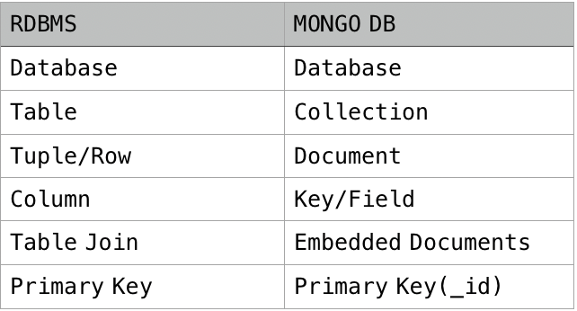

### Mongo DB

몽고디비는 기존의 **관계형 데이터 베이스**와 달리 **SQL**을 사용하지 않습니다.
따라서 데이터 조회 방식도 SQL과 다릅니다. <br> 하지만 데이터를 저장하거나 조회 하는 방법을 따로 제공하기 때문에 몇 가지 사용법만 알아두면 쉽게 사용할 수 있습니다.
<br> **몽고디비는 자바스크립트 객체를 그대로 저장할 수 있어서 노드에서 데이터를 저장하기 좋은 데이터베이스 입니다.**

**NoSQL**에 주목하는 이유는 대부분 성능 때문입니다. NoSQL은 데이터베이스 성능을 최우선시 하기 때문에 실시간 처리 나 <br>대용량 트래픽을 감당할 수 있는 메시징 시스템 등에 활용 됩니다. 특히 클라우드 서비스로 서버를 구성하는 경우가 많아지면서 많은 사용자를 수용하거나 시스템 자원을 적게 소모는 NoSQL DB에 더 관심을 갖게 되었습니다.

- **관계형 데이터베이스란** 데이터 항목들을 모아 놓은 집합체인 정형화된 테이블을 여러 개 포함하고 있으면서 다양한 방법으로 데이터에 접근하거나 조회할 수 있도록 만든 데이터 저장소를 말합니다. 관계형 DB는 데이터를 조작하거나 접근할 수 있도록 검색 언어인 **SQL**을 제공 합니다. **SQL**문장은 데이터를 직접 조회하거나 보고서를 추출하는데 주로 사용됩니다.

몽고디비는 앞서 말했듯이 **NoSQL**이기 때문에 **DB의 테이블 개념이 없습니다.**<br> 대신 여러 데이터가 모인 하나의 단위를 **컬렉션**이라고 부릅니다.<br>
몽고디비는 데이터 저장소를 갖고 있으며, 그 안에 여러개의 컬렉션을 갖고 있는 **컬렉션의 집합** 이라고 할 수 있습니다.
각각의 컬렉션은 여러 개의 **문서 객체(Document)** 를 가질 수 있습니다.
문서는 Key-value pair로 이루어져 있습니다.

```js
{
    "_id": ObjectId("5099803df3f4948bd2f98391"), // 12bytes의 hexadecimal 값으로서, 각 document의 유일함(uniqueness)을 제공합니다.
    "username": "aengLee",
    "name": { first: "C.H", last: "LEE" }
}
```

Document 동적( dynamic )의 schema 를 갖고있습니다. 같은 Collection 안에 있는 Document 끼리 다른 schema 를 갖고 있을 수 있는데요, 쉽게 말하면 서로 다른 데이터 ( 즉 다른 key ) 들을 가지고 있을 수 있습니다.

#### 장점

- Schema-less ( Schema가 없다. 같은 Collection 안에 있을지라도 다른 Schema를 가지고 있을 수 있다 )
- 복잡한 JOIN 이 없다.

---

### Data Modelling

- 예제


<br>
<br>
<br>
<br>

---

#### MongoDB 와 RDBMS 비교

<br>



<!--
<center>

#### docker 터미널에서 mongo DB 설정
</center>
<br>

  
docker pull mongo
<br>
<br>


  
docker images<br>
  <br>

  
  docker run --name (mongodb) mongo<br>

docker run -d -p 27017-27019:27017-27019 --name (mongodb) mongo

1. aleredy error
2. docker ps -a ( 실행 중인 상태 확인 )
3. docker stop mongodb
4. docker rm mongodb
<br>

  
  <br>

  
  <br>

  ### *docker exec -it (mongodb) bash*
  
  <br>

## mongo shell - 명령어

  ### mongo
>mongo 내부

  
  <br>
  
  <br>

  ### use (db name)
>use는 현재 존재하지않는 dbname 도 사용 가능하다


<br>

<br>

<br>


 -->

<hr />

<center>

Reference <br>
[MongoDB](https://docs.mongodb.com/manual/core/databases-and-collections/)<br>

</center>
