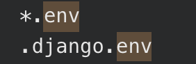
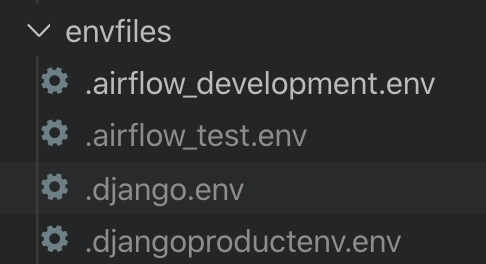
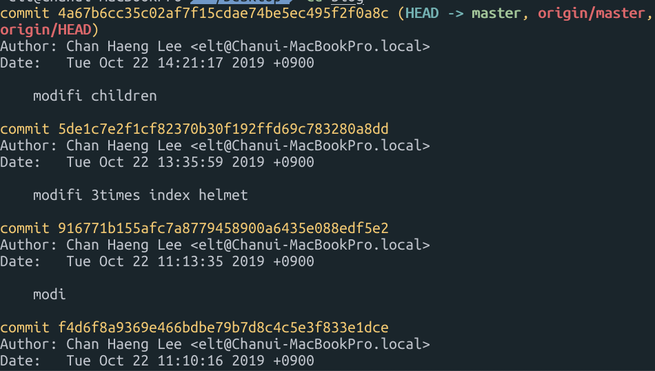
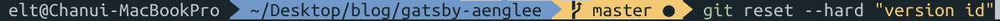

### git Ignore

AWS access key 처럼 github에 올라가서는 안되는 값의 경우 **git ignore**를 해주어야 합니다. [보안상 매우 중요한 부분]

git ignore file을 생성합니다.

 

위 그림처럼 ignore 하고 싶은 데이터가 담긴 파일명 자체를 ignore 안에 추가하거나, 확장자 자체를 ignore 할 수 있습니다.

 

ignore 된 파일은 editor 상에서 그림과 같이 회색으로 바뀌고, github에도 파일이 올라가지 않습니다.

 

### git commit reset

이전 버전 또는 상태를 돌리기 위해선 **git commit reset**을 통해 되돌릴 수 있습니다.

git log를 통해 commit 이력을 조회 및 version id를 확인 및 복사 합니다.

git reset 명령어를 통해 이전 커밋으로 되돌아 갑니다.

Reference  
[git_reset](https://www.popit.kr/%EA%B0%9C%EB%B0%9C%EB%B0%94%EB%B3%B4%EB%93%A4-git-back-to-the-future/)  

