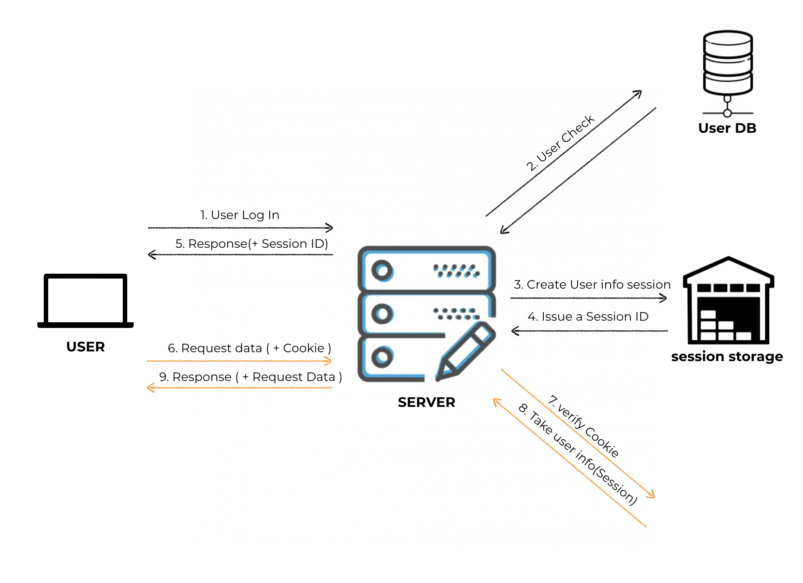

---

### 쿠키

현대의 웹사이트는 개인화 된 서비스를 제공하고 싶어 합니다. 네트워크로 연결된 사용자들에 대해 더 많은 것을 알고 싶어 하고 사용자들이 브라우징 하는 것을 기록 하고 싶어합니다. HTTP의 특성인 무상태(Stateless)는 연결 자체에 대한 정보를 갖지 않습니다. 이런 HTTP에서 사용자를 식별하고 세션을 유지하는 방식중 하나가 바로 <b>쿠키</b> 입니다.

**쿠키** 란 사용자가 웹 사이트를 방문할 경우 **해당 사이트에서 사용자의 컴퓨터에 설치하는 기록 정보** 입니다. **로컬에서 관리 합니다.**
다른 페이지들 사이의 세션정보를 유지하는데 아주 유용하며 웹 사이트를 방문한 사용자의 성향을 분석하거나 통계에 필요한 정보를 추적 관리하는데도 사용하고 있습니다.

서버에서 저장하는 쿠키의 형태는 Key - Value 형태 로 사용자 컴퓨터에는 텍스트 형태로 저장이 됩니다.
보통 방문자가 다른 페이지로 이동했을때 브라우저가 서버에 방문자 쿠키를 보내게 됩니다.

**쿠키는 클라이언트(프론트) 와 서버 간에 데이터를 주고받는 가장 간단한 방법** 중 하나 입니다.  이런 것들에 대한 설정을 **헤더를 통해 할 수 있습니다.**

익스프레스에서는 **cookie-parser 미들웨어** 를 사용하면 쿠키를 설정하거나 확인할 수 있습니다. 
**Set-Cookie : Key - Value** : 옵션들 [서버에서 클라이언트 에게 이런 쿠키를 저장하라고 명령하는 응답 헤더] 
**Cookie Persistence** : 이전에 접속한 적 이 있는 웹 서버로 다시 접속할때 사용

---

### 캐시

**캐시** 는 개인 캐시를 뜻합니다. (CDN 같은 공유 캐시가 아닙니다) 
여러분의 브라우저에 응답으로 온 HTML이나 JSON과 같은 데이터가 저장되어 나중에 서버에 요청을 보내지 않고도 브라우저에 저장된 응답을 사용할 수 있습니다. 
Cahcing은 GET 요청에만 합니다. GET이 REST적 의미로 가져오다 이기 때문에, 가져온 데이터를 저장 해두고 두고두고 쓰는 것 입니다. 
일반적으로 200(가져오기 성공), 301(다른 주소로 이동 후 가져옴), 404(가져올게 없음) 상태 코드로 온 응답을 캐싱할 수 있습니다.

---

### 세션

**세션** 은 웹 서버에 저장되는 정보 입니다.

---

### 인증이 필요한 이유

 

**인증은 프론트엔드 관점에서 봤을 때 사용자의 로그인, 회원가입과 같이 사용자의 도입부분을 가리키곤 합니다. 반면 서버사이드 관점에서 봤을 때는 모든 [API](http://localhost:8000/ko/blog/2019/10/22/channing/) 요청에 대해 사용자를 확인하는 작업입니다.** 서버에서는 각각의 서로 다른 사용자를 확인할 필요가 있습니다.
서로 다른 사용자가 요청을 보내면 서버는 각각의 요청이 어떤 사용자가 보낸 요청인지를 알아야 합니다. 그렇지 못한다면 자신의 정보가 타인에게 유출되는 상황이 일어날 수 있습니다. 
따라서, **프론트 엔드(앱)** 에서는 자신이 누구인지를 알 수 있는 정보를 서버에 보내야 하며 _서버_ 는 그 정보를 토대로 각 요청에 맞는 데이터를 뿌려주면 됩니다.

### HTTP 통신

각각의 [HTTP](https://developer-channing.com/blog/2019/09/12/channing)요청 에는 누구인지에 대한 정보가 필수 입니다. 서버에 요청을 보내는 작업은 HTTP 메세지를 보내는 것 입니다.

- 헤더에는 기본적으로 요청에 대한 정보들이 들어갑니다.
- 바디에는 서버로 보내야 할 데이터가 들어가게 됩니다.

---

### 인증

서버사이드에서 인증은 모든 **API 요청**에 대해 사용자를 확인하는 것 입니다.

#### 인증 방식

1. 계정정보를 요청 헤더에 넣는 방식 
   -- 계정정보를 요청에 담아 보내는 방식입니다. HTTP 요청에 인증할 수단에 비밀번호를 넣습니다. <b>보안에 매우 취약합니다.</b>
2. COOKIE / SESSION 방식 
3. 토큰 기반 인증 방식 (JWT

---

### 쿠키 / 세션 방식

- <b>Session이란?</b> 
  **세션** 은 유저가 로그인 이나 특정 컴퓨터, 네트워크 서비스, 소프트웨어 서비스에 접근할 때 시작 되고, 유저가 서비스에 로그아웃 하거나 컴퓨터를 종료하면 끝나게 됩니다. **세션**은 유저가 접속하는 동안의 행동과 연관된 정보를 임시로 저장할 수 있습니다.  **세션 쿠키**는 웹 페이지 에서 유저가 웹 페이지를 떠나거나 웹 브라우저를 닫았을 경우의 정보를 저장하기 위해 사용됩니다. 
  **세션**은 쿠키보다 더 안전하고 많은 데이터를 저장하는 저장 방식 입니다. 쿠키의 경우 데이터를 사용자의 컴퓨터에 저장하기 때문에 비밀번호 같은 민감한 부분이라도 예외 없이 그대로 드러나는 반면에 **세션**은 **데이터를 서버에 저장**하기 때문에 쿠키보다 안전하다고 볼 수 있습니다.
  그래서 로직은 **사용자(클라이언트)는 쿠키**를 이용하고, **서버**에서는 **쿠키를 받아 세션의 정보를 접근하는 방식**으로 인증을 합니다.

1. 사용자가 로그인 합니다.

- 서버에서 계정 정보를 읽어 사용자를 확인 합니다.
- 사용자의 고유한 ID값을 부여합니다.
- Session ID를 발행 합니다.
- 사용자는 서버에서 해당 세션 ID를 받아 쿠키에 저장합니다.
- 인증이 필요한 요청마다 쿠키를 헤더에 실어 보냅니다.
- 서버에서는 쿠키를 받아 세션 저장소에서 대조를 한후 대응되는 정보를 가져옵니다.
- 인증이 완료되고 서버는 사용자에 맞는 데이터를 보내줍니다.

---

### 토큰 기반 인증 방식 (JWT)

**JWT(Json Web Token)** 인증에 필요한 정보들을 암호화시킨 토큰을 뜻합니다. 
사용자는 **Access Token(JWT 토큰)**을 HTTP 헤더에 실어 서버로 보내게 됩니다.

> https://jwt.io 를 들어가보면 암호화된 토큰을 볼 수 있습니다.  

토큰을 만들기 위해서는 크게 3가지 <b>Header</b>, <b>Payload</b>, <b>Verify Signature</b>가 필요합니다.

- Header : 위 3가지 정보를 암호화할 방식(alg), 타입(type) 등이 들어갑니다.
- Payload : 서버에서 보낼 데이터가 들어갑니다. 일반적으로 유저의 고유 ID값, 유효기간이 들어갑니다.
- Verify Signature : Base64 방식으로 인코딩한 Header, payload 그리고 SECRET KEY를 더한 후 서명됩니다.

---

### 익스프레스에서의 인증

익스프레스에는 **패스포트(Passport)** 라는 노드에서 사용할 수 있는 사용자 인증 모듈이 존재합니다.

---

### ---

### ERROR | ISSUE

> <b> - </b>

Reference  
[Session&Cookie](https://tansfil.tistory.com/58)  

