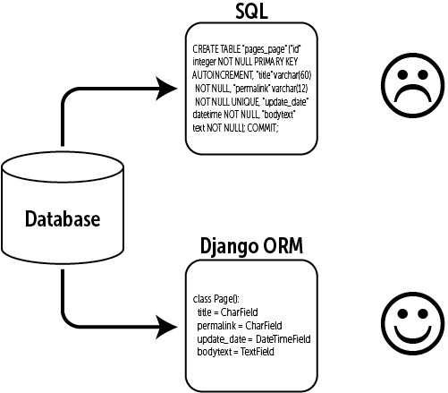
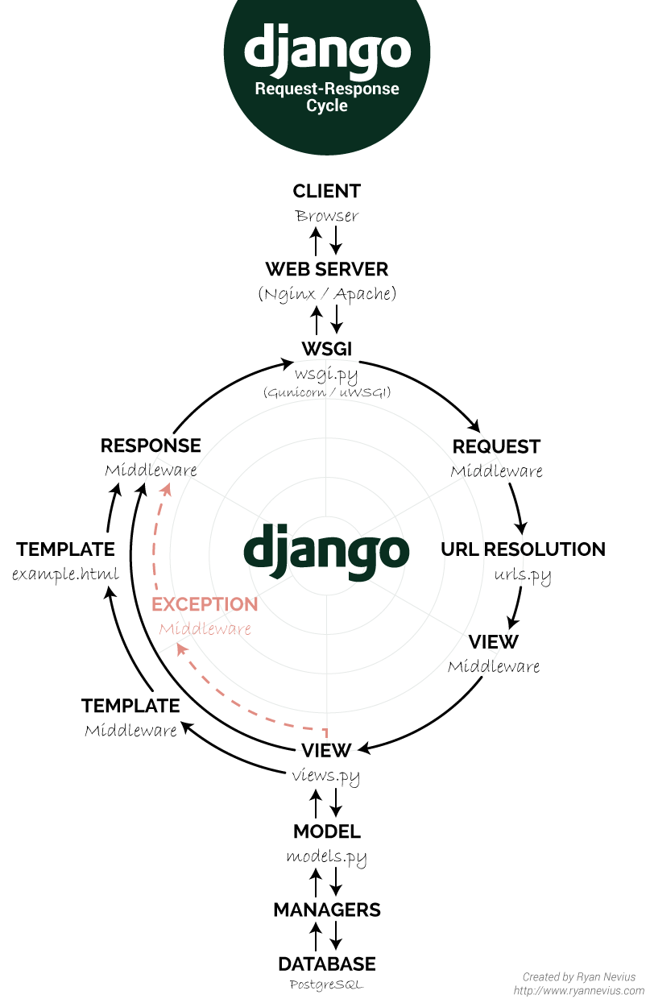

---

### Django

**장고**는 Django Software Foundation이 관리하는 파이썬으로 작성된 오픈소스 **웹 애플리케이션 프레임워크** 입니다.

> <b>Model View Controller (MVC) 패턴을 따르고 있습니다.</b>

고도의 데이터베이스 기반 웹사이트를 작성하는 데 있어서 **수고를 더는 것**이 장고의 주된 목표입니다.<br>
실제로 많은 기능들이 구현되어 있습니다. 프레임워크 특성상 장고에서 요구하는 범위에서 벗어나지만 않는다면 에러를 발생시키지 않으며, 편리하게 활용할 수 있습니다.
장고는 **컴포넌트의 재사용성(reusability)** 과 **플러그인화 가능성(pluggability)** 또 **빠른 개발** 등을 강조하고 있습니다. <br>
또한, **"DRY(Don't repeat yourself)"** 원리를 따릅니다.
설정 파일부터 데이터 모델까지 파이썬 언어가 구석구석에 쓰여 있습니다.

---

### Django ORM

**ORM(Object Relational Mapping)** OOP언어와 데이터를 다루는 RDBMS와의 상이한 시스템을 매핑하여 데이터 관련 OOP 프로그래밍을 쉽게 하도록 도와주는 기술 입니다.
**즉, 복잡한 SQL문을 공부할 필요 없이 우리의 파이썬 코드를 SQL문으로 바꿔서 DB에서 알아들을 수 있게 해줍니다.**
`models.py`에 작성한 코드를 장고가 알아서 DB 테이블로 만들어 줍니다.


---

### Django Model

> **Django** 에서 **Model**은 MVC패턴에서 Model 영역을 의미합니다. <br> 데이터를 DB에 저장하고 가공 하는 작업을 하며 데이터 서비스를 제공하는 기능을 담당합니다.

Django의 Model은 각각의 Django App 안에 기본적으로 생성되는 models.py에 코드를 작성하여 정의합니다.<br> 클래스 형태로 정의하며, <b>하나의 모델 클래스는 DB에서 하나의 테이블에 해당됩니다.</b> <br>
장고 모델은 DB데이터를 정의하는 작업 입니다.
models 패키지의 Model 객체를 상속받는 클래스가 하나의 DB 테이블 입니다.
<br>특정 `Field 클래스`의 인스턴스로 생성되는 변수들이 해당 테이블의 한 필드가 됩니다. <br><b>각 `Field`는 기능이 내장되어 있으며, 장고는 각 `Field` 의 유효성 타입 검사 까지 자동으로 해줍니다.</b> <br> 즉 해당 필드에 적합하지 않은 데이터를 장고 스스로 검사하여 보다 편한 환경을 제공해줍니다.

- Each model is a Python class that subclasses django.db.models.Model.

* Each attribute of the model represents a database field.
* With all of this, Django gives you an automatically-generated database-access API

<br>

> **DB 테이블 구조 / 타입을 먼저 설계를 한 후에 모델을 정의합니다.**

```py
from django.db import models

class Post(models.Model):
    title = models.CharField(max_length=100) # 길이 제한이 있는 문자열
    content = models.TextField() # 길이 제한이 없는 문자열
    created_at = models.DateTimeField(auto_now_add=True) # 해당 레코드 생성시 현재 시간 자동저장
    updated_at = models.DateTimeField(auto_now=True) # 해당 레코드 갱신시 현재 시간 자동저장
    # DB에서는 길이제한 유무에 따라서 문자열 필드 타입이 다릅니다.
    # 길이 제한이 없는 문자열을 많이 쓰면 성능이 떨어집니다.
```

> 모델 등록 절차

1. `models.py`에 모델 클래스를 정의합니다.
2. `pipenv shell` 에서 `migrations`, `migrate`를 실행합니다.
3. `admin.py`에 모델 클래스를 등록 합니다.

```py
$ python3 manage.py makemigrations
$ python3 manage.py migrate
# 위 명령을 통해서 앱폴더 아래에 migration 폴더가 생성되고 DB에 테이블을 생성합니다.
```

```py
# admin.py에 모델 클래스를 등록합니다.
from django.contrib import admin
from .models import Post

admin.site.register(Post)
# 또는 decorator를 활용합니다.
@admin.register(models.User)

```

> 주요 모델

---

### Django Restful [API](https://channing.netlify.com/ko/blog/2019/10/22/channing/)

<br>
<br>



<hr />

<center>

Reference <br>
[REST](https://medium.com/@BennettGarner/build-your-first-rest-api-with-django-rest-framework-e394e39a482c) <br>
[Model](https://revidream.tistory.com/18)<br>
[DJANGO](https://docs.djangoproject.com/en/2.2/topics/db/models/)<br>

</center>
