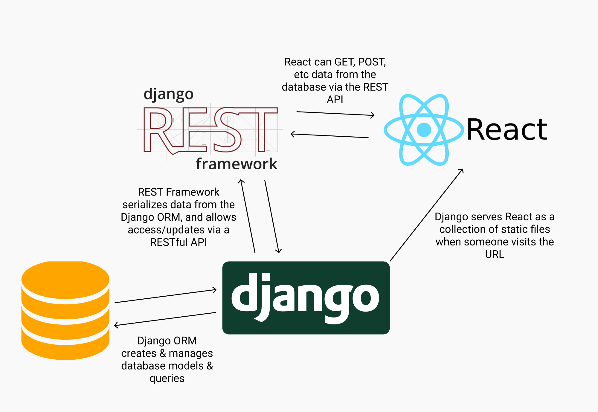

---

### Django

**장고**는 Django Software Foundation이 관리하는 파이썬으로 작성된 오픈소스 **웹 애플리케이션 프레임워크** 입니다.

> <b>Model View Controller (MVC) 패턴을 따르고 있습니다.</b>

고도의 데이터베이스 기반 웹사이트를 작성하는 데 있어서 **수고를 더는 것**이 장고의 주된 목표입니다.<br>
실제로 많은 기능들이 구현되어 있습니다. 프레임워크 특성상 장고에서 요구하는 범위에서 벗어나지만 않는다면 에러를 발생시키지 않으며, 편리하게 활용할 수 있습니다.
장고는 **컴포넌트의 재사용성(reusability)** 과 **플러그인화 가능성(pluggability)** 또 **빠른 개발** 등을 강조하고 있습니다. <br>
또한, **"DRY(Don't repeat yourself)"** 원리를 따릅니다.
설정 파일부터 데이터 모델까지 파이썬 언어가 구석구석에 쓰여 있습니다.

---

### Django ORM

**ORM(Object Relational Mapping)** OOP언어와 데이터를 다루는 RDBMS와의 상이한 시스템을 매핑하여 데이터 관련 OOP 프로그래밍을 쉽게 하도록 도와주는 기술 입니다.
**즉, 복잡한 SQL문을 공부할 필요 없이 우리의 파이썬 코드를 SQL문으로 바꿔서 DB에서 알아들을 수 있게 해줍니다.**
`models.py`에 작성한 코드를 장고가 알아서 DB 테이블로 만들어 줍니다.


---

### Django Model

[Model](https://brunch.co.kr/@ddangdol/1)

> **Django** 에서 **Model**은 MVC패턴에서 Model 영역을 의미합니다. <br> 데이터를 DB에 저장하고 가공 하는 작업을 하며 데이터 서비스를 제공하는 기능을 담당합니다.

Django의 Model은 각각의 Django App 안에 기본적으로 생성되는 models.py에 코드를 작성하여 정의합니다.<br> 클래스 형태로 정의하며, <b>하나의 모델 클래스는 DB에서 하나의 테이블에 해당됩니다.</b> <br>
장고 모델은 DB데이터를 정의하는 작업 입니다.
models 패키지의 Model 객체를 상속받는 클래스가 하나의 DB 테이블 입니다.
<br>특정 `Field 클래스`의 인스턴스로 생성되는 변수들이 해당 테이블의 한 필드가 됩니다. <br><b>각 `Field`는 기능이 내장되어 있으며, 장고는 각 `Field` 의 유효성 타입 검사 까지 자동으로 해줍니다.</b> <br> 즉 해당 필드에 적합하지 않은 데이터를 장고 스스로 검사하여 보다 편한 환경을 제공해줍니다.

- Each model is a Python class that subclasses django.db.models.Model.

* Each attribute of the model represents a database field.
* With all of this, Django gives you an automatically-generated database-access API

<br>

> **DB 테이블 구조 / 타입을 먼저 설계를 한 후에 모델을 정의합니다.**

```py
from django.db import models

class Post(models.Model):
    title = models.CharField(max_length=100) # 길이 제한이 있는 문자열
    content = models.TextField() # 길이 제한이 없는 문자열
    created_at = models.DateTimeField(auto_now_add=True) # 해당 레코드 생성시 현재 시간 자동저장
    updated_at = models.DateTimeField(auto_now=True) # 해당 레코드 갱신시 현재 시간 자동저장
    # DB에서는 길이제한 유무에 따라서 문자열 필드 타입이 다릅니다.
    # 길이 제한이 없는 문자열을 많이 쓰면 성능이 떨어집니다.
```

> 모델 등록 절차

1. `models.py`에 모델 클래스를 정의합니다.
2. `pipenv shell` 에서 `migrations`, `migrate`를 실행합니다.
3. `admin.py`에 모델 클래스를 등록 합니다.

```py
$ python3 manage.py makemigrations
$ python3 manage.py migrate
# 위 명령을 통해서 앱폴더 아래에 migration 폴더가 생성되고 DB에 테이블을 생성합니다.
```

```py
# admin.py에 모델 클래스를 등록합니다.
from django.contrib import admin
from .models import Post

admin.site.register(Post)
# 또는 decorator를 활용합니다.
@admin.register(models.User)

```

> 주요 모델

---

### DJANGO REST API

[API](https://developer-channing.com/blog/2019/10/22/channing) <br>
[HTTP](https://developer-channing.com/blog/2019/09/12/channing)

<br>


---

<center>

<mark>[REST](https://medium.com/@BennettGarner/build-your-first-rest-api-with-django-rest-framework-e394e39a482c) 를 번역한 글입니다. (오역 / 의역에 유의하세요)
</mark>

</center>
<br>


장고 에서 REST API를 build 하는건 매우 쉽습니다.

#### WHY REST API ?

코드를 작성하기 전에 왜 API를 만드는 것이 중요한지 알아야 합니다. <b> REST API </b> 는 어플리케이션에 데이터를 제공하는 가장 표준화된 방법입니다. 어플리케이션은 원하는 대로 데이터를 사용할 수 있습니다. 또한 API는 다른 어플리케이션이 데이터를 변경할 수 있는 방법을 제공합니다.<br> REST API 요청에는 아래와 같이 몇가지 옵션이 존재합니다.

- GET : 가장 보편적인 옵션으로, 사용자가 방문한 endpoint 와 사용자가 제공하는 매개변수를 기반으로 API 에서 일부 데이터를 반환 합니다.
- POST : DB에 추가되는 새로운 레코드를 생성합니다.
- PUT : Looks for a record at the given URI you provide. If it exists, update the existing record. If not, create a new record
- DELETE : Deletes the record at the given URI
- PATCH : Update individual fields of a record

일반적으로, API는 데이터베이스에 대한 창 입니다. API 백엔드는 DB 쿼리 및 응답 포맷을 처리합니다. 사용자는 요청한 리소스에 대한 정적인 응답(일반적으로 JSON 형식) 을 받습니다.

REST API는 소프트웨어 개발에서 매우 일반적이며 개발자가 작동 방식을 아는 데 필수적인 기술입니다



> A typical Django application that uses React as a front end. It needs an API to allow React to consume data from the database.
> <br> [제 생각 입니다.] API를 통해 제공받는 데이터는 형식 도 타입도 다양합니다. binary data(그림, 소리 파일) / html(웹 페이지) / db data(Json/xml) 등이 있습니다. 구조를 보게 되면 클라이언트(프론트) 는 서버로 데이터를 요청 하는 데요, 이와 같은 데이터는 DB에 들어가 있게 됩니다. 결국 Client가 서버의 DB로 데이터를 요청하고 서버는 이에 대한 응답을 하는 구조가 됩니다. 그리고 이 과정은 API endpoint로 요청 과 응답을 하게 되구요. 여기서 REST Framework가 작동하게 되는겁니다.

예를들어, 웹 개발에서 많은 응용 프로그램은 REST API를 사용하여 프런트 엔드가 백 엔드와 통신 할 수 있도록합니다. 만약 개발자인 당신이 장고 위에 리액트 어플리케이션을 배포 했다면,
당신은 리액트가 DB의 정보를 사용할수 있도록 API가 필요합니다.

테이블 형식 데이터베이스 값을 쿼리하고 JSON 또는 다른 형식으로 변환하는 프로세스를 serialization 이라고 합니다. API를 만든다고 할때 주요한 과제는 올바른 data serialization을 구현하는 것 입니다.

---

#### WHY DJANGO REST FRAMEWORK?

Django REST Framework를 사용하는 가장 큰 이유는 바로 serialization이 매우 쉽기 때문입니다!
장고에서는 파이썬을 사용해서 DB의 모델을 정의합니다. (장고 ORM은 위에서 설명했기에 넘어가겠습니다.)

---

### To-do list to create a REST API in Django

1. 장고 환결 설정을 합니다.
2. Django ORM이 관리할 DB model을 생성합니다.
3. Django REST Framework를 설정 합니다.
4. 2번의 모델을 Serialize 합니다.
5. Serialize data를 보기 위해 URI endpoints를 생성합니다.

> 1,2 번의 과정은 생략하고 3번과정 부터 따라가겠습니다. <br> > [Serialize란](https://developer-channing.com/blog/2019/11/08/channing)

#### SET UP DJANGO REST FRAMEWORK

우리는 엔드 포인트를 통해 데이터베이스의 데이터를 serialize 해야 합니다. 이를 위해서는, Django Rest Framework를 설치하고 사용해야 합니다.

```py
// REST FRAMEWORK 를 설치합니다.
$ pip install djangorestframework
```

이제 장고에게 REST FRAMEWORK 를 설치했다고 말해줘야 합니다. 생성한 프로젝트의 settings.py에 아래와 같이 추가해줍니다.

```py
INSTALLED_APPS = [
    # All your installed apps stay the same
    ...
    'rest_framework',
]
```

#### SERIALIZE MODEL

우리는 우리의 모델이 어떻게 데이터를 serialize해야 하는지를 REST Framework에 알려야 합니다.
이를 위해서 `serializers.py` 파일을 생성합니다. 그리고 아래 코드와 같이 Import 해줍니다.

```py
# model을 Import 합니다.
# REST Framework serializer를 Import 합니다.
# Create a new class that links the Hero with its serializer

# serializers.py
from rest_framework import serializers

from .models import Hero

class HeroSerializer(serializers.HyperlinkedModelSerializer):
    class Meta:
        model = Hero
        fields = ('name', 'alias')
```

<center>
--- 번역중 ---
</center>

---

<center>

### ---

### ERROR | ISSUE

</center>

> <b> - </b>

<hr />

<center>

Reference <br>
[REST](https://medium.com/@BennettGarner/build-your-first-rest-api-with-django-rest-framework-e394e39a482c) <br>
[Model](https://brunch.co.kr/@ddangdol/1)<br>
[DJANGO](https://docs.djangoproject.com/en/2.2/topics/db/models/)<br>

</center>
