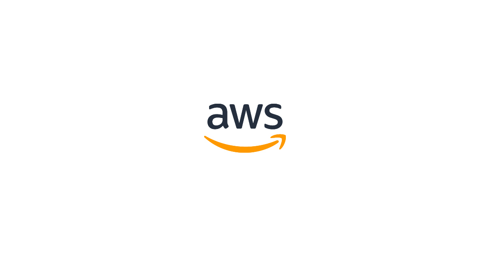

### E-COMMERCE 기업과 협업을 통해 구축한 AWS Personalize 서비스에 대해서 소개 해보려고 합니다.

### 추천 알고리즘

**Wish**는 기존의 전자상거래 는 고객이 검색을 해서 상품을 찾아 해당 상품을 구매하는식 이였습니다. 이를 타파하기 위해 노력한 기업이 Wish 인데,
Wish 같은 경우 쇼핑몰과 같이 상품을 전시하고 고객은 둘러 보다가 원하는 것을 고르는 식의 앱을 구현해 왔습니다

**아마존**은 평점(Rating), 구매행위(Buying Behavior) 그리고 검색행위(BrowsingBehavior) 정보들을 이용해 추천시스템을 운영하고 있습니다. 특히 Rating이 추천시스템에 있어서 중요한 역할을 하는데 아마존에서는 이를 명시적인 평점(Explicit Rating)와 암묵적인 평점(Implicit Rating)의 2가지로 구분해 활용하고 있습니다. 명시적인 평점은 사용자가 직접 주는평점을 의미하는 것이고, 암묵적인 평점은 구매행위와 피드백을 가공해 사용하고 있습니다.

**Netflix**는  “Netflix Prize Contest“라는 것을 개최해 머신러닝 발전에 혁혁한 공을 세우기도 했습니다.
Netflix Prize Contest를 통해 SVD(Singular Value Decomposition, 특이값 분해)과 ensemble의 중요성 등이 많이 부각되었고, 우승팀이 사용했던 방법과 수학 이론들을 많은 데이터과학자들과 머신러닝 개발자들에게 영감을 주었습니다.

**페이스북** 역시 추천시스템을 적극적으로 활용중인 회사인데 앞서 언급한 회사들과는 다르게 상품이나 뉴스 추천이 아니라 친구추천을 하는데 활용하고 있습니다. 친구추천은 전통적인 추천시스템의 대상이었던 상품과는 다른 성격을 가지고 있습니다.
상품추천의 목적은 매출의 증대와 같은 직접적인 목적을 가지고 있는 반면에 친구추천은 서로의 교류를 증대 시킬 목적을 가지고 있기 때문에 Link Prediction이라는 것에 중점을 두고 있습니다.

**AWS Personalize** 이전에 **추천**을 위해 사용하던 알고리즘 몇 가지를 소개하자면 다음과 같습니다.

- **편향된 추천 시스템**
- **왜곡된 추천 시스템**
- **체류 시간**
- **Collaborative Filtering**
- **Content-based filtering**
- **Hybrid**
- **User-based Collaborative Filtering**
- **Memory-based**
- **Model-based**
- **Demographic Data**
- **Customer Intent**
- **Wisdom of the Crowd**

---

### AWS Personalize 란?

**Amazon Personalize**는 개발자가 애플리케이션을 사용하는 고객에게 개별화된 추천을 손쉽게 생성할 수 있도록 하는 AWS의 기존 데이터와 노하우를 종합하여 만든 독자적인 기계 학습 서비스입니다. 개별화 추천을 위해 AWS Personalize 서비스에는 다양한 종류의 알고리즘 이 존재합니다. AWS 에서는 이 알고리즘을 **레시피**라고 표현을 합니다. 레시피를 사용하기 전에 AWS Personalize와 친해져 보도록 하겠습니다.

한가지 예를 들어보겠습니다. 제가(A) 좋아하는 맥주로 설명 해보겠습니다. 저 같은 경우 맥주 종류 중 '라거'를 좋아합니다. 
'라거'는 또 칭다오, 카스, 코로나 .. 등 수십, 수백가지의 제품이 있습니다.
그리고 여기에 저와 같은 취향의 맥주 '라거' 를 좋아하는 친구(B)가 있습니다.
 저는(A) 라거를 좋아하지만 다양한 제품을 즐겨보지는 못했습니다. 그에 반해 친구(B)는 매우 다양한 제품의 맥주를 먹어봤습니다. 
여기서 **B는 A의 친구이기 때문에 A는 B를 통해 맥주를 추천 받을 수 있습니다.**

Personalize는 이처럼 나와 비슷한 성향의 사람의 일련의 행동(이벤트)을 기준으로 학습하여 관련성 높은 추천을 생성할 수 있습니다.
물론 레시피 마다 필요로 하는 데이터가 차이가 있지만, 이번에 구현한 Personalize는 이와 같은 식의 알고리즘을 적용했습니다. 
 

> 그럼 이제 Personalize를 구현하기 위해 어떤 것이 필요한지 알았습니다.

---

### Personalize 구축 하기

먼저, 추천을 받기 위해서는 나와 비슷한 사람 임을 연결 시켜줄 데이터가 필요합니다. AWS Personalize는 데이터를 가져오기 위해서 필수적으로 충족해야할 요구 사항이 존재합니다.

- 쉼표로 구분된 값(CSV) 파일로 데이터를 포맷합니다. 
  -- 저 같은 경우에는 MongoDB를 사용하고 있었고, JSON 타입의 데이터를 CSV 형태로 변환하기 위하여 pandas를 이용하여 데이터 변환을 했습니다.
- Amazon Personalize가 데이터를 올바르게 가져올 수 있도록 스키마를 제공합니다. 
  -- Personalize에는 데이터에는 필수적으로 들어가야 할 Column이 존재합니다. 아래에서 보다 상세하게 말하겠습니다.
- Amazon Personalize가 액세스할 수 있는 Amazon Simple Storage Service(Amazon S3)에 파일을 업로드합니다. 
  -- CSV 파일을 S3에 업로드 함으로써 기본적인 세팅을 마칩니다.

추천 알고리즘을 구현하기 위해서 사용할 수 있는 몇 가지 방법이 존재합니다.

- AWS Console 을 이용하여 서비스를 구축하는 방법.
- Python의 경우 SDK(boto3)를 활용하여 서비스를 구축하는 방법.
- JS의 경우 AWS Amplify를 활용하여 서비스를 구축하는 방법.

 

- **Process [ AWS Console 을 사용한 방법 ]**

  1. 사용자 ID, 항목 ID 등에 대한 Personalize 예약 키워드를 사용하여 **데이터 세트를 정의**하는 **스키마를 생성**합니다.
  2. 모델 구축 및 예측에 사용되는 데이터 세트를 포함하는 **데이터 세트 그룹을 생성**합니다.  여기에는 사용자-항목 상호 작용(“누가 무엇을 좋아하는지”), 사용자 및 항목 데이터 세트가 포함될 수 있습니다.
      
  3. Personalize로 데이터를 보냅니다.
  4. **솔루션을 생성**합니다. 즉, 추천 레시피를 선택하고 데이터 세트 그룹에서 훈련합니다.
  5. 새로운 샘플을 예측하는 **캠페인을 생성**합니다.
  6. 생성한 캠페인을 통해 추천데이터를 받습니다.
      
      

- **Process [ AWS SDK를 사용한 방법 ]**

  세팅 전에 툴을 정합니다. 저는 Jupyter 를 사용하겠습니다. AWS Personalize에는 각 과정을 생성 및 설정 하기 위한 기능을 갖고 있는 [API](https://boto3.amazonaws.com/v1/documentation/api/latest/reference/services/personalize.html#Personalize.Client.list_solutions)가 존재 합니다. API를 활용하여 각 부분을 구성 하겠습니다.

  > 코드를 보여주면서 따라가지는 않겠습니다. 실제 SDK(boto3)를 활용 하면 실제 구현은 매우 쉽습니다.

<b> Data Formatting 과 형식만 잘 잡혔다면 데이터를 올리고 난후 모델 생성은 매우 간단합니다.</b>

### Personalize Update

#### Airflow를 활용한 방법

- Batch processing을 활용합니다. **Airflow** 는 batch scheduler 로써 큰 데이터를 특정 시간에 처리할 수 있도록 도와주는 스케줄러 입니다. 
  각 Task를 분리하여 특정 시간마다 AWS Personalize 일련의 과정을 생성 하는 과정을 반복합니다. 데이터가 클수록 소요시간이 길어집니다.

#### PutEvents API를 활용한 방법.

1.  PutEvents API를 통해 요구하는 형태의 데이터를 수집합니다. 
2.  Cloud Watch를 통해 생성된 데이터를 확인합니다. 
3.  최종적으로 create solution version -> campaign update 를 통해 추천결과를 업데이트 합니다.( 단 trainning을 주기적으로 해야합니다. ) 
    PutEvents시 데이터 업데이트가 이뤄지고, 트레이닝만 다시해주면 됩니다. 

> \*\* PutEvents API 는 실시간 업데이트를 실행하는 API임에도 트레이닝을 주기적으로 해줘야 하는 점은 의문 입니다. 리트레이닝 자체가 실시간 업데이트라는 의미가 퇴색 되는 것 아닌지.. ( by AWS solutions architect )

---

### Personalize 구축 중 생긴 문제 와 고려 사항

**실시간 데이터 처리**

초기 S3 에 CSV 파일로 다룬 item-user interaction data는 6900 여 개의 데이터로 recommendation 테스트를 하였고, recommendation의 경우 userId 를 기준으로 추천을 받았으며, 초기 구현시 예상 데이터로 각각의 userId 마다 서로 다른 추천 데이터를 받기를 기대 하였으나 결과적으로 각기 다른 userId에 같은 상품을 추천해주는 문제 가 발생하였습니다.

이후 문제를 초기 데이터 샘플의 수가 적어서 cold start recipe( 사용자에 대한 데이터가 없을때 사용하는 알고리즘 )를 기준으로 추천해주는 상태일 것이라 결론을 내리고, AWS 가이드라인 에 따라서 Put Events API를 활용하여 설정해 둔 Schema 의 Field에 맞춰서 events를 추가, 데이터 샘플 수를 증가 시켰습니다.

AWS Cloud Watch를 통해 Events가 에러 없이 추가 되는 것을 확인했습니다. 
[ S3 CSV 데이터 자체를 업데이트 한 것 이 아니며, 업데이트 된 실시간 데이터는 Cloud Watch 로만 확인이 가능한 점 이 불편했으나 데이터 가공 및 처리 자체를 AWS 알고리즘이 작동 하므로, 우리가 신경 쓸 부분이 아니라고 생각했습니다. ]

이벤트가 추가된 지표(25,000개)를 토대로 하여 Solution Version Update를 AWS 콘솔상에서 실행했습니다.  
이후 Get Recommendation 를 요청 했을때, 기존 데이터와 같은 추천값을 반환했습니다.

상식적으로 6900 개의 데이터와 25000 개의 데이터 간의 차이가 없는 것은 말이 안되므로,
AWS Personalize 설정 과정을 백트래킹 했고, 일련의 과정을 모두 재설정 하였습니다.

이후 solution version update 뿐만 아니라 campaign update 또한 필요하다는 걸 알게 되었습니다.

현재 크런치 프라이스는 Put Events를 활용한 실시간 데이터 업데이트 가 아닌 airflow 라는 scheduler 를 활용 하루에 쌓인 데이터를, 사용자가 적은 시간대에 S3 에 저장된 CSV 파일 부터 차례대로 import job - create solution version - update campaign의 과정을 통해 데이터를 업데이트, 사용자 추천 품목을 변화시키는 방안을 채택 활용하고 있습니다.

### 결론

Personalize 세팅에 있어서 고려해야 할 가장 주된 사항을 고른다면, AWS Personalize를 사용할 고객이 갖고 있는 데이터 가 Personalize에 요구하는 Schema Field에 맞도록 데이터를 알맞게 구성하는게 제일 중요한 부분이라고 생각합니다.

가령 크런치 프라이스의 예를 들면, 필수적으로 들어가는 TIMESTAMP 값이나 선택사항인 EVENT TYPE의 경우가 있습니다.
크런치 프라이스 사용자가 해당 상품 페이지에 접속한 시간을 TIMESTAMP 값으로 넣어줬으며 , EVENT TYPE은 Click, Add to Cart 등 과 같이 의미있는 값을 데이터로 넘겨야 보다 정확한 추천 결과를 받을 수 있습니다.

또한 사용자 입맛에 맞게 recipe라 불리는 알고리즘을 선택 하여 추천에 적용할 수 있으므로, 초기 AUTO 로 AWS 추천해주는 레시피 대로 추천 알고리즘을 사용하다가, 이후 지표를 확인후에 solution을 수정하거나 추가하는 식으로 보다 정확한 추천을 받을 수 있습니다.

---
