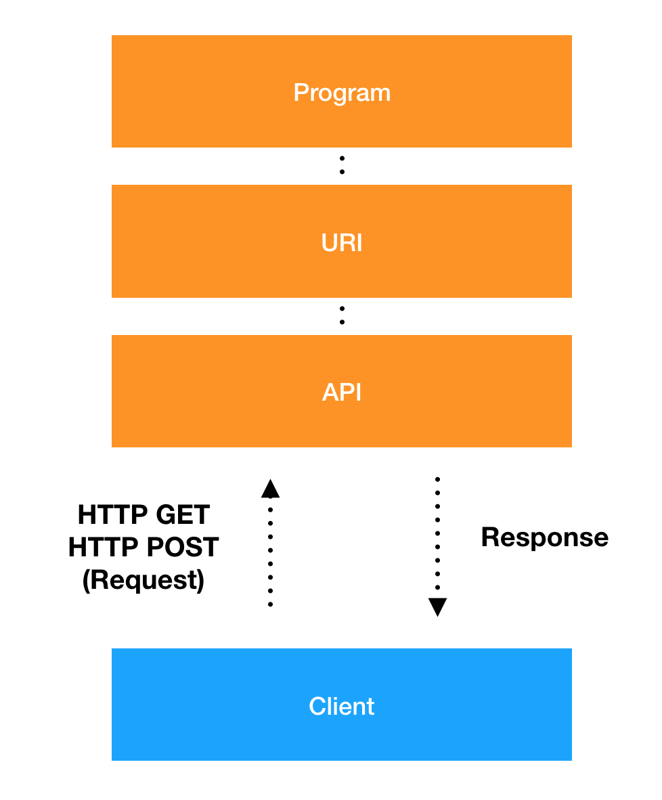

### API

**API(Application Program Interface)**

- 정의 - 다른 소프트웨어를 제어하기 위해 미리 <b>약속된 인터페이스</b> 나 <b>규약</b>
- 효과 - 반복되는 코드를 *API*로 이용함으로써 소스 코드의 재사용성을 높여 개발 *생산성*을 올릴 수 있습니다.

---

### WEB API

- *HTTP/HTTPS*와 같은 웹 프로토콜을 사용하여 네트워크를 통해 호출하는 API, 웹에서 접근 가능한 특정 _URI_ 에 *HTTP 요청*을 보내고 이에 대한 응답으로 필요한 정보를 얻어냅니다.
- 클라우드 서비스에서 많이 사용합니다.

<!-- ### SOA
+ 대규모 시스템 구축 시 업무상의 일에 해당하는 부분을 소프트웨어의 서비스로 판단하여 네트워크에 연동하며 시스템을 구축해 가는 방법론 입니다.
+ 폐쇄적인 네트워크 안에서 사내 정보 시스템들을 연계 합니다. -->

---

### 웹 API의 통신 방법 변화

> SOAP -> REST

---

### WEB API의 구성 요소

- 인증 처리 : _액터_ 를 식별하는 처리 과정
- 제어할 대상 : *리소스*에 해당하며 *URI*로 표현
- 제어 행위 : *액션*에 해당하며 주로 *HTTP Method*로 표현 
  **CRUD (Create, Read, Update, Delete)**

---

### URI(Uniform Resourcd Identifier)

- *API*에서 _리소스를 지정_ 할 때 사용
- _네트워크 부분 + 경로 부분_

---

### 도메인

- 네트워크 상에서 자원(리소스)의 위치를 표현할때 사용
- IP 주소와 같이 숫자 형태가 아니라 사람이 식별하기 쉬운 문자 형태
- 오른쪽 -> 왼쪽으로 읽으면 계층 구조가 표현이 됩니다.(Domain Tree)

---

### DNS

- 도메인과 IP주소 사이에 변환 기능을 해줍니다.
- TCP/IP 에서는 통신을 할 때 도메인을 IP 주소로 변환해서 사용
- 정방향 조회 : 도메인 -> IP 주소 조회
- 클라우드 환경 에서는 주로 정방향 조회가 일어납니다.

---

### 도메인과 IP 주소의 변환 방법

---

### 엔드포인트

- 클라우드에 공개된 API를 실행하기 위해 접속하는 연결 접점을 엔드포인트 라고 합니다.
- 엔드포인트는 FQDN으로 표현되는데 API 접점으로 일종의 게이트웨이 역할을 합니다.
- 클라우드 환경에서는 인프라 컴포넌트를 제어하기 위해 엔드포인트에 접속합니다.
- 엔드포인트는 주로 IP주소가 아닌 도메인으로 접속을 합니다

---

### 리소스 지정 방법

- API를 호출하는 URL에 리소스를 식별할 수 있는 정보 
  -- _REST API_ : 계층화된 경로 정보로 리소스를 식별합니다. 

---

### REST API

**REST**는 웹의 장점을 최대한 활용할 수 있는 아키텍처 입니다.  
REST는 기존 RPC나 SOAP 등 복잡한 프로토콜로 통신하는 것보다 이미 널리 사용하는 HTTP 프로토콜로 통신하는 것이 더 효율적이라는 내용입니다. REST는 자원 지향 구조로 접근하고자 하는 자원에 고유한 URI를 부여하는 방식입니다.

- REST API 의 구성
  - 자원(Resource) - URI
  - 행위(Verb) - HTTP METHOD
  - 표현(Representations)

---

### RESTful API 설계

---

### ---

### ERROR | ISSUE

> <b> - </b>

Reference  
[API](https://jungwoon.github.io/infra,%20api,%20cloud/2019/01/31/Api-Summary/)  
[그림으로 배우는 클라우드 인프라](https://book.naver.com/bookdb/book_detail.nhn?bid=12071725)  
[REST](https://meetup.toast.com/posts/92) 
[Restful API 설계](https://sanghaklee.tistory.com/57)  
[Restuful API 설계2](https://spoqa.github.io/2012/02/27/rest-introduction.html)

  

