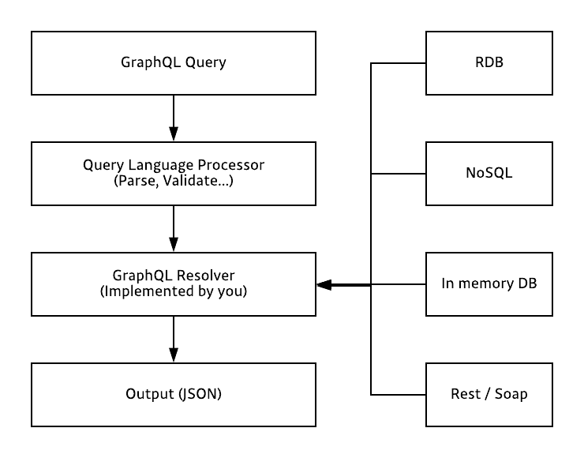
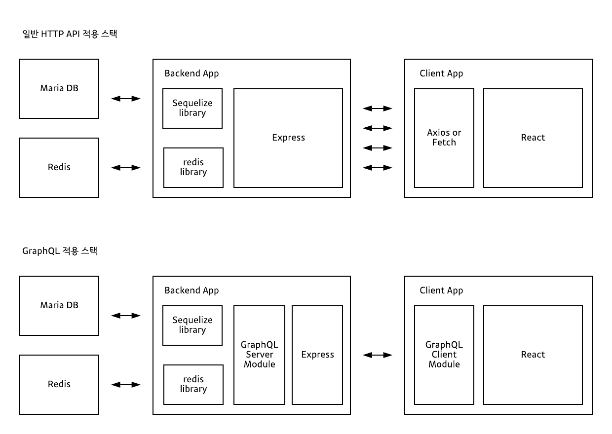
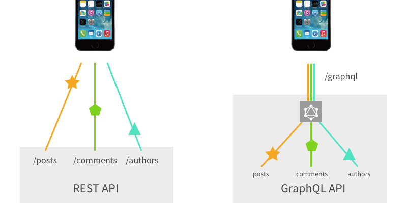

### GraphQL

---

GraphQl은 SQL 과 마찬가지로 쿼리 언어 입니다.
기존의 웹 은 어플리케이션의 API를 구현할 때, 통상적으로 **REST API** 를 사용합니다. 우리가 클라이언트 사이드에서 어떠한 기능이 필요할 때마다 그때 그때 새로운 API를 만들어 주었어야 했습니다.

---

### SQL VS GQL

- SQL은 데이터베이스 시스템에 저장된 데이터를 효율적으로 가져오는 것이 목적 입니다.
- GQL은 웹 클라이언트가 데이터를 서버로 부터 효율적으로 가져오는 것이 목적 입니다.

```sql
SELECT plot_id, species_id, sex, weight, ROUND(weight / 1000.0, 2) FROM surveys;
```

```gql
{
  hero {
    name
    friends {
      name
    }
  }
}
```

---

### GraphQL

GraphQL은 페이스북에서 만든 어플리케이션 레이어 쿼리 언어 입니다.<br>

- 클라이언트측 에서 서버쪽으로 필요한 정보를 쿼리로 만들어서 서버에 전달합니다.
- 서버는 이를 토대로 프로세싱 하여 주어진 틀 대로 데이터를 보여주는 것이 **GraphQL** 의 역할 입니다.

- 쿼리를 통하여 필요한 데이터만 fetching 하기 때문에 overfetch / underfetch 할 걱정을 할 필요가 없습니다.

```js
쿼리
query {
    account(id: "1") {
        username
        email
        firstName
        lastName
        friends {
            firstName
            username
        }
    }
}
```

```js
결과
{
  "data": {
    "account": {
      "username": "velopert",
      "email": "public.velopert@gmail.com",
      "firstName": "Minjun",
      "lastName": "Kim",
      "friends": [
        {
          "firstName": "Jayna",
          "username": "jn4kim"
        },
        {
          "firstName": "Abet",
          "username": "abet"
        }
      ]
    }
  }
}
```

---

### 장점

특정 언어에 제한된 기술이 아니기 때문에, 여러 환경에서 사용할 수 있으며, 이미 구현된 시스템에 도입을 해도 기존에 있던 시스템이 무너지지 않기 때문에 부담 없이 적용할 수 있습니다.

---

### PipeLine



<center>

source : https://tech.kakao.com/2019/08/01/graphql-basic/

</center>

<br>

서버사이드 GQL 어플리케이션은 GQL로 작성된 쿼리를 입력으로 받아 쿼리를 처리한 결과를 다시 클라이언트로 돌려줍니다.

---

### REST API 와 비교

REST API는 URL, METHOD등을 조합하기 때문에 다양한 Endpoint가 존재 합니다. 반면, GQL은 단 하나의 Endpoint가 존재 합니다. 또한, GQL API에서는 불러오는 데이터의 종류를 쿼리 조합을 통해서 결정 합니다. <br>예를 들면, REST API에서는 각 Endpoint마다 데이터베이스 SQL 쿼리가 달라지는 반면, GQL API는 GQL 스키마의 타입마다 데이터베이스 SQL 쿼리가 달라집니다.


<center>

source : https://tech.kakao.com/2019/08/01/graphql-basic/

</center>

---

### HTTP와 GQL의 기술 스택 비교

<br>



<center>

source : https://blog.apollographql.com/graphql-vs-rest-5d425123e34b

</center>

REST API와 GraphQL API의 사용
위 그림처럼, gql API를 사용하면 여러번 네트워크 호출을 할 필요 없이, 한번의 네트워크 호출로 처리 할 수 있습니다.

---

### GraqhQL의 Structure

#### 쿼리 / 뮤테이션 ( query / mutation )

쿼리와 뮤테이션 그리고 응답 내용의 구조는 상당히 직관적 입니다. 요청하는 쿼리문의 구조와 응답 내용의 구조는 거의 일치 합니다.

```gql
 {                                           {
   hero {                                       "data" : {
     name                                           "hero" : {
     friends {                                          "name" : "WALL-E"
       name                                         }
     }                                           }
   }
 }                                           }
 쿼리문                                        응답
```

> 즉 요청 쿼리를 응답 쿼리 구조와 비슷하게 하면 된다 라는 말

---

<center>

### ---

### ERROR | ISSUE

</center>

> <b> - </b>

<hr />

<center>

Reference <br>
[GraphQL-velopert](https://velopert.com/2318) <br>
[GraphQL-kakao](https://tech.kakao.com/2019/08/01/graphql-basic/)<br>
[GraphQL 공식홈페이지](https://graphql.org/)

</center>
