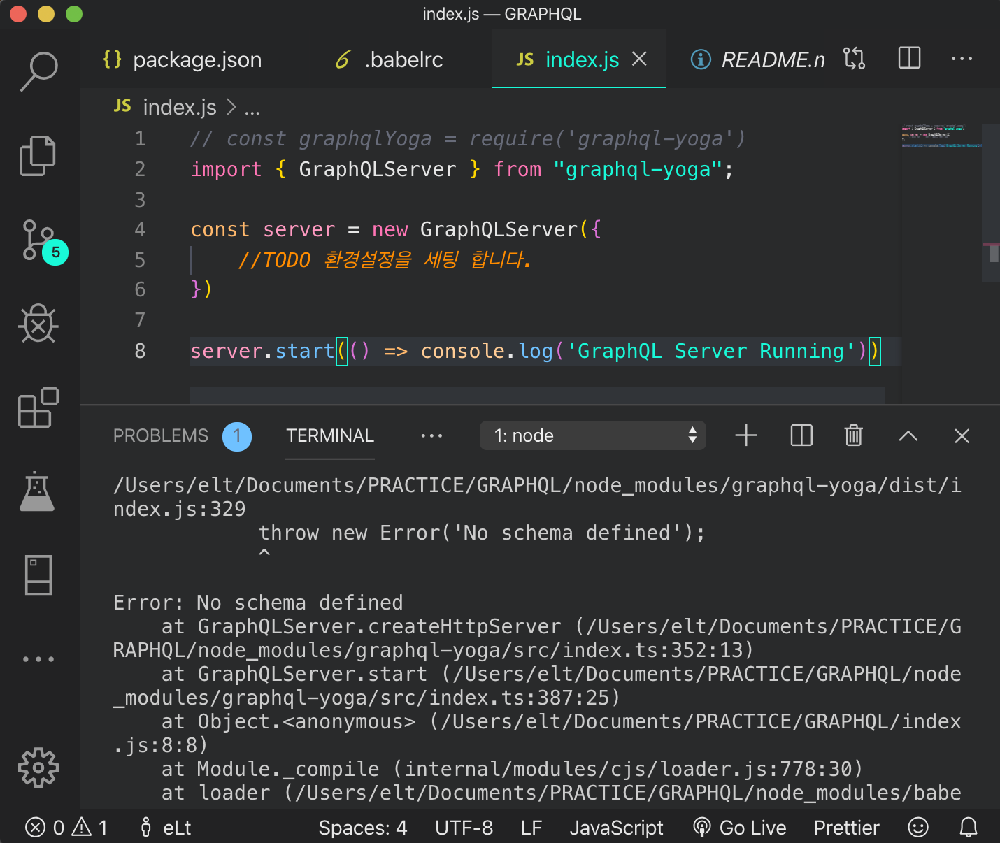
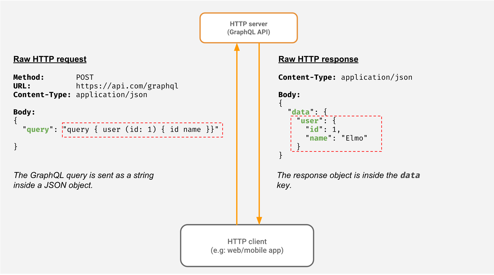

먼저 GraphQL의 특징을 먼저 복습 해보겠습니다.<br>

### Problems solved by GraphQL

- #### Over-fetching<br>

  /users/ GET <br>
  --  
  가령 모든 유저의 이름을 웹 사이트에 보여주고 싶다고 가정하겠습니다.<br>
  /users/ GET 을 통해서 유저정보를 가져올 것 입니다. <br>
  하지만 우리는 유저의 이름만을 원하는 반면에 성별, 프로필 사진 등 유저의 모든 정보를 줄 것 입니다.<br>
  **Database에 내가 사용하지 않을 영역을 요청하는 방식은 비효율적 입니다.**<br>
  이와 같은 상황을 _Over-fetching_ 이라고 합니다. 요청한 영역의 정보보다 더 많은 정보를 서버에서 받는 것 입니다.

  이를 해결하는 방법은 프론트엔드 에서 DB에 오직 사용자 명만을 요청하는 방법이 있습니다.<br>
  그리고 이를 **GraphQL**로 해결할 수 있습니다.

- #### Under-fetching<br>

  /users/1/ GET <br>
  /notification <br>
  /feed<br>
  --  
  위와 같이 앱을 시작할때 REST에서 하나를 완성하려 많은 소스롤 요청하는 것을 _Under-fetching_ 이라고 합니다.
  **GraphQL**은 URL 체계도 없으며 URL도 없습니다. **오로지 하나의 _endpoint_ 만이 존재합니다** <br>
  /graphql 처럼 말이죠 이름은 상관없습니다. 하지만 단 하나만 존재 합니다.<br>

  위 3번의 과정을 한번의 Query로 처리 가능합니다.

  ```sql
    // Query는 DB에 무언가를 요청하는 GraphQL 언어로 내가 원하는 정보를 알려줄 수 있습니다.
    query {
      feed {
        comments
        likeNumber
      }
      notification{
        isRead
      }
      user{
        username
        profilePic
      }
    }
  ```

  위와 같이 query를 보내면 백엔드 에서는 아래 처럼 위 요청 정보를 담은 Object를 보냅니다.

  ```js
    {
      feed : [
        {
          comments : 1,
          likeNumber : 20,
        }
      ],
      notification : [
        {
          isRead : true,
        },
        {
          isRead : false,
        }
      ],
      user :  {
        username : 'CH',
        profilePic : 'http:',
      }
    }

  ```

  graphQL은 내가 원하는 정보만을 받을 수 있게 도와줍니다.

---

<center>

#### GraphQL 실습 [ Nomad Coders ]

</center>

- 먼저, GraphQL을 실습할 Github Repository를 생성합니다.

  1. GraphQL 을 실습할 폴더를 생성합니다.
  2. yarn init 을 터미널에서 입력합니다.<br>
     description, repository url 을 차례대로 입력합니다.
  3. 내 origin에 생성한 repository를 remote에 추가합니다.
  4. git pull origin master

* [GraphQL-Yoga](https://github.com/prisma-labs/graphql-yoga)를 사용할 겁니다.<br>
  GraphQL-Yoga 는 React의 CRA와 비슷합니다. 매우 간편하게 서버를 설정할 수 있습니다.

```js
$ yarn add graphql-yoga 를 입력합니다.
```

```js
$ yarn global add nodemon 노드몬을 설치해줍니다.
```

- index.js 파일을 생성합니다.
- package.json에 nodemon을 추가합니다.

```js
  "scripts" :{
      "start": "nodemon"
  }
```

- **yarn start** 를 실행하면 index.js 내의 코드가 실행됩니다. 수정 시 nodemon이 자동으로 서버를 재시작 합니다.

<br>

다음으로 babel 세팅을 하겠습니다.

```js
$ yarn add babel-node --dev
```

```js
$ yarn global add babel-cli
```

- package.json scripts를 수정 해줍니다.

```js
  "scripts": {
    "start": "nodemon --exec babel-node index.js"
  },
```

- .babelrc 파일을 생성한뒤, 초기 세팅을 해줍니다.

```js
{
    "presets": ["env", "stage-3"]
}
```

```js
$ yarn add babel-cli babel-preset-env babel-preset-stage-3 --dev
```

- index.js 에 graphql-yoga를 import 합니다.

```js
  // const graphqlYoga = require('graphql-yoga')
  import { GraphQLServer } from "graphql-yoga";

  console.log('hello') 를 추가하여 yarn start 시 문제없이 콘솔이 찍히는지 확인합니다.
```

- sever를 구성 합니다.



- schema 에러가 납니다. schema 를 구성 합니다.
- graphql 폴더를 생성합니다.
- schema.graphql 형식의 schema를 생성합니다.

### graphql의 schema

#### Object types and fields

가장 기본적인 GraphQL 스키마 구성 요소는 단순히 저의 서비스에서 가져올 수 있는 객체와 그 객체가 가지고 있는 필드를 보여주는 Object Type 입니다.

```js
  이런식으로 스키마를 구성합니다.

  type Query{
    name: String!
  }
```

### resolvers

Resolver란 query에서 특정 필드에 대한 요청이 있을 때, 그것을 어떤 로직으로 처리할지 GraphQL에게 알려주는 역할을 합니다.

- resolvers.js 를 생성합니다.

```js
const resolvers = {
  Query: {
    name: () => 'CH'
  }
};
export default resolvers;
```

<br>

- index.js 에 resolvers를 추가합니다.

```js
// const graphqlYoga = require('graphql-yoga')
import { GraphQLServer } from 'graphql-yoga';
import resolvers from './graphql/resolvers';

const server = new GraphQLServer({
  //TODO 환경설정을 세팅 합니다.
  typeDefs: 'graphql/schema.graphql',
  resolvers
});

server.start(() => console.log('GraphQL Server Running'));
```

- GraphQL Server Running이 실행되며, localhost:4000에 접속이 가능합니다.

### GraphQL FLOW

- Query를 보내면 GraphQL이 해당 서버에서 요청을 받고 서버에 정의되어 있는 schema 에서 일치하는 데이터를 찾고, resolver를 찾습니다. 즉 schema 에 일치하는 field가 resolver에도 있어야 합니다.


<br>
<br>


<center>

**GraphQL은 Operation(질문) 을 Resolve(해결)하는 함수를 만드는 것**

</center>

<hr />

<center>

Reference <br>
[GraphQL-nomad](https://academy.nomadcoders.co/courses/) <br>

</center>
