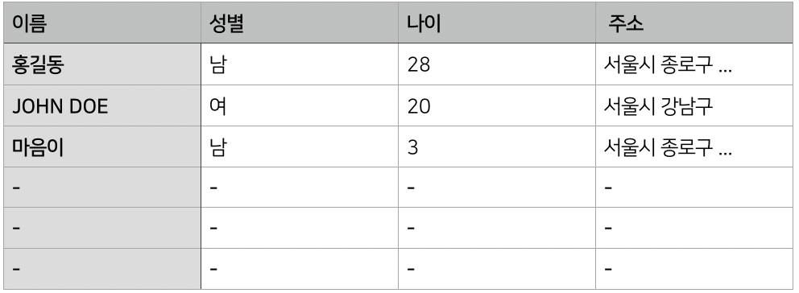

## DATABASE 란?

#### 먼저 데이터,

데이터는 어떤 것들의 ‘기록 정보’이고, 이러한 데이터를 모아 둔 것을 데이터베이스라고 합니다. 과거에는 이런 정보들을 문서에 직접 손으로 기록하여 관리하는 수밖에 없었습니다. 하지만 지금은 IT 기술이 발달하면서 정보들을 컴퓨터로 관리할 수 있게 되었습니다. 이로써 데이터를 좀 더 일관되고 효율적으로 관리할 수 있게 되었고, 데이터를 여러 가지 형태로 가공하거나 분석하는 것뿐만 아니라 신속하게 찾아내 출력할 수 있게 되었습니다.

방대한 데이터를 효율적으로 관리할 수 있는 컴퓨터 프로그램을 만들었는데, 이를 **데이터베이스 관리 시스템(DBMS, DataBase Management System)**이라고 합니다. **데이터베이스**란 **데이터를 모아 놓은 것**으로, 이런 데이터베이스를 관리하는 소프트웨어가 바로 **DBMS**입니다. 데이터베이스를 관리한다는 것은 데이터베이스 안에 데이터를 저장하고, 필요한 데이터를 꺼내 보고, 저장된 데이터를 수정하거나 삭제하는 행위를 의미하는데, 이런 일련의 작업을 DBMS가 처리합니다.

### 테이블


테이블은 "표" 입니다. 테이블은 **행(row**) 과 **열(column)**로 구성되어 있습니다. 컬럼은 테이블을 구성하는 **속성(attribute)** 을 뜻합니다. 즉 컬럼이 테이블에 저장될 데이터 유형을 결정합니다.
따라서 테이블을 정의할때 는 어떤 로우가 아닌 어떤 컬럼으로 구성할 것인지를 정해야 합니다.

---

### 관계형 데이터 베이스

**열(column, 컬럼)**과 **행(row, 로우)**을 갖는 2차원 테이블을 중심으로 설계된 데이터베이스 입니다.<br>
수많은 데이터를 ‘키(key)’와 ‘관계’라는 연결 고리로 연결하여 원하는 데이터를 조회하고 가공하는 방식의 데이터베이스입니다.<br>
컬럼이 테이블에 저장될 데이터 유형을 결정하므로 실제 테이블을 만들 때는 컬럼에 대한 내용만 기술합니다.



컬럼은 테이블을 구성하는 데이터의 속성(attribute)을 말합니다. 그림을 보면 첫 번째 컬럼은 이름을, 두 번째 컬럼은 성별을 나타냅니다. 이름 컬럼에는 누군가의 이름만, 성별 컬럼에는 그 사람의 성별만 들어가도록 미리 결정해 놓은 것 입니다. 이런 컬럼들이 모여 하나의 테이블을 구성합니다. 반면 로우는 지정된 컬럼 데이터로 이루어진 하나의 묶음입니다. 따라서 컬럼별로는 이름, 성별처럼 그 성격이 다르지만, 로우별로는 ‘이름,성별’이 한 묶음이 되어 성격이 다르지 않습니다.

컬럼이 테이블에 저장될 데이터 유형을 결정하므로 실제 테이블을 만들 때는 컬럼에 대한 내용만 기술합니다.<br> 테이블을 정의할 때는 어떤 로우가 아닌 어떤 컬럼으로 구성할 것인지를 정하는 것 입니다.

위의 그림은 회원정보를 저장하는 테이블로 이름, 성별, 나이, 주소 의 필수적인 칼럼을 갖고 있습니다. 그런데 데이터 저장 관점에서 보면 회원정보 테이블에 주소까지 저장하는 것은 비효율적 입니다. 주소는 다른 성격의 데이터에 비해 길고 중복 요소가 많기 때문입니다.<br>
서울시 종로구 XX동에 산다고 할 경우 회원정보 테이블에 주소 컬럼을 두고 ‘서울시 종로구 XX동’을 저장해 놓으면 저장 공간이 크게 낭비됩니다. 주소는 이름이나 성별에 비해 데이터 크기가 큰데, 똑같은 데이터를 10만 건이나 저장해 갖고 있기 때문이죠.

한 테이블에 몰아넣는 대신 별도로 주소 테이블을 만들고, 회원정보 테이블에는 주소 테이블의 특정 주소를 가리키는, 데이터 크기가 작은 컬럼(보통 숫자형 컬럼을 사용합니다)을 둔다면 훨씬 효율적일 것입니다

- RDBMS의 관계<br>
  -- 데이터 성격에 맞게 테이블을 여러개로 분리하고 분리한 테이블 간에 연결고리 역할을 하는 컬럼을 두어 이 컬럼을 이용해 관계를 맺는 것.

  <br>

- RDBMS의 유형<br>
  -- 데이터 저장 관점: 필요한 데이터만 적재적소에 저장해 두는 것이 효율적 입니다. 가급적 중복된 데이터는 저장하지 않는것이 좋습니다.<br>
  -- 데이터 조회 관점: 원하는 데이터를 쉽게 찾을 수 있어야 합니다.<br>
  -- 데이터 수정 관점: 특정 데이터만 선택하여 원하는 값으로 수정할 수 있어야 합니다.<br>
  -- 데이터 삭제 관점: 원하는 데이터만 지울 수 있어야 합니다.

  <br>

* RDBMS 의 단점 <br>
  -- 컬럼과 관련된 것인데, 테이블 생성 시 컬럼의 유형을 정의하면 나중에 변경할 때 문제 발생 소지가 많다는 점 입니다.
  예를들어, 회원 정보와 관련된 데이터만 넣으려고 했는데 컬럼을 삭제하거나 새로운 컬럼을 추가해야하는 상황이 생기면 컬럼 변경으로 인해 기존에 이 테이블을 사용했던 프로그램을 모두 수정해야 한다는 번거로움이 생깁니다.

    <br>

- RDBMS 의 특징<br>
  -- 데이터 성격에 맞게 테이블을 여러 개로 분리하고, 분리한 테이블 간에 연결고리 역할을 하는 컬럼을 두어 이 컬럼을 이용해 관계를 맺는 것 입니다.

### Key

데이터 무결성을 확보하기 위해 테이블에는 반드시 하나의 키가 되는 컬럼을 두어야 합니다. 같은 이름의 값을 분별하기 위해 사용할 값으로, `primary key`(기본키) 를 활용합니다.
`foreign key`(외래키)

---

## SQL

SQL은 관계형 데이터베이스에서 사용하는 컴퓨터 언어입니다.
DB에 접근하여 데이터를 조회, 입력, 수정, 삭제 하기 위해 사용합니다.

- SQL의 종류

  <br>

  | DDL            | DML    | TCL      |
  | :------------- | :----- | :------- |
  | CREATE         | MERGE  | ROLLBACK |
  | DROP           | SELECT | COMMIT   |
  | ALTER          | INSERT |          |
  | TRUNCATE TABLE | UPDATE |          |
  | RENAME         | DELETE |

### 테이블 생성

```sql
CREATE TABLE table_name(
    column_name1 datatype [NOT] NULL,
    column_name2 datatype [NOT] NULL,
    ...
    PRIMARY KEY(column_list)
);

```

### 컬럼의 데이터형

- 대체로 문자형 컬럼은 `VARCHAR2` 형으로 만듭니다. `VARCHAR2(n)` 은 가변 길이 문자, 최대 4000byte 입니다.
- 숫자형은 `NUMBER` 형으로 만듭니다.
- 날짜형은 `DATE` 형으로 만듭니.
- `NULL`은 해당 컬럼에 값이 들어갈지 / 안들어갈지를 명시합니다.

### ORACLE Live SQL


<center>

[ORACLE](https://livesql.oracle.com/) 페이지 에서 SQL 을 실제 생성 연습할 수 있습니다.

</center>

```sql
# academy라는 테이블을 생성합니다.
CREATE TABLE academy (
    student_name    VARCHAR2(10) NOT NULL,
    age             NUMBER NOT NULL,
    major           VARCHAR2(10) NULL,
    job             VARCHAR2(10) NULL,
    rg_date         DATE NOT NULL,
    PRIMARY KEY( student_name , rg_date )
)
```

### 테이블 조회

```sql
SELECT * FROM academy;
```

### 데이터 입력 INSERT

테이블에 데이터를 입력하는데 필요한 정보는 크게 테이블 명, 컬럼 명과 개수, 컬럼에 들어갈 데이터 로 구분할 수 있습니다.

```sql
INSERT INTO TABLE_NAME(column1, column2, column3, ...)
VALUES( value1, value2, ... )
```

<hr />
<center>

Reference <br>
[누구나 쉽게 SQL](http://www.kyobobook.co.kr/product/detailViewKor.laf?ejkGb=KOR&mallGb=KOR&barcode=9791160508161&orderClick=LAG&Kc=)<br>
[모두의 SQL](http://www.kyobobook.co.kr/product/detailViewKor.laf?ejkGb=KOR&mallGb=KOR&barcode=9791160505771&orderClick=LAG&Kc=)<br>
[TCP-IP](http://tcpschool.com/mysql/mysql_intro_intro)<br>
[데이터베이스의 이해](https://www.slideshare.net/asukakoogy/ss-11984171)<br>
[ORACLE](https://docs.oracle.com/cd/B28359_01/server.111/b28310/tables003.htm#ADMIN11004)

</center>
