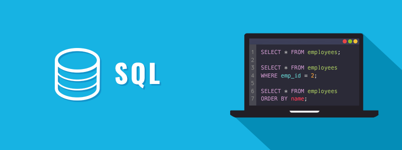
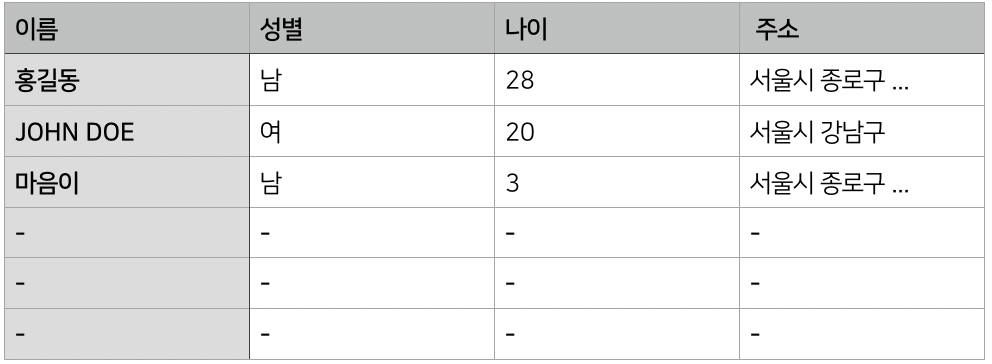
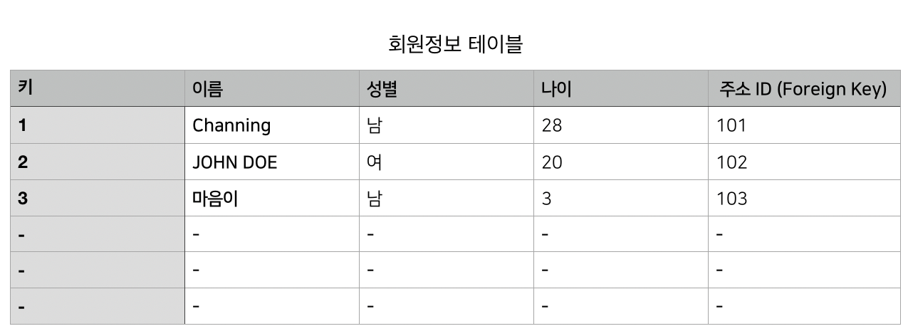
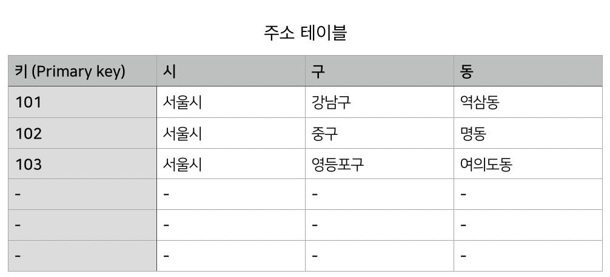

## DATABASE 란?

### 먼저 데이터,

데이터는 어떤 것들의 ‘기록 정보’이고, 이러한 데이터를 모아 둔 것을 데이터베이스라고 합니다.

데이터를 효율적으로 관리하는 프로그램을 **DBMS**라고 합니다. **데이터베이스**란 **데이터를 모아 놓은 것**으로, 이런 데이터베이스를 관리하는 소프트웨어가 바로 **DBMS**입니다. 데이터베이스를 관리한다는 것은 데이터베이스 안에 데이터를 저장하고, 필요한 데이터를 꺼내 보고, 저장된 데이터를 수정하거나 삭제하는 행위를 의미하는데, 이런 작업을 DBMS가 처리합니다.

---

### 테이블


테이블은 "표" 입니다. 테이블은 **행(row**) 과 **열(column)**로 구성되어 있습니다. 컬럼은 테이블을 구성하는 **속성(attribute)** 을 뜻합니다. 즉 컬럼이 테이블에 저장될 데이터 유형을 결정합니다.
따라서 테이블을 정의할때 는 어떤 로우가 아닌 어떤 컬럼으로 구성할 것인지를 정해야 합니다.

---

### 관계형 데이터 베이스

**열(column, 컬럼)**과 **행(row, 로우)**을 갖는 2차원 테이블을 중심으로 설계된 데이터베이스 입니다.<br>
수많은 데이터를 ‘키(key)’와 ‘관계’라는 연결 고리로 연결하여 원하는 데이터를 조회하고 가공하는 방식의 데이터베이스입니다.<br>



컬럼은 테이블을 구성하는 데이터의 속성(attribute)을 말합니다. 이런 컬럼들이 모여 하나의 테이블을 구성합니다.

> 위의 그림은 회원정보를 저장하는 테이블로 이름, 성별, 나이, 주소 의 필수적인 칼럼을 갖고 있습니다. 그런데 데이터 저장 관점에서 보면 회원정보 테이블에 주소까지 저장하는 것은 비효율적 입니다. 주소는 다른 성격의 데이터에 비해 길고 중복 요소가 많기 때문입니다.<br>
> 서울시 종로구 XX동에 산다고 할 경우 회원정보 테이블에 주소 컬럼을 두고 ‘서울시 종로구 XX동’을 저장해 놓으면 저장 공간이 크게 낭비됩니다. 주소는 이름이나 성별에 비해 데이터 크기가 큰데, 똑같은 데이터를 수십건이나 저장해 갖고 있기 때문이죠.

한 테이블에 몰아넣는 대신 별도로 주소 테이블을 만들고, 회원정보 테이블에는 주소 테이블의 특정 주소를 가리키는, 데이터 크기가 작은 컬럼(보통 숫자형 컬럼을 사용합니다)을 둔다면 훨씬 효율적입니다.




- RDBMS의 관계<br>
  -- 데이터 성격에 맞게 테이블을 여러개로 분리하고 분리한 테이블 간에 연결고리 역할을 하는 컬럼을 두어 이 컬럼을 이용해 관계를 맺는 것.

  <br>

- RDBMS의 유형<br>
  -- 데이터 저장 관점: 필요한 데이터만 적재적소에 저장해 두는 것이 효율적 입니다. 가급적 중복된 데이터는 저장하지 않는것이 좋습니다.<br>
  -- 데이터 조회 관점: 원하는 데이터를 쉽게 찾을 수 있어야 합니다.<br>
  -- 데이터 수정 관점: 특정 데이터만 선택하여 원하는 값으로 수정할 수 있어야 합니다.<br>
  -- 데이터 삭제 관점: 원하는 데이터만 지울 수 있어야 합니다.

  <br>

* RDBMS 의 단점 <br>
  -- 컬럼과 관련된 것인데, 테이블 생성 시 컬럼의 유형을 정의하면 나중에 변경할 때 문제 발생 소지가 많다는 점 입니다.
  예를들어, 회원 정보와 관련된 데이터만 넣으려고 했는데 컬럼을 삭제하거나 새로운 컬럼을 추가해야하는 상황이 생기면 컬럼 변경으로 인해 기존에 이 테이블을 사용했던 프로그램을 모두 수정해야 한다는 번거로움이 생깁니다.

    <br>

- RDBMS 의 특징<br>
  -- 데이터 성격에 맞게 테이블을 여러 개로 분리하고, 분리한 테이블 간에 연결고리 역할을 하는 컬럼을 두어 이 컬럼을 이용해 관계를 맺는 것 입니다.

### Key

데이터 무결성을 확보하기 위해 테이블에는 반드시 하나의 키가 되는 컬럼을 두어야 합니다. 같은 이름의 값을 분별하기 위해 사용할 값으로, `primary key`(기본키) 를 활용합니다.
테이블에서 유일하게 로우를 식별하는 키를 `기본 키(primary key)`, 다른 테이블의 기본 키와 연결고리가 되는 키를 `참조 키(foreign key)`라고 합니다.
참조 키 컬럼은 `참조 키(foreign key)`를 중복으로 갖을 수 있습니다.

---

### 관계

---

**1. 일대일 관계**

> 인사 테이블

| 인사 ID | 이름     |
| :------ | :------- |
| 01      | TOM      |
| 02      | Channing |
| 03      | Brown    |
| 04      | John Doe |

> 주민번호 테이블

| 주민번호       | 인사 ID |
| :------------- | :------ |
| 111111-1111111 | 01      |
| 222222-2222222 | 02      |
| 333333-3333333 | 03      |
| 444444-4444444 | 04      |

| 인사 테이블 | 주민번호 테이블 |
| :---------: | :-------------: |
|      1      |        1        |

> 한명의 사람은 하나의 주민번호만을 가질 수 있습니다. 일대일 관계 입니다.

**2. 일대다 관계**

> 직급테이블

| 직급 | 인사 ID |
| :--- | :-----: |
| 사장 |   01    |
| 부장 |   02    |
| 차장 |   03    |
| 팀장 |   04    |
| 대리 |   05    |
| 대리 |   06    |
| 사원 |   07    |
| 사원 |   08    |
| 사원 |   09    |
| 사원 |   10    |

> 인사 테이블

| 인사 ID | 이름     |
| :------ | :------- |
| 01      | TOM      |
| 02      | Channing |
| 03      | Brown    |
| 04      | John Doe |
| 05      | Jay      |
| 06      | Won      |
| 07      | Ji       |
| 08      | Sung     |
| 09      | Min      |
| 10      | So       |

| 인사 테이블 | 직급 테이블 |
| :---------: | :---------: |
|      1      |      N      |

> 한명의 직원은 하나의 직급만을 가질 수 있으나 직급에 해당하는 사람은 여러명 입니다.

**3. 다대다 관계**

> 인사테이블

| 인사 ID | 이름     | 주소     |
| :------ | :------- | :------- |
| 01      | TOM      | Suwon    |
| 02      | Channing | Seoul    |
| 03      | Brown    | Busan    |
| 04      | John Doe | Seongnam |

> 취미 테이블

| 취미 ID | 취미 | 인사ID |
| :------ | :--- | :----- |
| 01      | 독서 | 02     |
| 02      | 그림 | 01     |
| 03      | 농구 | 04     |
| 04      | 축구 | 03     |
| 05      | 독서 | 01     |
| 06      | 요리 | 02     |
| 07      | 영화 | 03     |
| 08      | 축구 | 04     |

| 인사 테이블 | 취미 테이블 |
| :---------: | :---------: |
|      N      |      N      |

> 한명의 사람은 여러개의 취미를 가질수 있으며 취미는 여러사람이 같은 취미를 가질 수 있습니다.

---

## SQL

### ORACLE Live SQL


<center>

[ORACLE](https://livesql.oracle.com/) 페이지 에서 SQL 을 실제 생성 연습할 수 있습니다.

</center>

---

SQL은 관계형 데이터베이스에서 사용하는 컴퓨터 언어입니다.
DB에 접근하여 데이터를 조회, 입력, 수정, 삭제 하기 위해 사용합니다.

- SQL의 종류

  <br>

  | DDL            | DML    | TCL      |
  | :------------- | :----- | :------- |
  | CREATE         | MERGE  | ROLLBACK |
  | DROP           | SELECT | COMMIT   |
  | ALTER          | INSERT |          |
  | TRUNCATE TABLE | UPDATE |          |
  | RENAME         | DELETE |

### 테이블 생성

```sql
CREATE TABLE table_name(
    column_name1 datatype [NOT] NULL,
    column_name2 datatype [NOT] NULL,
    ...
    PRIMARY KEY(column_list)
);

```

### 컬럼의 데이터형

- `CHAR(n)` 고정 길이 문자형 으로, 최대 2000byte 입니다.
- 대체로 문자형 컬럼은 `VARCHAR2` 형으로 만듭니다. `VARCHAR2(n)` 은 가변 길이 문자, 최대 4000byte 입니다.
- 숫자형은 `NUMBER` 형으로 만듭니다.
- 날짜형은 `DATE` 형으로 만듭니다.
- `NULL`은 해당 컬럼에 값이 들어갈지 / 안 들어갈지를 명시합니다. 따라서 `NOT NULL` 로 지정한 컬럼은 값이 반드시 들어가야 합니다.

<br>
<br>

- Primary key 는 컬럼 정의시에 `PRIMARY KEY` 구문을 추가하여 생성할 수 있습니다. 기본키 칼럼에는 `NOT NULL`을 반드시 추가해야 합니다.

```sql
CREATE TABLE Person (
    user_name NUMBER NOT NULL PRIMARY KEY,
);
```

```sql
# academy라는 테이블을 생성합니다.
# 정의한 해당 컬럼을 갖고 있는 academy라는 빈 테이블이 생성 됩니다.

CREATE TABLE academy (
    student_id NUMBER NOT NULL,
    student_name    VARCHAR2(10) NOT NULL,
    age             NUMBER NOT NULL,
    major           VARCHAR2(10) NULL,
    job             VARCHAR2(10) NULL,
    register_date         DATE NOT NULL,
    PRIMARY KEY( student_id, student_name , register_date )
)
```

### 데이터 조회 SELECT

```sql
SELECT * FROM academy;

SELECT column1, column2, …
FROM 테이블 명
WHERE 조건
ORDER BY 정렬 순서;

# academy 테이블 에서 컬럼 값이 '전공(컴퓨터 공학)'에 해당하는 데이터만을 조회하는 쿼리 입니다.
SELECT * FROM academy
WHERE major = 'CS'
```

- `WHERE` 절은 `IF문` 입니다. 조건 연산자를 활용할 수 있습니다.
  <br>
  <br>

  | 조건 연산자 | 기능                                      |
  | :---------- | :---------------------------------------- |
  | =           | 조건 대상 값이 같을 때 참                 |
  | !=, <>      | 조건 대상 값이 다를 때 참                 |
  | <           | 왼쪽 값이 오른쪽 값보다 작을 때 참        |
  | >           | 왼쪽 값이 오른쪽 값보다 클 때 참          |
  | <=          | 왼쪽 값이 오른쪽 값보다 작거나 같을 때 참 |
  | >=          | 왼쪽 값이 오른쪽 값보다 크거나 같을 때 참 |

- 2개 이상의 조건을 사용할 때는 `AND` 또는 `OR` 를 사용합니다.

  - 연산자 우선순위에 유의해야 합니다. (괄호를 활용해야 합니다)

- `LIKE` 와 `IN` 그리고 `BETWEEN`

```sql

SELECT * FROM academy
WHERE major = 'CS'
 AND age >= 20
 AND job = 'None'
```

### 데이터 입력 INSERT

테이블에 데이터를 입력하는데 필요한 정보는 크게 테이블 명, 컬럼 명과 개수, 컬럼에 들어갈 데이터 로 구분할 수 있습니다.

```sql
INSERT INTO TABLE_NAME(column1, column2, column3, ...)
VALUES( value1, value2, ... )

INSERT INTO academy(student_id, student_name, age, major, job, register_date)
VALUES( 1, 'channing', 28, 'CS', 'None', '2019-10-27' )
```

### 데이터 삭제 DELETE

```sql
DELETE FROM TABLE_NAME
WHERE COLUMN_NAME = X;
```

### 데이터 정렬 ORDER BY

### 트랜잭션 TRANSACTION

### DATA JOIN

JOIN은 테이블 간의 관계를 맺는 방법 입니다. 당연히 두개 이상의 테이블이 필요합니다.
또 두 테이블의 관계를 맺는데 사용할 칼럼 이 필요 합니다.

- 테이블간의 연결고리가 필요합니다. → column
- WHERE(조건)과 SELECT로 JOIN을 수행합니다.

---

### MySQL


<br>

<b>brew 를 이용해서 MySQL을 설치합니다.</b>

```js
// 먼저 brew를 최신버전으로 업데이트 합니다.
$ brew update
// mysql을 설치합니다.
$ brew install mysql
// 설치 모록에서 mysql을 확인합니다.
$ brew list
```

```sql
-- mysql 을 시작합니다.
$ mysql.start server
-- mysql secure 설정을 합니다.
$ mysql_secure_installation
-- mysql로 들어갑니다
$ mysql -uroot -p
mysql>

-- mysql 서버를 종료합니다.
$ mysql.server stop
```

```sql
-- 실전입니다.

-- 먼저 mysql 터미널에서 database를 확인합니다.
$ show databases;
+--------------------+
| Database           |
+--------------------+
| Test_db            |
+--------------------+

-- db 가 없다면 db를 생성해줍니다.
$ create database Test_db;

-- 만든 db를 사용하겠다고 말합니다.
$ use Test_db;

-- 테이블을 생성합니다.
mysql> CREATE TABLE prac(
    -> name char(10),
    -> address char(80),
    -> primary key(name)
    -> );

-- 생성한 테이블을 확인합니다.
$ show tables;
+-------------------+
| Tables_in_test_db |
+-------------------+
| prac              |
+-------------------+

-- 테이블 내부를 들여다 보겠습니다.
$ desc prac;
+---------+----------+------+-----+---------+-------+
| Field   | Type     | Null | Key | Default | Extra |
+---------+----------+------+-----+---------+-------+
| name    | char(10) | NO   | PRI | NULL    |       |
| address | char(80) | YES  |     | NULL    |       |
+---------+----------+------+-----+---------+-------+
```

---

### AWS RDS

---

<center>

## ---

## ERROR | ISSUE

</center>

> <b> - </b>

<hr />
<center>

Reference <br>
[누구나 쉽게 SQL](http://www.kyobobook.co.kr/product/detailViewKor.laf?ejkGb=KOR&mallGb=KOR&barcode=9791160508161&orderClick=LAG&Kc=)<br>
[모두의 SQL](http://www.kyobobook.co.kr/product/detailViewKor.laf?ejkGb=KOR&mallGb=KOR&barcode=9791160505771&orderClick=LAG&Kc=)<br>
[TCP-IP](http://tcpschool.com/mysql/mysql_intro_intro)<br>
[데이터베이스의 이해](https://www.slideshare.net/asukakoogy/ss-11984171)<br>
[ORACLE](https://docs.oracle.com/cd/B28359_01/server.111/b28310/tables003.htm#ADMIN11004)

</center>
