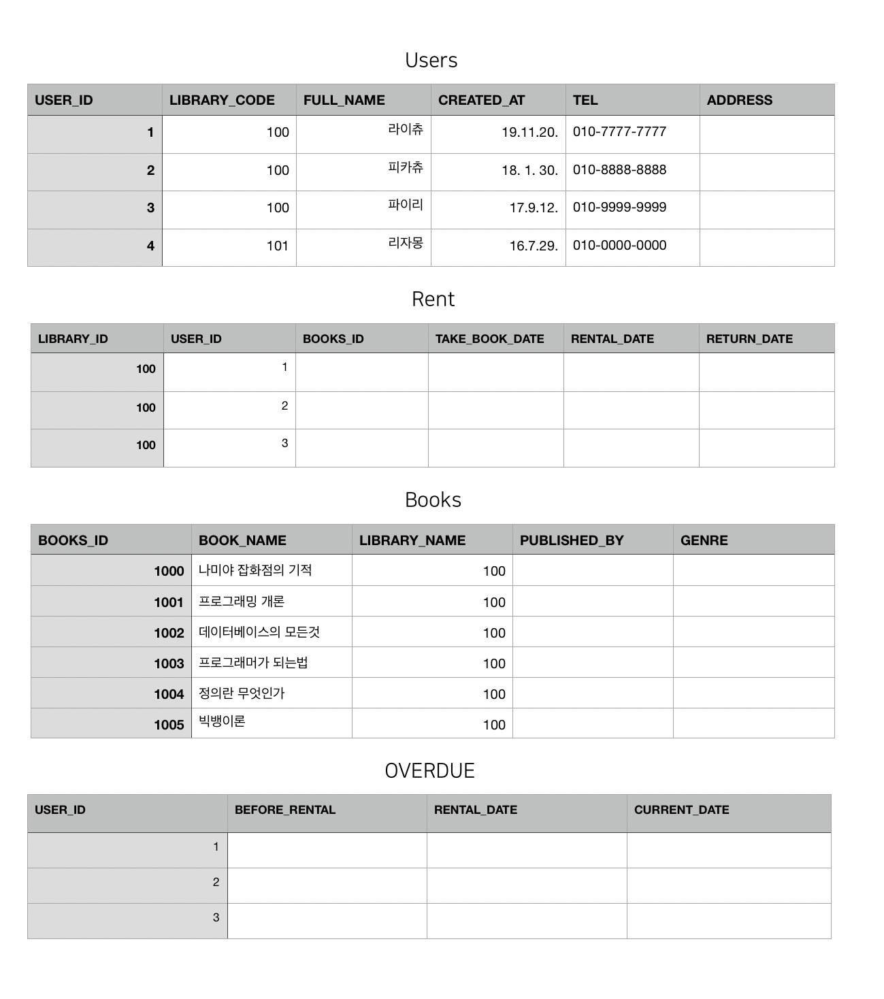
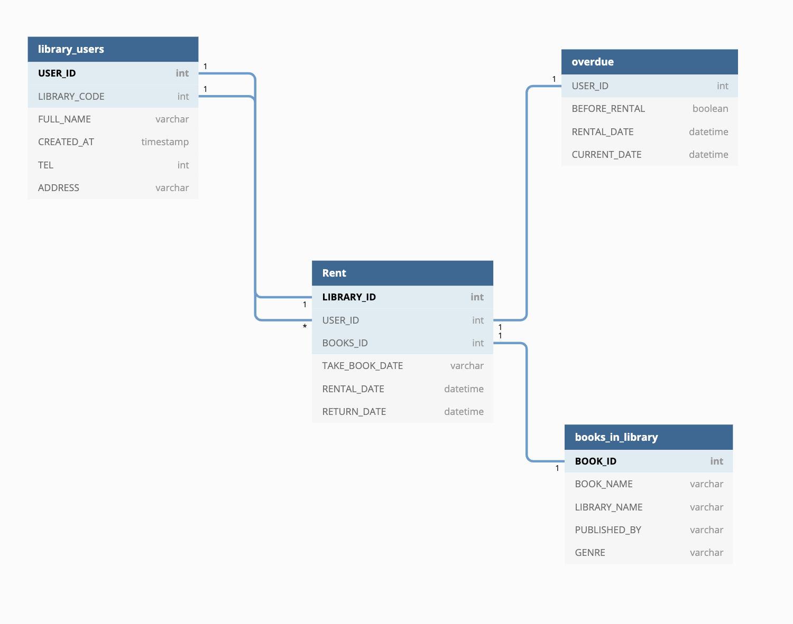

<b>[데이터 구조와 설계](https://medium.com/@khwsc1/%EB%B2%88%EC%97%AD-%EB%8D%B0%EC%9D%B4%ED%84%B0-%EA%B5%AC%EC%A1%B0%EC%99%80-%EC%84%A4%EA%B3%84-%ED%8A%9C%ED%86%A0%EB%A6%AC%EC%96%BC-b25792a0aa86)</b>

> **개인학습** [아래 내용은 정확하지 않습니다..]  
> 데이터 구조와 설계 레퍼런스를 참조하여 '도서관' DB를 작성 해보겠습니다. 
> schema 작성 이전에 고려 사항에 대해서 정리하겠습니다. 
> 먼저 데이터 설계를 할때 있어서, 해당 테이블에 필요로 하는 컬럼이 무엇이 있을지를 고려해야 합니다.  
> 또 어떻게 schema를 짤지 구상해 봅니다.

### 도서관 DB

---

- 먼저 **도서관**에는 **도서관 회원 정보**와 소장하고 있는 **책**에 대한 정보가 존재합니다.
- 회원 정보에는 이름 / 나이 / 도서관 코드 등이 들어갈 수 있습니다.
- 도서관 코드는 해당 사용자가 도서를 대여/반납 할 수 있는 도서관의 이름(ID)가 될겁니다. 
  || 도서관을 이용하기 위해서는 해당 지역의 사람만이 회원가입을 할 수 있어야합니다.
- 도서관에는 회원 정보와 책 정보를 많이 갖고 있습니다.
- 책 정보에는 책 이름 / 도서관 코드 / 그 외 정보 등이 담겨 있을 수 있습니다.
- 회원은 책을 여러권 빌릴 수 있습니다. | [1:M]
- 책은 같은 책이 여러권 있을 수 있습니다.
- 회원이 책을 대여하기 위해서는 도서관을 통해서 대여 할 수 있습니다.
- 연체한 회원은 책을 빌릴 수 없습니다.

> 여기까지 정리후에 레퍼런스를 참조 설계부분을 수정해보도록 하겠습니다.

 
 
 
 

[미완성 스케마 v1]

- 먼저 회원이 해당 도서관의 회원이 맞는지 확인합니다. 도서관에선는 해당 회원이 연체 회원 인지를 체크합니다. 연체회원이 아니라면 해당하는 책을 대여해줍니다. 회원은 책을 빌릴 것이고, 여러 권 빌릴 수 있습니다.

Reference  
[데이터 구조와 설계](https://medium.com/@khwsc1/%EB%B2%88%EC%97%AD-%EB%8D%B0%EC%9D%B4%ED%84%B0-%EA%B5%AC%EC%A1%B0%EC%99%80-%EC%84%A4%EA%B3%84-%ED%8A%9C%ED%86%A0%EB%A6%AC%EC%96%BC-b25792a0aa86) 
[lucidchart](https://www.lucidchart.com/pages/database-diagram/database-models#discovery__top) 
[DATAMODELING](http://www.dbguide.net/db.db?boardUid=148404&boardConfigUid=9&boardIdx=132)

