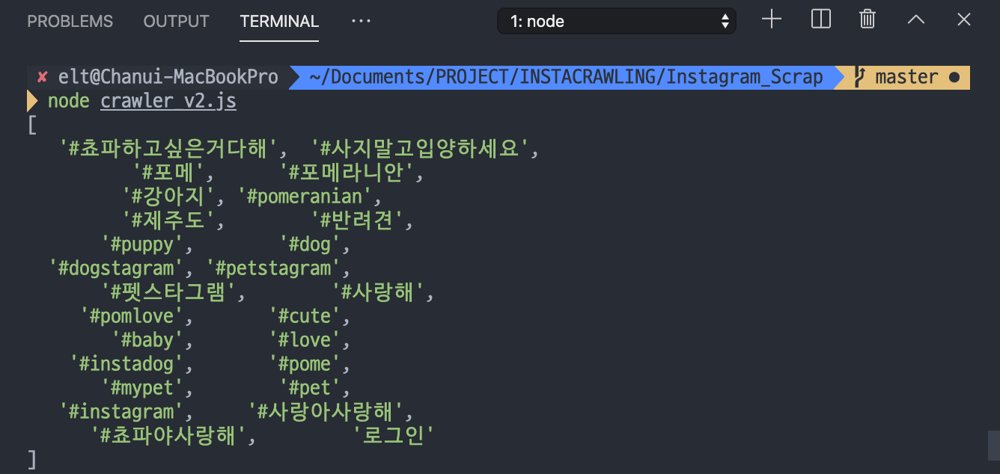
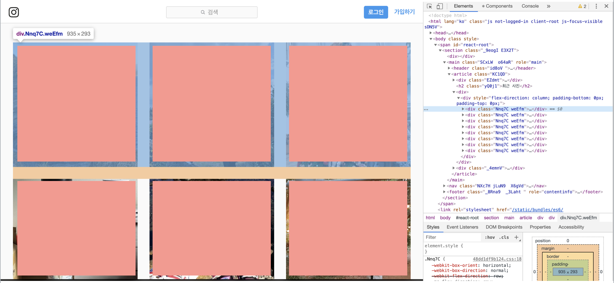
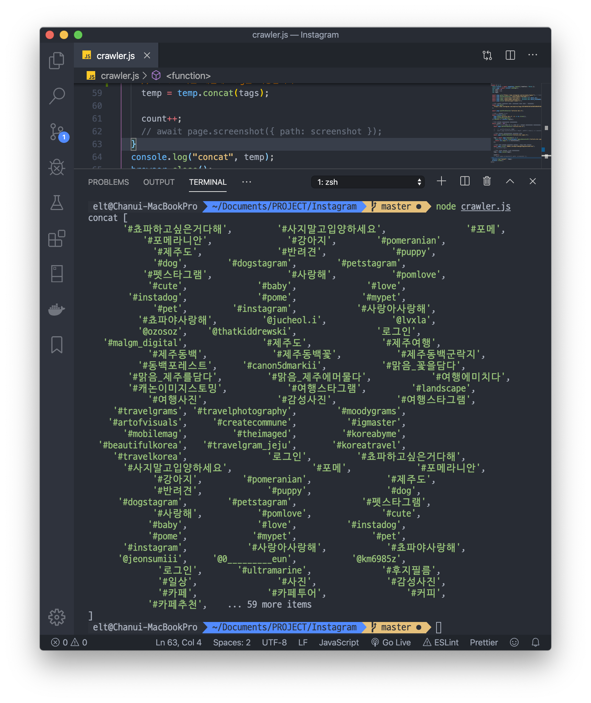
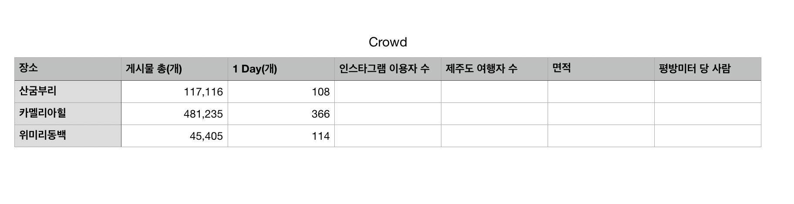

<center>

**INSTAGRAM CRAWLING** <br>
[기덥](https://github.com/CgodL/Insta_Crawling) | 현재는 Private으로 확인할 수 없습니다~ <br>
[ 2019.12.03(본격 시작) - ]

</center>

### GOAL

> 인스타그램 해시태그를 활용하여 특정 지역 들의 데이터를 스크랩핑 / 크롤링 해보도록 하겠습니다.

---

### STACK

초기 스택으로 <b>Beautiful Soup</b>을 활용하려 했으나, 인스타그램의 모든 스크립트(데이터)를 크롤링 해오지 못하는것 같아서,<br>
**selenium** 또는 **puppeteer**을 사용하는 방향으로 전향했습니다.
저는 **JavaScript** 와 **puppeteer**를 활용하여 크롤링 하겠습니다.

- JS + Puppeteer
- Python + Selenium

---

### 시나리오

> 1. 인스타그램 로그인 화면을 띄운다.
> 2. 인스타그램에 로그인 한다.
> 3. 검색창에 '제주도'를 입력한다.(해시태그)
> 4. 페이지 소스를 검사한다.
> 5. 사진에 있는 해시 태그를 추출한다.

<b>먼저 특정 검색어를 지정해서 원하는 데이터를 제대로 크롤링 해오는지</b> 부터 확인하기 위해 검색어를 '제주도'로 하여 크롤링을 구현해보도록 하겠습니다.<br>
후에 '제주도' 로 크롤링을 성공한 후 다른 키워드로 확장하는 식으로 구현 해보겠습니다.

<center>

\* 작지만 작동하는 기능을 구현한 후, 크게 확장하는 식으로 코드를 작성하기

</center>

---

### REQUIREMENTS

- 비동기로 처리해야 합니다.
- 인스타 페이지 로그인이 필요합니다.<br>
  - 로그인 시에 계정 비밀번호와 같은 시크릿한 값에 대한 처리가 필요합니다. <b>dotenv</b>를 활용하겠습니다.
- 인스타 그램 검색 페이지는 인피니티 스크롤로 이루어져 있습니다. 인스타 그램 에서 적정량의 데이터만을 처리해야 합니다.<br>
  - 모든 데이터를 크롤링 하다보면 `Timeout`에 걸리게 됩니다. 분기 처리나 / 제약을 걸 수 있는 API를 활용해야 합니다.
- robot.txt를 확인해야 합니다.

---

### SETTING DOTENV

puppeteer instagram은 비밀번호 와 아이디를 포함하기 때문에 `.env`파일(환경변수)로 따로 세팅해야 합니다. 그리고 `.gitignore`에 `.env`파일을 추가하여 github에 개인정보가 올라가는 불상사를 막습니다.

- `npm i dotenv` 로 dotenv를 설치합니다.
- .env 파일을 프로젝트 루트에 생성합니다.
- .gitignore에 .env 를 추가합니다.
- .env 내부에 아이디와 비밀번호를 설정해 줍니다.
- 패스워드나 아이디 같은 값을 .env에 설정해줍니다.
- 필요한 부분에 .env 에 저장한 값을 가져와 사용합니다.

```js
$ .env;
INSTA_ID = 'HHHHHHHHHHH';
INSTA_PASSWORD = 'BBBBBBBBB';

$ crwaler.js
require('dotenv').config();
await page.type('input[name="username"]', process.env.INSTA_ID)
await page.type('input[name="password"]', process.env.INSTA_PASSWORD)
```

---

### 무작정 구현해보기

> 일단 무작정 이해없이 부딪혀봅니다.

```js
const puppeteer = require('puppeteer');

puppeteer.launch().then(async browser => {
  const page = await browser.newPage();

  // TODO 인스타그램 로그인 페이지에서의 설정을 먼저 해줍니다.
  await page.goto('https://www.instagram.com/accounts/login/');
  await page.waitForSelector('input[name="username"]');

  // TODO 인스타그램 페이지에 접속하기 위해서 계정에 로그인 해야 합니다.
  // SECRET 한 값으로 관리할 필요가 있습니다.
  // DOTENV!!
  await page.type('input[name="username"]', '');
  await page.type('input[name="password"]', '');
  await page.click('button[type="submit"]');

  // TODO 로그인 을 기다린 뒤 리다이렉트 합니다.
  await page.waitForResponse(
    response =>
      response.url() === 'https://www.instagram.com/' &&
      response.status() === 200
  );
  // TODO Gets the full HTML contents of the page, including the doctype.
  await page.waitForNavigation();
  // const html = await page.content();
  // console.log('html', html)

  // var links = "https://www.instagram.com/";
  // var instaHtml = await page.content(links);
  // console.log('insta', instaHtml)

  // await page.goto('https://www.instagram.com/')

  // //TODO 제주도를 검색합니다.
  // await page.type('input[value]', '제주도')
  // //! 인스타그램은 엔터한번으로 검색이 되지 않는다.
  // // await page.keyboard.type(String.fromCharCode(13));
  // await page.goForward('https://www.instagram.com/explore/tags/%EC%A0%9C%EC%A3%BC%EB%8F%84/')

  //TODO 제주도 페이지로 이동합니다.
  await page.waitForResponse(
    response =>
      response.url() ===
        'https://www.instagram.com/explore/tags/%EC%A0%9C%EC%A3%BC%EB%8F%84/' &&
      response.status() === 200
  );

  // await page.goto('https://www.instagram.com/explore/tags/%EC%A0%9C%EC%A3%BC%EB%8F%84/')
  //TODO div class = "Nnq7C weEfm"의 개수가 10개 면 .. 으로 조건을 걸면 되나
  let countDivTag = [];

  //TODO 페이지 스크립트를 배열로 만든다.
  // let htmlArr = [];
  // const html = await page.content('https://www.instagram.com/explore/tags/%EC%A0%9C%EC%A3%BC%EB%8F%84/');
  // htmlArr.push(html)
  // console.log('html', htmlArr)
  let div = `<div class="Nnq7C weEfm">`;
  await page.screenshot({ path: '인스타제주도첫번째클릭.png' });

  // let splited = html.split('<div')
  // console.log('spt', splited)
  // await page.waitForResponse(async response => {
  //     if(response.url() === 'https://www.instagram.com/explore/tags/%EC%A0%9C%EC%A3%BC%EB%8F%84/' && response.status() === 200){
  //         let arr = response.url().split(',')
  //         if(arr.includes(div)){
  //             console.log(true)
  //         }
  //         if(countDivTag > 20){
  //             await page.screenshot({path: '인스타제주도첫번째클릭.png'})
  //         }
  //     }
  // })
  await browser.close();
});
```

> 역시나 원하는 대로 코드가 작동하지 않으므로 순서에 맞춰서 다시 작성해보겠습니다.(2019.12.02~ )

---

### 태그 읽어오기

<br>

태그를 읽어오기 위해선 해당 페이지를 `evaluate`하여, 원하는 태그를 읽어와야 합니다. 그런데 여기서 문제가 생겨버렸습니다.. 예상과 달리 아래 코드는 undefined 만을 반환합니다. page 자체에서 해당 태그 자체를 읽어오지 못합니다.
`content`의 경우 html을 다 읽어오는데...

```js
// 틀린 코드
// TODO Page에 특정 태그 클래스 네임만 읽어오기
const text = await page.evaluate(() => {
  document.querySelectorAll('article');
});
console.log(text);
```

<center>

--

</center>

`evaluate`을 잘못 사용했었습니다! 당연하게도 return이 필요했습니다. (puppeteer 를 이해를 안하고 사용하다보니 ㅠ)<br>아래와 같이 코드를 구성했을 경우, 태그를 통해 데이터를 받아오는걸 볼 수 있었습니다!

```js
const links = await page.evaluate(() => {
  const article = Array.from(document.querySelectorAll('article div a'));
  return article.map(a => a.textContent);
});
```

<center>

--

</center>

또, [Puppeteer Crawling](https://moonsupport.tistory.com/239) 블로그를 참조하니, 아래와 같이 제이쿼리를 사용하여 태그에 접근할 수 있다는 것을 알았습니다.

```js
const scoreEl = await page.$('.score.score_left .star_score');
```

"태그의 접근은 해당 페이지로 이동 후 .\$ 메소드를 이용하고, 그 중 text만 가져오기 위해서 evaluate 메소드를 이용하였다."<br>
이를 활용해서도 인스타 태그에 접근할 수 있을것 같습니다.

---

### 인스타 사진 클릭하기

<br>

```js
const links = await page.evaluate(() => {
  const article = Array.from(document.querySelectorAll('article div a'));
  return article.map(a => a.textContent);
});
```

이렇게 `querySelectorAll("article div a")` 태그를 읽었을 때 return 값으로 textContent를 주면 빈 스트링을 담은 배열이 반환됩니다. <br>왜냐하면 인스타그램의 a 태그에는 text가 없기 때문입니다. 따라서 저는 a 태그를 클릭하여 해당 사진에 들어가는 코드를 작성해보겠습니다.<br>
<br>

[Select Link](https://stackoverflow.com/questions/51011466/puppeteer-select-link)를 참조하여 클릭 이벤트를 작동시킵니다.

```js
await page.waitForSelector('article div a'); // article 태그 밑, div 태그 밑, a 태그

await Promise.all([
  page.$eval('article div a', el => el.click()),
  page.waitForNavigation()
]).catch(e => console.log(e));

// 스크린샷은 작동하지 않습니다. 하지만 console을 따로 찍어서 확인하지 않으므로 넣어줍니다.
await page.screenshot({ path: '인스타' });
```

---

### 해시태그 읽어오기

인스타 사진을 클릭하는 것 까지 구현이 되었으며, 이제 인스타 사진 내부의 해시태그를 가져와야 합니다.

```js
await page.waitForSelector('article div span a');

const tags = await page.evaluate(() => {
  const div = Array.from(document.querySelectorAll('article div span a'));
  return div.map(a => a.textContent);
});
console.log(tags);
```

<center>

--

</center>



<center>

읽어오는데에 성공했습니다!

</center>
<br>

**해시태그가 없을때 예외 처리**<br>
이제 마지막으로 해시태그가 없을때 예외 처리를 통해 다음 페이지로 넘어가는 로직을 구성해주면 됩니다. `try/catch`를 활용하면 구현할 수 있습니다.

> 초기에는 if/else로 분기처리를 시도 했지만, 응답을 받고 / 이를 처리하는 구조로 인해 한계가 있다 생각하여 try/catch를 통해 구현했습니다.

```js
try {
  await page.waitForSelector('article div span a', { timeout: 800 });

  tags = await page.evaluate(() => {
    const div = Array.from(document.querySelectorAll('article div span a'));
    return div.map(a => a.textContent);
  });
} catch (error) {
  await page.click('.HBoOv.coreSpriteRightPaginationArrow');
}
```

---

### DATE / LOCATION 읽어오기

**Location을 크롤링 해보겠습니다.**


'동백포레스트' 저 부분을 읽어와야 합니다. 해당 태그 부분에 class 이름이 있으므로 이를 통해서 크롤링 해옵니다.

```js
// 해당 selector가 로딩 되기를 기다립니다.
await page.waitForSelector('.O4GlU');
// 해당 태그의 문자열을 읽어옵니다.
location = await page.evaluate(() => {
  const div = document.querySelector('.O4GlU').textContent;
  return div;
});
```

<br>

**Location 예외 처리** <br>
하지만 location 이 없는 경우 timeOut 에러를 냅니다. location은 항상 제공되어지는 것 이 아닙니다. 즉 예외 처리가 필요합니다!

> 분기 처리를 위해서 로직을 구성해봅니다. <br>
>
> 1.  비동기적으로 작동합니다. waitForSelector를 통해서 원하는 selector를 읽어오길 기다립니다.<br>
> 2.  1번 과정을 기다리는데, 만약 없다면 다음 페이지로 넘어가도록 합니다.
> 3.  try/catch와 timeout을 이용합니다.

```js
try {
  await page.waitForSelector('.O4GlU', { timeout: 2000 });
  location = await page.evaluate(() => {
    const div = document.querySelector('.O4GlU').textContent;
    if (div) {
      return div;
    }
  });
} catch (error) {
  await page.click('.HBoOv.coreSpriteRightPaginationArrow');
}
```

**중복 데이터 고려**<br>
마지막으로, 고려해야할 사항이 있습니다. 인스타 그램은 한개 이상의 사진을 올릴 수 있습니다.
그렇다 보니 장소의 경우 중복되는 값이 배열에 저장되게 됩니다. 이를 처리하여 중복되는 요소가 없도록 하겠습니다.

> 한가지 유의할 점이, 만약 A라는 사람이 '제주도'라는 장소로 4개의 사진을 올렸다고 했을때, 현재 배열에는 ['제주도', '제주도', '제주도', '제주도'] 이런식의 데이터가 저장될 겁니다.
> 따라서 이를 uniq등의 처리를 통해 '제주도' 하나만을 저장한다고 하였을 때, 그 해당 페이지의 장소만 uniq처리 되야 한다는 점 입니다. 다른 페이지(B)에서 나온 '제주도'를 같은 값으로 처리해서는 안됩니다.<br> <b>다시 생각해보니</b> 각 페이지 에 응답을 기다린뒤, 한 페이지에 해당하는 데이터(태그)들을 배열에 저장하는 구조 입니다. 이 말은 즉 각 데이터 간의 중복은 없으며, 페이지가 변할 때 마다 새롭게 카운트 되는 데이터라고 생각할 수 있을것 같습니다.

**Date를 크롤링 해보도록 하겠습니다**<br>
방식은 위와 같으며, Date는 인스타그램에 항상 존재하기 때문에 예외처리 없이 간단하게 구현할 수 있습니다.

> Date에 문제가 하나 있습니다.. 현재 크롤링을 하게 되면 a 링크의 textContent 1시간전 / 20시간전 / 날짜일 수도 있구요 이와 같은 데이터를 가져오는데요, 이렇게 되면 매일 또는 특정 시간 에 크롤링 한 기준으로 계속 1시간전 / 몇 시간전 과 같이 구분할 수 없는 데이터가 추가 되버립니다. 따라서 크롤링 하는데 데이터를 변경을 하던가 또는 Date 메서드를 이용해서 크롤링 요청을 할때마다 요청시간을 추가하는 방법 이 있을것 같습니다.<br> <b>인스타그램 태그를 확인해보니, a 링크내에 title 과 datetime이 시간 관련 데이터를 제공하고 있습니다. 따라서 저는 title 이나 datetime 데이터를 크롤링 해보도록 하겠습니다.</b>

`document.querySelector('._1o9PC.Nzb55').datetime` 을 통해서 원하는 데이터를 잘 크롤링 해옵니다.

---

### 크롤링 고도화 하기

<br>

**많은 태그 크롤링 하기**<br>
이제 저는 하나의 사진에 해당하는 태그를 읽어올 수 있습니다. 보다 많은 데이터를 가공하기 위해서 더많은 사진의 태그를 크롤링해야 합니다. <br>이에 대한 코드를 구상해보도록 하겠습니다.

먼저 클릭한 이미지에서 나가야 합니다. 인스타 그램 사진을 누르면 상단에 X 버튼이 있습니다.
puppeteer로 X를 클릭해 줍니다.

```js
// <button class="ckWGn" > 닫기 </button>
await page.click('button.ckWGn');
```

<center>

-<br>
이제 문제에 대해 고려해야 합니다.

</center>

<br>



인스타그램 페이지는 위 사진 처럼 `<div>` 안에 이미지 태그가 들어있습니다. 이미지 100개를 크롤링 한다고 가정할때 어떻게 할지 시나리오를 작성해 보겠습니다.

- `<div>` 하나를 클릭한다
- 해시태그를 크롤링 한다
- 크롤링을 마친후 X 버튼을 클릭하여 이전 페이지로 돌아온다.
- 다음 `<div>`를 클릭한다.
- 위 과정을 반복한다.

위 처럼 해야겠다고 생각했었는데, 인스타그램 사진을 클릭한 뒤 잘보면, `<a class="HBoOv coreSpriteRightPaginationArrow"> 이전 또는 다음 </a>` 태그가 존재합니다.
네 그렇습니다 살아남은것 같습니다. 다음 페이지를 클릭한뒤 해시태그를 크롤링을 반복하는 식으로 시나리오를 변경해야 할 것 같습니다.

- X 버튼을 클릭하는 코드를 지웁니다.
- '>' 다음 버튼을 클릭합니다.
- 변한 페이지의 해시태그를 크롤링 합니다.
- '>' 다음 버튼을 클릭합니다.
- 위 과정을 반복합니다.

```js
// 다음 버튼을 클릭합니다.
await page.click('.HBoOv.coreSpriteRightPaginationArrow');
```

<center>
페이지가 잘 이동합니다!<br>
<br>
-
</center>

<br>

**반복 구현하기** <br>
반복작업을 어떻게 할지 고민해봅니다. puppeteer 자체에 반복을 도와주는 API가 있는지 모르기 때문에, 일단 JS 코드로 구현해보겠습니다.
<br>로직은 매우 간단합니다. 100개의 사진의 해시태그만을 뽑을 것 이기 때문에 while문을 활용하여 코드를 작성합니다.

```js
let count = 0;
// 맨 처음 사진을 클릭하는 코드
while(count < 100){
  ...
  await page.click('.HBoOv.coreSpriteRightPaginationArrow');
  ...
  temp = temp.concat(tags);
  count++
}

```

콘솔을 찍어보니 원하는 데이터가 출력이 됩니다! 이제 데이터를 담아줄 배열을 추가하여, 안에 넣어줍니다. <br> 데이터 타입을 `Array.from` 으로 배열로 뽑으므로, 보다 데아터 관리가 쉽도록 1차원 배열로 만들기 위해 `concat`을 활용합니다.



**데이터 형태 정하기**<br>
한가지 고민되는 점이 있습니다. 현재는 concat으로 1차원 배열로 데이터를 관리하는데, 이를 2차원 배열로 관리하는게 나을지 고민입니다. <br> 또, 현재(19.12.05.목) 저는 데이터를 각각의 배열을 만들어 따로 따로 관리를 하고 있었는데, 이를 하나의 배열에 넣는 방식으로 할지 고민입니다. <br>
<b>최종적으로 `instarr.push([location, date, tags])` 처럼 2차원 배열로 저장하는게 DB에서 사용하기 용이할것 같습니다.
</b>

**의미없는 데이터 필터링 하기**<br>
<b>해시태그</b>를 크롤링 하다보면, waitforSelector에 해당하는 데이터를 모두 가져옵니다. 여기에는 사용자의 아이디와 '로그인' 같이 의미 없는 데이터도 따라옵니다. 따라서 이런 의미없는 값을 필터링 해야 합니다.
필터링은 쉽습니다. map한 부분에서 split / splice / join 을 통해서 '#' 이외의 데이터는 무시하고, '#'를 포함한다면 위의 메소드로 처리해줍니다.

---

### 데이터 가공하기

데이터를 의미있는 값만 뽑아내어 CSV 파일로 변환하여 데이터를 관리할지 아니면 DB안에서 관리할지 선택해야합니다.<br>

> 데이터 가공을 목표로 하는 프로젝트에 맞춰서 해야할 것 같습니다.<br>
> 저는 데이터를 클라이언트 단에서 사용할 것 이므로 DB안에 담는 형태로 데이터를 가공하겠습니다. <br>
> DB와 연동하는 부분은 새로운 포스트에 만들겠습니다. [여기](https://developer-channing.com/blog/2019/12/04/channing)

개략적으로, 제가 사용하는 DB 스키마에 어떤 값이 들어가야 할지 부터 고려해야 합니다.<br>
저는 MongoDB (Mongoose)를 사용할 것입니다.
크롤링을 클라이언트 단 에서 하지 않기 때문에, 크롤링 데이터가 POST를 통한 추가로 이뤄지지 않습니다. 서버 단에서 크롤링한 데이터를 바로 추가하도록 하겠습니다.

```js
// Mongoose
const catSchema = new mongoose.Schema({
  name: String,
  age: Number
});

const munchkin = new Cat({ name: 'Maum' });
```

몽구스는 위와 같은 형태 입니다. 그리고 제 데이터는 1차원 또는 2차원 배열 입니다. 어떻게 제 인스타 태그를 스키마에 집어넣을지 구상해야 합니다.

```js
const hashTagSchema = new mongoose.Schema({
  date: String,
  location: String,
  tags: Array,
  weather: String,
  crowd: String
});
```

**의미없는 데이터 처리**<br>
인스타그램은 생각외로 의미없는 데이터가 많습니다. 가장 최근의 데이터를 요구하는 입장에서, 인스타그램은 지난 기간의 사진을 현재시간에 올릴 수 있기 때문에 이러한 데이터는 저에게 필요없는 더미가 됩니다. 이를 처리해야 합니다.

> 일단 최신 데이터 기준 분류하는 방법으로 생각한 로직은 현재 Date를 뽑아낼 수 있으니 이 데이터와 크롤링한 Date를 빼서 분기 하는 식으로 하면 최신 데이터만을 뽑아올 수 있을 것 같습니다. ( 애초에 크롤링한 데이터 자체가 최근 데이터이기 때문에 필요없는 과정이기도 합니다.)

**crowd를 어떻게 계산할까**<br>

> 인스타 그램은 많은 사람이 이용합니다. 특정 장소에 관련된 태그는 그 사람이 장소를 방문했다는 자료가 됩니다. 그리고 이 태그의 수는 장소마다 다릅니다. 따라서 생각한 로직은 이를 기반으로 하여, 상대적 지표를 만들 수 있지 않을까 싶습니다. 최신 데이터만을 크롤링 할 것이며,날짜 기준으로 하여 각 키워드 별 해시태그 수의 차이를 계산하면 단순 태그로 혼잡도를 계산할 수 있지않을까 싶습니다. ( 물론 정확도는 기대하기 어렵습니다.. ㅠㅠ )



**데이터 시간 문제**<br>

> 인스타그램 사용자들은 자신이 촬영한 사진과 장소에 대한 정보를 실시간으로 업로드 하지 않는 경우가 더 많습니다. 예를 들어 밤 11시에 낮에 찍은 사진을 올린다던가 말이죠. 이는 즉 실시간으로 데이터를 반영하기에 오류가 될 수 있는 부분인 것 같습니다.

**Array to JSON**<br>
먼저 제 데이터는 2차원(tags는 3차원) 배열로 구성되어 있습니다. 저는 D3를 사용하려고 하는데요, D3는 CSV파일을 요구합니다. 그리고 CSV파일은 JSON데이터를 통해서 만들 수 있습니다. 이를 위해서 먼저 Array를 JSON으로 바꿔야 합니다.

로직은 이렇습니다. 객체를 생성하고, 키를 추가하여 배열 데이터를 추가하면 됩니다.

```js
let tags2Json = [];
let tagsObj = { location: '', date: '', tags: [] };

for (let i = 0; i < instArr.length; i++) {
  tagsObj = { location: '', date: '', tags: [] };
  for (let key in tagsObj) {
    if (key === 'location') {
      tagsObj[key] = instArr[i][0];
    } else if (key === 'date') {
      tagsObj[key] = instArr[i][1];
    } else if (key === 'tags') {
      tagsObj[key] = instArr[i][2];
    }
  }
  tags2Json.push(tagsObj);
}
```

> 코드가 매우 더럽지만, 리팩토링은 어느정도 기능을 구현한 후에 해도 늦지 않을 것 같습니다.

**JSON to CSV**<br>
이제 JSON 형태로 데이터를 바꿨으니, 이를 CSV로 바꿔야 합니다.
Python의 경우에 `Pandas`를 통해서 할 수 있고, JS의 경우 `json2csv` 패키지를 이용해서 할 수 있습니다.

> 사실 더 다양한 방법이 존재하지만, 저는 이 방법으로 생성했습니다.

- `npm i json2csv`를 통해서 json2csv 패키지를 설치합니다.
- https://www.npmjs.com/package/json2csv 레퍼런스를 확인합니다.

```js
const { Parser } = require('json2csv');

const fields = ['car', 'price', 'color'];
const myCars = [
  {
    car: 'Audi',
    price: 40000,
    color: 'blue'
  },
  {
    car: 'BMW',
    price: 35000,
    color: 'black'
  },
  {
    car: 'Porsche',
    price: 60000,
    color: 'green'
  }
];

const json2csvParser = new Parser({ fields });
const csv = json2csvParser.parse(myCars);

console.log(csv);
```

위 예제가 저의 데이터와 비슷한 모양을 하고 있습니다. 위를 참조하여 코드를 구현합니다.
console을 찍어보면 csv형태로 데이터가 출력됩니다.

저는 이 데이터를 저장하고 싶습니다. 이를 위해서 `file-system`을 사용합니다.<br>

- `npm install file-system --save` 설치 합니다.

```js
fs.writeFileSync('./tag.csv', csv);
```

위 코드를 통해서 CSV 파일이 생성된걸 확인 할 수 있습니다!

**Failed to load resource: the server responded with a status of 429 ( )**<br>
인스타그램을 크롤링 하다보면 해당 에러가 발생합니다. 인스타그램 자체에서 요청 횟수를 막은 에러 인데요, 이 에러를 try / catch로 처리 하겠습니다.

> VPN을 통해서 해결할 수 있다면 좋겠지만, 일단은 에러처리를 통해서 해결하겠습니다.

```js
for (let i = 0; i < instArr.length; i++) {
  tagsObj = { location: '', date: '', tags: [] };
  for (let key in tagsObj) {
    if (key === 'location') {
      tagsObj[key] = instArr[i][0];
    } else if (key === 'date') {
      tagsObj[key] = instArr[i][1];
    } else if (key === 'tags') {
      tagsObj[key] = instArr[i][2];
    }
  }
  tags2Json.push(tagsObj);
}

if (error instanceof puppeteer.errors.TimeoutError) {
  const fields = ['location', 'date', 'tags'];
  const json2csvParser = new Parser({ fields });
  const csv = json2csvParser.parse(tags2Json);
  fs.writeFileSync('./csv_container/limit_hashtag.csv', csv);
  browser.close();
}
```

저는 이런식으로 데이터를 JSON으로 그리고 CSV파일로 생성합니다. 이 코드를 새롭게 추가해주는 겁니다. <br>로직은 이렇습니다. 먼저 크롤링시 제일 먼저 Loaction을 크롤링하게 되는데요, 요청 횟수 제한의 에러가 나게 되면, Location을 읽어오지 못하고, Timeout 에러가 발생하게 됩니다. 따라서 이 부분에 try/catch 에서 catch 로 에러가 발생시에 상단에 코드를 실행하게 하여, 에러가 발생하기 전 까지의 데이터를 CSV 파일로 생성합니다.

**크롤링 소요시간**<br>
100개 기준 1분 30초 정도 소요되며, 요청 횟수 제한에 자주 걸립니다.

---

### D3 | 워드 클라우드

**Tags Count CSV**<br>
D3에서 CSV파일을 활용하여 워드 클라우드를 만들 수 있습니다. D3 가 CSV를 읽고, CSV에서 column이 tagsCount(저 같은 경우)의 값이 큰 순서대로 size를 줘서, 크고 / 작게를 나타냅니다. 이를 위해서 tags 배열을 {tags: string, tagsCount: number} 과 같은 데이터 형태가 필요했으며, 이를 위해서 `const collections = require("pycollections");`를 활용하여 이차원 배열을 만들고 이를 다시 변환하는 과정을 거쳐, tagsCount CSV 파일을 생성했습니다.

**D3.js**<br>

- `npm install d3 d3.layout.cloud`<br>
- [reference](https://gist.github.com/e9t/e462f7462e9d83b03464)를 활용하여 d3를 구현합니다.

> d3에 대한 이해가 부족하므로 더 학습이 필요합니다.


---

### 자연어 처리

**필터링**<Br>
원하는 태그들을 모두 뽑을 수 있습니다. 다만 의미없는 데이터들이 많습니다. 제공하고자 하는 목표에 맞춰서 태그를 더 가공할 필요가 있습니다.

[korean-text-analytics](https://npm.runkit.com/korean-text-analytics)<br>
[koalanlp](https://www.npmjs.com/package/koalanlp)

---

### Airflow

---

<center>

### ---

### ERROR | ISSUE

</center>

<br>

> <b> - </b> `UnhandledPromiseRejectionWarning: Error: net::ERR_ABORTED` : 리소스를 가져오지 못한다.. | 애초에 검색창에서 '제주도'를 입력해서 페이지에 접근하려 `page.type( )`을 활용하려 했으나 태그 class를 읽지못해서(능력부족 ㅠㅠ) 다른 방법을 찾아보다가, 그냥 제주도 링크를 `page.goto( )`로 주고, `launch( )에 headless 설정` 을하여 chronium으로 접근 하는 방법을 찾았고, 콘솔에 찍히는걸 확인했다. <br> [참고]: https://github.com/puppeteer/puppeteer/issues/1477 > <br> 이를 해결했는데, 초기 설정 페이지를 클릭해서 넘어가도록 코드에 추가했습니다.

> <b>-</b> **dotenv 설정**을 코드를 어느정도 구현한 상태에서 했었는데, ignore처리가 잘 된걸 확인했지만, github에 올라갈때는 이전 커밋 내역들이 함께올라가게 되어서, 테스트하며 했던 시크릿 키 값이 담긴 코드가 그대로 올라가버렸다. 커밋을 지우거나 / 파일을 새로 파거나 ..

> <b>-</b> **multiple class selector** | 인스타그램은 class 명이 `<a class="HBoOv coreSpriteRightPaginationArrow"></a>` 이런식인 경우가 많은데,<br>
> 이를 선택하기 위해선 multiple select가 필요했다. `.HBoOv.coreSpriteRightPaginationArrow` 이런식으로 말이다.<br> [참고]: https://stackoverflow.com/questions/2554839/select-element-based-on-multiple-classes > <br>

> <b>-</b> `UnhandledPromiseRejectionWarning: TimeoutError: waiting for selector "article div span a" failed: timeout 30000ms exceeded` | 크롤링을 하다보면 잘되던 코드가 갑자기 TimeOutError가 걸리며 크롤링을 해오지 못한다. 이럴때 vscode를 종료후 다시 실행시킨뒤 코드를 실행하면 다시 작동한다.. (임시 방편)
> 알고보니까 새로운 배열에 생성된 태그들을 push 해주는 부분에서 에러가 난거 같다.
> push 할때 timeouterror가 빈번하다..
> 크로니움에서 `Failed to load resource: the server responded with a status of 429 ()`
> 이 에러를 발견했다. 이에 대한 검색이 필요. <br> <b>검색해본 결과 Too Many Requests, 정해진 쿼터를 초과한 것이며,
> 쿼터는 사용처별로 통합관리되는데 사용량이 많아 발생한 것으로 보인다고 한다..</b>
> Instagram has silently changed the API request limit to 200
> <br>**궁금한점(가능할까)**- Insta 자체에서 요청을 제한 한다면, 제한하는 기준이 어떻게 되는지 | 즉 만약에 요청이 ip기준 이다 라고 하면 vpn을 활용해서 limit에 다가갈때마다 ip를 리셋하는 식으로 할 수 있는거 아닌지?

> <b>-</b> **태그/지역정보가 없을때** : 크롤링 하던중 태그가 없는 사진을 만나게 되면 크롤링을 멈춥니다. 코드에 태그가 없을 경우 에 대한 처리가 필요합니다. 태그가 없을때 크로니움에서는 콘솔에 어떤 에러도 나타내지 않습니다. 분기처리를 해줘야할 것 같습니다.<br> > `(node: 55679)UnhandledPromiseRejectionWarning: TimeoutError: waiting for selector "article div span a" failed: timeout 30000ms exceeded` | **위에 try/catch를 통해 해결했습니다.**

> <b>-</b> **git push error** <br>
> ! [rejected] master -> master (non-fast-forward)<br>
> error: failed to push some refs to 'https://github.com/...<br>
> hint: Updates were rejected because the tip of your current branch is behind<br>
> hint: its remote counterpart. Integrate the remote changes (e.g.<br>
> hint: 'git pull ...') before pushing again.<br>
> hint: See the 'Note about fast-forwards' in 'git push --help' for details.<br>
> 이 에러가 왜 나는건지 이제야 알았다.. 작업을 하던 vscode에서가 아닌, 깃헙 자체에서 README.md 파일을 추가 해줬었는데 vscode 커밋 내역에는 없던 README.md 파일이 있으니 에러가 날 수 밖에.. 작업은 한 곳에서 해야겠다.
> 해결방법은 git pull 해당 branch를 통해 변경된 값을 pull 해온다. (충돌이 날 수 있다..)

> <b>-</b> > `UnhandledPromiseRejectionWarning: TimeoutError: waiting for selector "article div span a" failed: timeout 30000ms exceeded` <br>
> 답: https://github.com/puppeteer/puppeteer/issues/1149<br> try / catch에 답이 있었다. 응답을 timeout을 걸어서 일정 시간까지 기다리게 하고 없다면 넘어가는 식으로 구현.

> <b>- ISSUE</b> :
> 요구하는 데이터가 없을때 / 로딩되기를 기다리는 시간을 `timeout` 을 통해 구현하고 있는데,
> 어떻게 해야 최적화할 수 있을지도 고려해야 한다.
> location 데이터를 받아올때 timeout을 1초 이하로 줄 경우, undefined를 반환 했습니다. 즉 해당 데이터를 크롤링 하기위해선 일정 시간이 필요하다는걸 알았습니다.

<hr />
<center>

Reference <br>
[PUPPETEER](https://github.com/puppeteer/puppeteer/blob/master/docs/api.md)<br>
[PupGithub](https://github.com/GoogleChrome/puppeteer)<br>
[INSTA-Package](https://www.npmjs.com/package/puppeteer-instagram)<br>
[Puppeteer Example](https://github.com/checkly/puppeteer-examples#amazon-search)<br>

</center>
