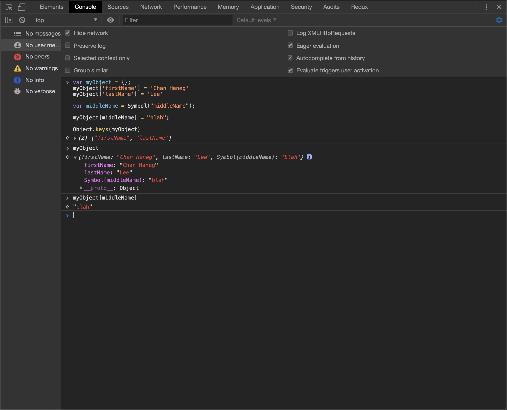
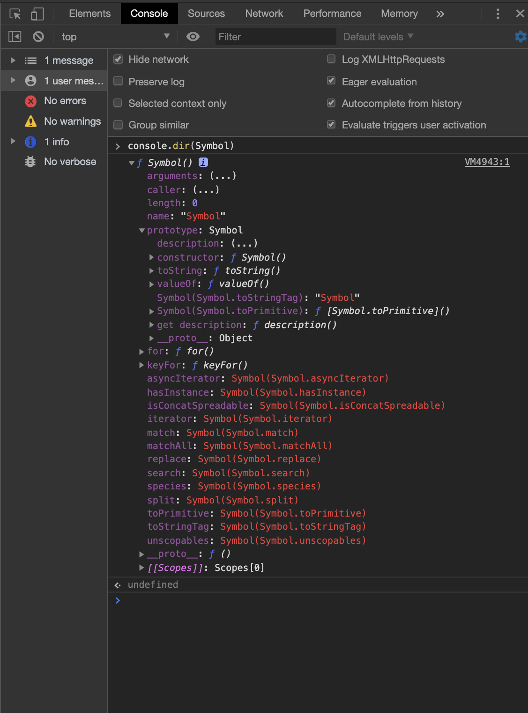

<center>

### TypeScript

TypeScript는 컴파일 속도가 일반 JavaScript 보다 월등히 빠릅니다.<br>
컴파일을 하는 동안 타입을 체크하는데 걸리는 시간이 현저히 짧기 때문입니다.

</center>

---

### 설치 및 초기 세팅

- 먼저 **typescript**를 전역에 설치합니다.
  <br>

```javascript
yarn global add typscript
npm install --save typescript @types/node // npm 으로도 설치 해줍니다.
```

- **tsconfig.json** 파일을 생성하여, Typescript 에게 Javascript로 어떻게 컴파일 할지 세팅 합니다.

---

### 심볼

<b>Symbol</b>은 ES6에서 나온 number | string 과 같은 <b>원시 데이터 타입</b> 이며 자바스크립트의 새로운 타입 입니다.<br> 심볼은 불변이며 고유합니다 또 프로퍼티를 추가할 수 없습니다.

---

### 왜 필요한가요?

탄생 배경 을 알아보겠습니다.
보통 객체의 key로는 문자열이나 정수 등의 값을 사용합니다. key가 문자나 정수일때 문제는, 객체의 key 값이 변경될 수 있다는 것 입니다. 만약, 많은 사람이 사용하는 JS 라이브러리가 있고, 거기에 어떤 객체가 있다고 가정 해보겠습니다. 그 객체에 우리(개인)가 메소드를 추가하게 되었을 때, 만약 이 메소드 이름이 이미 객체에 존재한다면 덮어 씌어질 수 있기 때문 입니다.<br>
또, JS 개발자들은 `for in loop` 나 `Object.keys` 같은 기존 메소드를 변경 없이 새로 객체에 프로퍼티를 추가하는 작업(hidden 속성)이 필요해져서 생겼다고도 합니다.

예를 들어, 아래와 같은 객체가 있다고 가정했을때,

```js
var myObject = { firstName: 'raja', lastName: 'rao' };
Object.keys(myObject); // return [firstName, lastName]
```

이제 여기에 새로운 프로퍼티를 myObject에 추가하고, <b>Object.keys</b>를 실행하면 새롭게 추가된 프로퍼티가 포함된 배열이 반환될 것 입니다.

```js
myObject.middleName = 'blah';
Object.keys(myObject); // return ["firstName", "lastName", "middleName"]
```

그리고 JS 개발자들은 위와 같은 상황을 피하기 위해 Symbol을 만들었습니다.<br>
새로운 프로퍼티를 Symbol로 추가하면, Object.keys(myObject) 는 새로 추가된 프로퍼티를 무시하고 ["firstName", "lastName"] 만을 반환 합니다.

```js
var myObject = {};
myObject['firstName'] = 'Chan Haneg';
myObject['lastName'] = 'Lee';

var middleName = Symbol('middleName');

myObject[middleName] = 'blah';

Object.keys(myObject); // return  ["firstName", "lastName"]
console.log(Object.getOwnPropertySymbols(myObject)); //Object.getOwnPropertySymbols()를 통해서 Symbol에 대한 key에만 접근할 수 있습니다.
```

<br>



---

### Avoid name collisions

Symbol은 주로 다른 라이브러리와의 이름 충돌 위험이 없는 유일한 객체의 프로퍼티 키(property key)를 만들기 위해 사용한다고 되어있습니다.<br> 이 말은 즉, 새로운 프로퍼티를 이름 충돌에 대한 우려를 하지 않고 계속 추가할 수 있다는 말입니다.

예를 들면,
`Array.prototype`에 우리가 정의한 `toUpperCase`를 추가하여 사용하고 있었는데, ES2019같은 새로운 라이브러리에 Array.prototype.toUpperCase 추가 된다면 우리의 함수에 이름 충돌이 일어나게 됩니다. 이러한 이름 충돌을 방지하기 위해 Symbol을 사용합니다.

```js
Array.prototype.toUpperCase = function() {
  for (let i = 0; i < this.length; i++) {
    this[i] = this[i].toUpperCase();
  }
  return this;
};
var myArray = ['raja', 'rao'];
myArray.toUpperCase(); // return ["RAJA", "RAO"]
```

심볼을 사용하게 되면, 내부적으로 unique한 값을 생성하고, 이름 충돌에 대한 걱정을 하지 않고 프로퍼티를 추가할 수 있게 됩니다.

```js
var toUpperCase = Symbol('toUpperCase');
Array.prototype[toUpperCase] = function() {
  for (let i = 0; i < this.length; i++) {
    this[i] = this[i].toUpperCase();
  }
  return this;
};
var myArray = ['raja', 'rao'];
myArray[toUpperCase](); // return ['RAJA', 'RAO']

---

var includes = Symbol('will store custom includes method');
Array.prototype[includes] = () => console.log('inside includes func');
var arr = [1, 2, 3];
console.log(arr.includes(1)); // true
console.log(arr['includes'](1)); // true
console.log(arr[includes]()); // 'inside includes func'
```

---

### Well-known Symbol

여러분이 정의하는 심볼 외에, 자바스크립트는 ECMAScript 5와 그 이전 버전에서는 개발자에게 제공되지 않았던 언어 내부의 동작을 나타내는 내장(built-in) 심볼을 몇 가지 가지고 있습니다.

<br>



---

1.  Symbol은 메서드를 갖고 있어 객체 처럼 보이지만, 원시 타입 이며, Symbol 생성자를 호출하여 생성됩니다.

```js
const symbol0 = new Symbol(); // Symbol은 객체가 아닌 원시타입 이기 떄문에 new 연산자를 이용한 문법은 TypeError를 일으킵니다.
```

2. Symbols 은 “description” 을 가집니다.

```js
const symbol1 = Symbol('key'); // 'key'(parameter)는 optional 이며,  “description” 입니다.
```

3. Symbols는 unique합니다.

```js
const symbol1 = Symbol('key');
const symbol2 = Symbol('key');
const symbol3 = Symbol(3);

symbol1 === symbol2; // false
console.log(typeof symbol1); // datatype => "symbol"
console.log(symbol2.toString()); // Symbol(key);
```

4.  문자열과 마찬가지로 객체 프로퍼티의 키로 사용할 수 있습니다.

```js
let sym = Symbol();

let obj = {
  [sym]: 'value'
};

console.log(obj[sym]); //value
```

5. dot 연산자는 사용할 수 없습니다.

```js
let myCar = { name: 'BMW' };
let type = Symbol('store car type');
myCar[type] = 'Sedan';

console.log(type); // Symbol('store car type');
console.log(myCar[type]); // 'Sedan'
console.log(myCar.type); // undefined
```

---

### Typescript에서의 Symbol

---

### Iterators

우리는 `for of loop` 와 `spread operator(...)` 같은 메서드를 활용하여 기존 array, strings 같은 표준 객체에서 데이터를 추출합니다. 하지만 Object에서는 사용할수 없습니다. 왜 그럴까요?

```js
const Dog = {
  Bichon: 'Maum',
  Pug: 'blah'
};

for (let dog of Dog) {
  console.log(dog); // TypeError Dog is not iterable
}
```

객체에서도 위 처럼 순회하기 위해 새로운 방식을 만들지 않고 기존에 있는 방식을 활용하기로 했습니다. 따라서 이를 위해 규칙을 만들었습니다. 그리고 이러한 규칙에 따라 순회할 수 있는 객체를 'iterable' 이라고 부르기로 했습니다.

---

<center>

### ---

### ERROR | ISSUE

</center>

> <b> - </b>

<hr />
<center>

Reference <br>
[NOMAD](https://academy.nomadcoders.co/courses/303219/lectures/4975930)<br>
[TypeScript](http://blog.haandol.com/2017/04/27/typescript2-experss-tutorial-part-one.html)<br>
[Symbol](https://www.freecodecamp.org/news/some-of-javascripts-most-useful-features-can-be-tricky-let-me-explain-them-4003d7bbed32/)<br>
[Symbol2](https://medium.com/sjk5766/es-6-symbol-%EC%9D%B4%EB%9E%80-48c2ad5b054c)<br>
[Symbol3](https://developer.mozilla.org/ko/docs/Web/JavaScript/Reference/Global_Objects/Symbol)

</center>
