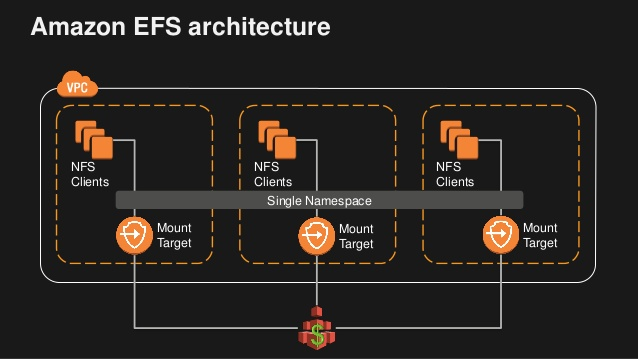

- 스토리지
- Block 스토리지 : AWS EBS
- File 스토리지 : AWS EFS
- Object 스토리지 : AWS S3
- Migration 툴

---

- S3 종류의 분류 -> 사용 빈도에 따라 분류
- 스토리지 특성 <be>
  1.  내구성
  2.  가용성 - 기대 다운타임
  3.  보안
  4.  비용
  5.  확장성
  6.  성능
  7.  Integration

---

- Block 스토리지 : AWS EBS

- EC2 
  EC2 는 휘발성 입니다. stop / start로 인해 하드웨어가 바뀌면서 사라집니다.

### AWS EBS(Elastic Block Store)

Amazon EBS Volumes. An Amazon EBS volume is a durable, block-level storage device that you can attach to a single EC2 instance. You can use EBS volumes as primary storage for data that requires frequent updates, such as the system drive for an instance or storage for a database application.

**Amazon EBS 볼륨**은 내구성이 있는 블록 수준 스토리지 디바이스를 제공하여 단일 EC2 인스턴스를 연결하는 것이 가능합니다. 인스턴스의 시스템 드라이브 또는 데이터베이스 애플리케이션용 스토리지 등 자주 업데이트해야 하는 데이터의 경우 EBS 볼륨을 기본 스토리지로 사용할 수 있습니다. 볼륨이 인스턴스에 연결되면, 다른 물리적 하드 드라이브처럼 사용할 수 있습니다.

- 생성한 용량만큼만 비용 지불

---

#### EBS Volume type

IOPS / Throughput 에 따라 선택

#### EBS Snapshot

Incremental로 저장, 초기 원본을 저장한뒤 후에 변경된 부분만 S3에 저장.
용량 최적화
S3에 저장(백업), EBS API 지원
스냅샷을 찍는 시점에 복사본

중요한 데이터가 EBS에 있다면 AWS DLM을 이용하여 Snapshot 찍을 것.

---

### File Storage

#### AWS EFS

---

### Object Storage

#### AWS S3

- 내구성이 뛰어납니다.
- 확장에 제약이 없습니다.
- 웹에서 사용 가능한 오브젝트 저장소
- 5가지의 유형의 서비스
  - 데이터 가용성에 따라서 나눠서 사용
- 병렬 처리 징원

#### S3 Life Cycle

#### AWS S3 Storage Tier

Access Frequency 에 따라서 분류

#### 가용성에 따라 선택

#### S3 Object Tagging

inteligence 어쩌구가 티어를 자동으로세팅

#### AWS Glacier

- 저렴한 보관용 스토리지(아카이브)
- 높은 보안성
- 높은 내구성
- 데이터의 보존 및 백업에 최적화된 스토리지
- 3가지 검색옵션

#### AWS CloudFront

구성과 사용이 간단한 CDN(컨텐츠 전송 네트워크)
다양한 원본 컨텐츠 : S3, EC2, On-Premise

---

### Data Migration Tool

데이터 이동을 위한 5가지 질문

1. 데이터의 종류, 어떤 종류로 옮겨야 하는가
2. 단발성인가 지속적 인가
3. 단방향 인가 양방향 동기화 인가
4. 얼마나 많은 데이터가 있는가, 얼마 동안에 옮겨야 하는가
5. 데이터를 WAN으로 옮겨도 되는가

### AWS Transfer for SFTP
