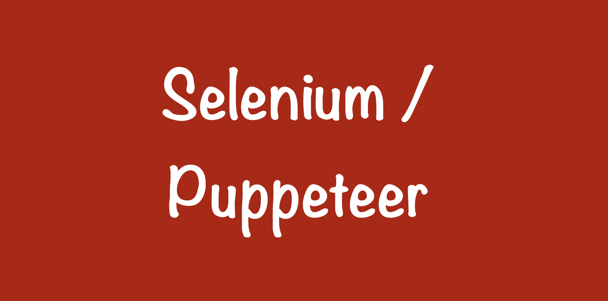

### Puppeteer

퍼페티어는 크롬에서 만든 자바스크립트 전용
셀레늄

### ---

### ERROR | ISSUE

> <b> - </b> 
    
    

Reference  
[PUPPETEER](https://developers.google.com/web/tools/puppeteer) 
[PuppeAPI](https://github.com/GoogleChrome/puppeteer/blob/v2.0.0/docs/api.md#)

