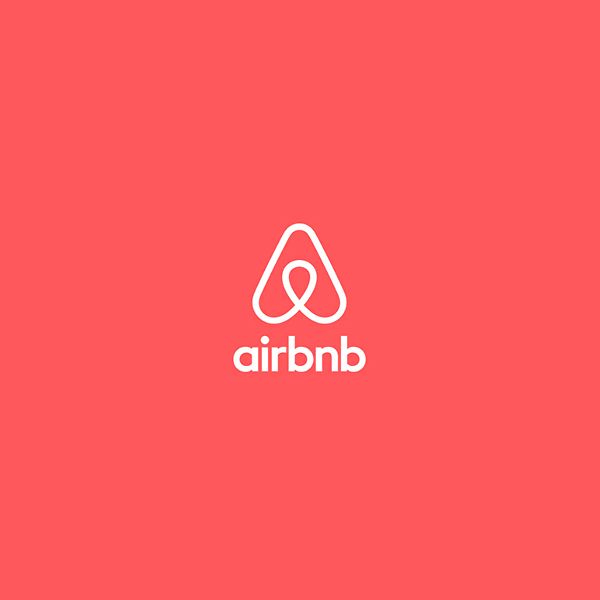
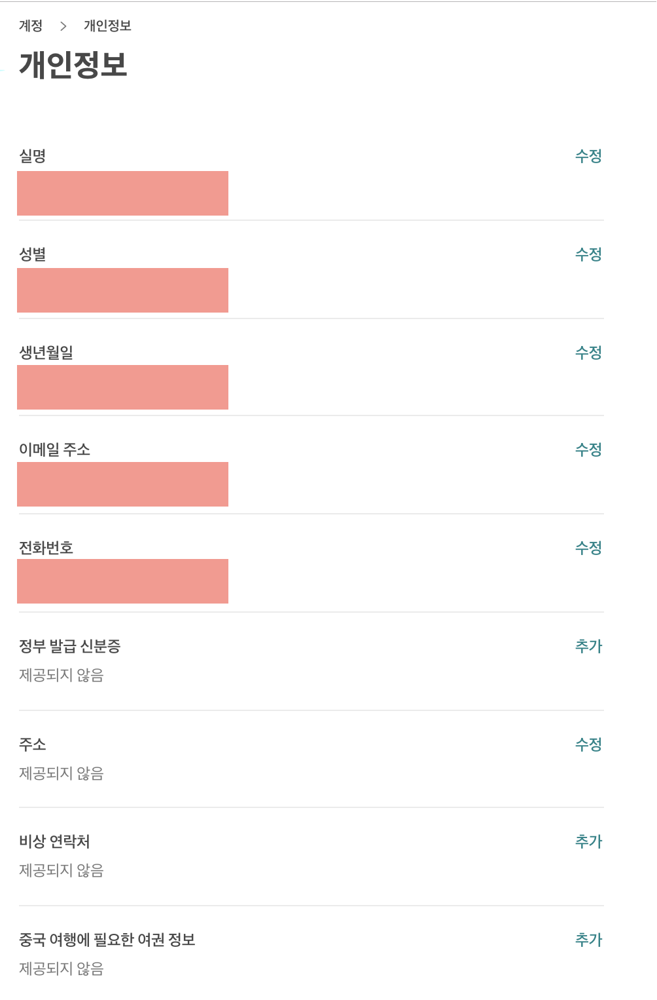

## Airbnb

> Airbnb 클론 코딩을 해보도록 하겠습니다.

### 기술 스택

- <b>[Django](https://www.djangoproject.com/)</b>
- <b>Python</b>
- <b>Selenium</b>

---

### 🎃 초기 환경 설정

<br>

- `Create github repository`
- `git init`
- `gitignore setting` / Search to google <b>`gitignore python`</b>
- `Install pipenv`<br>
  `pip`은 global에 설치 되므로, `pipenv` ( 가상환경으로써 JS의 package.json 과 비슷한 역할을 합니다. ) 를 설치 해줍니다.<br>
  `pipenv`는 `brew install pipenv` 로 설치 해줍니다.

```python
# pipenv로 python3 내에서 환경을 구축하겠다는 설정을 해줍니다.
$ pipenv --three
```

```py
# python3 shell 환경으로 들어갑니다.
# 루트 디렉토리가 앞에 붙습니다.
# 항상 가상환경을 켠 채(pipenv shell)로 작업해야 합니다.
$ pipenv shell
$ (AIRBNB)elt@Chanui-MacBookPro ~/Documents/PROJECT/AIRBNB...
```

```py
# django를 설치해줍니다.
$ pipenv install django

# django-adming을 통해 django가 설치되었는지 확인합니다.
$ django-admin

```

---

### 🎃 장고 프로젝트 생성하기

<br>

```py
$ django-admin startproject config
# config 폴더가 생성되면서 내부에 같은이름의 config 파일과 manage.py가 생성됩니다.
```

- 생성한 `config 폴더`를 Aconfig와 같이 이름을 변경한 후, 내부에 있는 `config` 파일과 `manage.py` 파일을 외부로 드래그 앤 드랍 합니다. <br>이후 Aconfig 파일을 제거합니다.

- 파이썬은 Runtime 언어로 컴파일을 따로 하지 않습니다. 따라서 **[Lint](<https://ko.wikipedia.org/wiki/%EB%A6%B0%ED%8A%B8_(%EC%86%8C%ED%94%84%ED%8A%B8%EC%9B%A8%EC%96%B4)>)** 설정을 해줍니다.

- **Linter** 는 오류를 미리 캐치해줍니다. **[python pep](https://www.python.org/dev/peps/pep-0008/) 가이드**를 따릅니다.

```py
# Linter로 flake8을 설치합니다.
$ pipenv install flake8 --dev
```

```py
# vs code의 settings.json에 아래 코드를 추가합니다.
"python.linting.flake8Enabled": true,
"python.linting.enabled": true,
```

- **Linter**로 찾은 에러를 **Formatter** 를 통해서 자동으로 수정하도록 설정합니다.

```py

# black이라는 formatter를 설치합니다.
$ pipenv install black --dev --pre

# 저장시 자동으로 formatting 되도록 설정합니다.
$ vscode > settings > format On save 체크

# 이제 formatter를 통해 lint(flake8) 설정에 맞도록 자동으로 수정 됩니다.
```

```py
# 장고 서버를 실행합니다.
$ python manage.py runserver
# localhost:8000 / 8000번 포트로 연결되어 있습니다.
```

- <b>localhost:8000/admin</b> 을 통해 admin 페이지에 접근할 수 있습니다. <br>
  하지만 초기 접근시에 migrate 하지 않았다는 에러가 발생하여 접근이 불가능 합니다.
  장고는 많은 기능들이 사전에 구현되어 있는 웹 프레임워크 입니다.
  admin 페이지 역시 구현이 되어있고 이를 사용하기 위해 장고의 초기 DB(sqlite)와 migrate를 해주면 됩니다.

```py
# admin page를 사용할 계정을 만듭니다.
$ python manage.py createsuperuser
```

---

### 🎃 Django Applications

#### Divide and Conquer

- <b>Application is Group of Function.</b><br>
  장고는 여러 개의 어플리케이션으로 구성되어 있습니다.<br>
  장고를 효과적으로 사용하는 벙법은 언제 어플리케이션을 만들고 만들지 않아야 하는지를 구별하는 것 입니다. <br>
  즉, 기능별 / 역할별 구분이 필요하며, 몇 개의 어플리케이션이 필요할지를 설계 해야합니다. <br>
  <b>Airbnb</b>를 예로 들면, room 어플리케이션( 룸 수정, 삭제, 입력 ) 과 review 어플리케이션( 리뷰 입력, 수정, 삭제 )은 별도의 기능을 갖고 있는 것처럼요.
  기능별로 구분한 어플리케이션을 **config** 에서 통합하여 장고 웹사이트를 구성합니다.

### 🎃 Create the Apps

> #### <b>"We play by the rule of the framework" </b><br>
>
> 프레임워크는 정해진 규칙에 따라서 사용해야 합니다. 장고 역시 폴더 명이나 파일명을 수정해서는 안됩니다. 생성은 가능합니다

<b>Divide and Conquer를 고려하여 각 기능을 고려하여 어플리케이션을 만들어 보겠습니다.

```py
# startapp 을 통해 어플리케이션을 생성합니다.
# application name은 복수형으로 생성합니다.
$ django-admin startapp < application name >
```

- **"reservations, users, lists, reviews, rooms, conversations"** application을 생성합니다.

```py
# admin 페이지에 대한 설정을 하는 파일 입니다.
admin.py

# data 우리가 원하는 database가 어떻게 생겼는지에 대해서 설명하는 곳 입니다.
Models.py

# 실제로 보여질 부분, 렌더링될 function을 작성합니다.
Views.py

# 웹 사이트의 url을 컨트롤 합니다.
confing > urls.py
```

---

### 🎃 Settings.py

- `$ config > settings.py`를 설정합니다.
  장고에서 우리가 만든 폴더를 인식 시키기 위해서 `settings.py`를 configuration 해야 합니다.

```py
$ config > settings.py
# 외부 패키지를 configuration할 변수를 생성합니다.
THIRD_PARTY_APPS = []

# Application Definition ( 기존에 생성되어 있는 변수 입니다. )
DJANGO_APPS = []

# Project를 담을 변수를 생성합니다.
PROJECT_APPS = []

INSTALLED_APPS = DJANGO_APPS + PROJECT_APPS + THIRD_PARTY_APPS

AUTH_USER_MODEL = "users.User"

```

---

### 🎃 Introduce and Make the User Model

> **DB 테이블 구조/타입을 먼저 설계를 한 후에 모델을 정의합니다.**

- [MODEL](https://channing.netlify.com/ko/blog/2019/10/18/channing)

* models.py를 통해 테이블을 구성합니다.<br>

<center>

[실제 Airbnb의 user 페이지 입니다]

</center>



- 이제 저희의 Airbnb `user model`(웹 마스터) 에 들어갈 수 있는 테이블을 구상하겠습니다.
  각 부분들이 필드가 될 것이고 Airbnb에서 필요로 할 유저의 정보를 담을 부분 이라고 생각하면 됩니다. models.py를 수정하여 기존 장고 `/admin` 페이지에 해당 필드들을 추가해보겠습니다.

  - avatar
  - gender
  - bio
  - birthday
  - language
  - currency
  - superhost

<br>

- 이를 기초로 하여 `modes.py` 코드를 작성해보겠습니다.

```py
$ users > models.py

# There are two ways to extend the default User model without substituting your own model.
from dango.contrib.auth.models import AbstractUser
from dango.db import models

# AbstractUser로 상속 합니다.
class User(AbstractUser):
    """ Custom User Model """

    GENDER_MALE = "male"
    GENDER_FEMALE = "female"
    GENDER_OTHER = "other"

    GENDER_CHOICES = (
        (GENDER_MALE, "Male"),
        (GENDER_FEMALE, "Female"),
        (GENDER_OTHER, "Other"),
    )

    LANGUAGE_ENGLISH = "en"
    LANGUAGE_KOREAN = "kr"

    LANGUAGE_CHOICES = ((LANGUAGE_ENGLISH, "English"), (LANGUAGE_KOREAN, "Korean"))

    CURRENCY_USD = "usd"
    CURRENCY_KRW = "krw"

    CURRENCY_CHOICES = ((CURRENCY_USD, "USD"), (CURRENCY_KRW, "KRW"))

    avatar = models.ImageField(null=True, blank=True)
    gender = models.CharField(
        choices=GENDER_CHOICES, max_length=10, null=True, blank=True
    )
    # default 가 필요한 이유.. DB column에 디폴트 값을  설정하기 위해서!
    bio = models.TextField(default="", blank=True)
    birthday = models.DateField(null=True)
    language = models.CharField(
        choices=LANGUAGE_CHOICES, max_length=2, null=True, blank=True
    )
    currency = models.CharField(
        choices=CURRENCY_CHOICES, max_length=3, null=True, blank=True
    )
    superhost = models.BooleanField(default=False)

```

- 이제 생성한 모델을 실제 확인 하려면`/admin` 패널에서 볼 수 있습니다. `/admin` 패널은 `admin.py` 로 작업해야 합니다.<br>
  `admin.py` 에서 우리가 만든 `model`을 `register` 해옵니다.

```py
from django.contrib import admin
from django.contrib.auth.admin import UserAdmin
from . import models

# Register your models here.
# decorator
# 저는 admin 패널에서 User를 보고 싶습니다.
@admin.register(models.User)
# User를 컨트롤할 클래스가 바로 CustomUserAdmin이 될 겁니다.
# CustomUserAdmin으로 User를 컨트롤 하고 싶습니다.
class CustomUserAdmin(UserAdmin):

    """ Custom User Admin """
    # admin 페이지에 해당 테이블을 생성합니다.
    # list_display = ("username", "email", "gender", "language", "currency", "superhost")
    # list_filter = ("superhost", "language", "currency")
    fieldsets = UserAdmin.fieldsets + (
        (
            "Custom Profile",
            {
                "fields": (
                    "avatar",
                    "gender",
                    "bio",
                    "birthday",
                    "language",
                    "currency",
                    "superhost",
                )
            },
        ),
    )
```

---

### 🎃 Room Model

#### Foreign Key

<hr />

<center>

Reference <br>
[DJANGO](https://docs.djangoproject.com/ko/2.2/intro/)<br>
[NOMAD](https://academy.nomadcoders.co/courses/category/KR)<br>
[장고](https://channing.netlify.com/ko/blog/2019/10/18/channing)<br>

</center>
