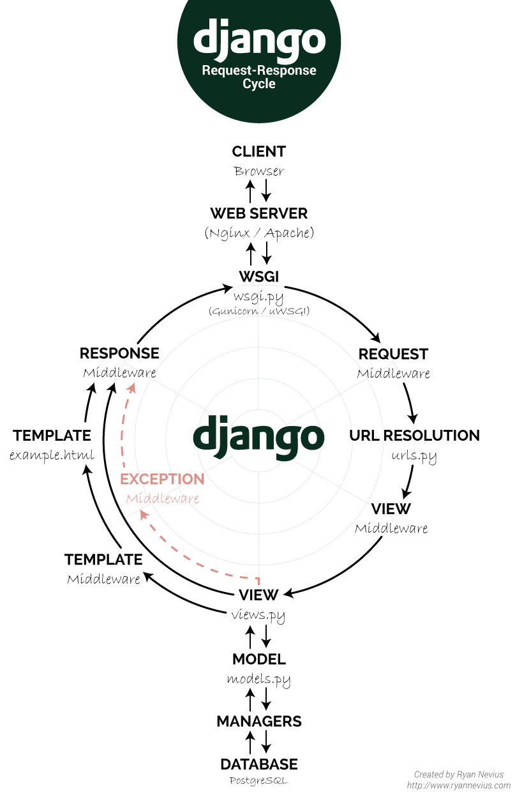

> 노마드코더를 통해 Airbnb 클론 코딩을 해보도록 하겠습니다.

### 기술 스택

- <b>[Django](https://www.djangoproject.com/)</b>
- <b>Python</b>
- <b>Selenium</b>
- <b>React Native</b>

---

### CONTENTS

1. <mark> Application 구성 </mark> | 그냥 말 그대로 기능별로 나눕니다.

   > 각 Application을 \$ django-admin startapp < application name > 요 코드로 만듭니다.

2. <mark> DB 테이블 구조/타입을 먼저 설계를 한 후에 models.py를 정의합니다. localhost:8000/admin/ 페이지를 먼저 구현 합니다. </mark>

   > 2-1. 구현하고자 하는 부분의 설계를 해야 DB Table 구상이 쉽습니다.<br>
   > 각 Column의 Field를 구상합니다.<br>

3. <mark> View 구성 </mark>
   > ~중간에 모델을 상세하게 설정 하고, command를 추가하여 더미데이터를 넣는 등의 과정은 아래에서 확인 가능합니다.

---

### 초기 환경 설정

<br>

- `Create github repository`
- `git init`
- `gitignore setting` / Search to google <b>`gitignore python`</b>
- `Install pipenv`<br>
  `pip`은 global에 설치 되므로, `pipenv` ( 가상환경으로써 JS의 package.json 과 비슷한 역할을 합니다. ) 를 설치 해줍니다.<br>
  `pipenv`는 `brew install pipenv` 로 설치 해줍니다.

```python
# pipenv로 python3 내에서 환경을 구축하겠다는 설정을 해줍니다.
$ pipenv --three
```

```py
# python3 shell 환경으로 들어갑니다.
# 루트 디렉토리가 앞에 붙습니다.
# 항상 가상환경을 켠 채(pipenv shell)로 작업해야 합니다.
$ pipenv shell
$ (AIRBNB)elt@Chanui-MacBookPro ~/Documents/PROJECT/AIRBNB...
```

```py
# django를 설치해줍니다.
$ pipenv install django

# django-adming을 통해 django가 설치되었는지 확인합니다.
$ django-admin

```

---

### 장고 프로젝트 생성하기

<br>

```py
$ django-admin startproject config
# config 폴더가 생성되면서 내부에 같은이름의 config 파일과 manage.py가 생성됩니다.
```

- 생성한 `config 폴더`를 Aconfig와 같이 이름을 변경한 후, 내부에 있는 `config` 파일과 `manage.py` 파일을 외부로 드래그 앤 드랍 합니다. <br>이후 Aconfig 파일을 제거합니다.

- 파이썬은 Runtime 언어로 컴파일을 따로 하지 않습니다. 따라서 **[Lint](<https://ko.wikipedia.org/wiki/%EB%A6%B0%ED%8A%B8_(%EC%86%8C%ED%94%84%ED%8A%B8%EC%9B%A8%EC%96%B4)>)** 설정을 해줍니다.

- **Linter** 는 오류를 미리 캐치해줍니다. **[python pep](https://www.python.org/dev/peps/pep-0008/) 가이드**를 따릅니다.

```py
# Linter로 flake8을 설치합니다.
$ pipenv install flake8 --dev
```

```py
# vs code의 settings.json에 아래 코드를 추가합니다.
"python.linting.flake8Enabled": true,
"python.linting.enabled": true,
```

- **Linter**로 찾은 에러를 **Formatter** 를 통해서 자동으로 수정하도록 설정합니다.

```py

# black이라는 formatter를 설치합니다.
$ pipenv install black --dev --pre

# 저장시 자동으로 formatting 되도록 설정합니다.
$ vscode > settings > format On save 체크

# 이제 formatter를 통해 lint(flake8) 설정에 맞도록 자동으로 수정 됩니다.
```

```py
# 장고 서버를 실행합니다.
$ python manage.py runserver
# localhost:8000 / 8000번 포트로 연결되어 있습니다.
```

- <b>localhost:8000/admin</b> 을 통해 admin 페이지에 접근할 수 있습니다. <br>
  > 하지만 초기 접근시에 migrate 하지 않았다는 에러가 발생하여 접근이 불가능 합니다.
  > 장고는 많은 기능들이 사전에 구현되어 있는 웹 프레임워크 입니다.
  > admin 페이지 역시 구현이 되어있고 이를 사용하기 위해 장고의 초기 DB(sqlite)와 migrate를 해주면 됩니다.

```py
# admin page를 사용할 계정을 만듭니다.
$ python manage.py createsuperuser
```

---

### Django Applications 구상

#### "Divide and Conquer"

- <b>Application is Group of Function.</b><br>
  > 장고는 여러 개의 어플리케이션으로 구성되어 있습니다.<br>
  > 장고를 효과적으로 사용하는 방법은 언제 어플리케이션을 만들고 만들지 않아야 하는지를 구별하는 것 입니다. <br>
  > 즉, 기능별 / 역할별 구분이 필요하며, 몇 개의 어플리케이션이 필요할지를 설계 해야합니다. <br> > <b>Airbnb</b>를 예로 들면, room 어플리케이션( 룸 수정, 삭제, 입력 ) 과 review 어플리케이션( 리뷰 입력, 수정, 삭제 )은 별도의 기능을 갖고 있는 것처럼요.
  > 기능별로 구분한 어플리케이션을 **config**에서 통합하여 장고 웹사이트를 구성합니다.

---

### Create the Apps

**"We play by the rule of the framework"**

> 프레임워크는 정해진 규칙에 따라서 사용해야 합니다. 장고 역시 폴더 명이나 파일명을 수정해서는 안됩니다.( 생성은 가능합니다 ) <br>일례로 모델을 생성할때 `class Any(models.Model)` 처럼 생성하는데 Django 는 `models`를 읽고 Any라는 모델을 생성하는구나 라고 해석하여 Any가 DB에 저장되어야 한다고 알게 됩니다.

<b>Divide and Conquer를 고려하여 각 기능을 고려하여 어플리케이션을 만들겠습니다.

> 각 기능별로 Model을 생성하겠지만 <b>기능을 어떻게 나눌지도 고려해야할 사항 입니다.</b><br>
> 에이비엔비 사이트에서 숙소를 선택해서 들어가면, 해당 Room 페이지에 존재하는 section 들을 나열하면 'Reservation', 'Room Info', 'Facilities', 'Amenity', 'Reviews', 'Conversation', 'Availability', 'Host's Info', 'The neighbourhood', 'Things to keep in mind', 'House Rules', 'Cancellations' 등과 같이 Room안 에서도 수많은 부분들이 존재합니다.<br>
> 이들을 Room 모델 하나에 다루는 것이 아닌 Divdie and Conquer를 고려하여 나눌 수 있는 부분들(기능・용도별)을 적절히 나누어 설계하는 것이 목표가 되겠습니다.

```py
# startapp 을 통해 어플리케이션을 생성합니다.
# application name은 복수형으로 생성합니다.
$ django-admin startapp < application name >
```

**-** **reservations** <br>
**-** **users** <br>
**-** **lists** <br>
**-** **reviews** <br>
**-** **rooms** <br>
**-** **conversations**<br><br>
application을 생성합니다.

```py
# admin 페이지에 대한 설정을 하는 파일 입니다.
admin.py

# data 우리가 원하는 database가 어떻게 생겼는지에 대해서 설명하는 곳 입니다.
Models.py

# 실제로 보여질 부분, 렌더링될 function을 작성합니다.
Views.py

# 웹 사이트의 url을 컨트롤 합니다.
confing > urls.py
```

---

### Settings.py

- `$ config > settings.py`를 설정합니다.
  장고에서 우리가 만든 폴더를 인식 시키기 위해서 `settings.py`를 configuration 해야 합니다.

```py
$ config > settings.py
# 외부 패키지를 configuration할 변수를 생성합니다.
THIRD_PARTY_APPS = []

# Application Definition ( 기존에 생성되어 있는 변수 입니다. )
DJANGO_APPS = []

# Project를 담을 변수를 생성합니다.
PROJECT_APPS = []

INSTALLED_APPS = DJANGO_APPS + PROJECT_APPS + THIRD_PARTY_APPS

AUTH_USER_MODEL = "users.User"

```

---

### Make the User Model

> **DB 테이블 구조/타입을 먼저 설계**를 한 후에 모델을 정의합니다.
> **admin/ 페이지**를 먼저 구현 합니다.

- [MODEL](https://developer-channing.com/blog/2019/10/18/channing)

* models.py를 통해 테이블을 구성합니다.<br>

<center>

[실제 Airbnb의 user 페이지 입니다]

</center>


- 이제 저희의 Airbnb `user model`(웹 마스터) 에 들어갈 수 있는 테이블을 구상하겠습니다.
  각 부분들이 필드가 될 것이고 Airbnb에서 필요로 할 유저의 정보를 담을 부분 이라고 생각하면 됩니다. `models.py`를 수정하여 기존 장고 `/admin/users` 페이지에 해당 필드들을 추가해보겠습니다.

  - avatar
  - gender
  - bio
  - birthday
  - language
  - currency
  - superhost

<br>

- 이를 기초로 하여 `models.py` 코드를 작성해보겠습니다.

```py
$ users > models.py

# There are two ways to extend the default User model without substituting your own model.
from dango.contrib.auth.models import AbstractUser
from dango.db import models

# AbstractUser로 상속 합니다.
class User(AbstractUser):
    """ Custom User Model """

    GENDER_MALE = "male"
    GENDER_FEMALE = "female"
    GENDER_OTHER = "other"

    GENDER_CHOICES = (
        (GENDER_MALE, "Male"),
        (GENDER_FEMALE, "Female"),
        (GENDER_OTHER, "Other"),
    )

    LANGUAGE_ENGLISH = "en"
    LANGUAGE_KOREAN = "kr"

    LANGUAGE_CHOICES = ((LANGUAGE_ENGLISH, "English"), (LANGUAGE_KOREAN, "Korean"))

    CURRENCY_USD = "usd"
    CURRENCY_KRW = "krw"

    CURRENCY_CHOICES = ((CURRENCY_USD, "USD"), (CURRENCY_KRW, "KRW"))

    avatar = models.ImageField(null=True, blank=True)
    gender = models.CharField(
        choices=GENDER_CHOICES, max_length=10, null=True, blank=True
    )
    # default 가 필요한 이유.. DB column에 디폴트 값을  설정하기 위해서!
    bio = models.TextField(default="", blank=True)
    birthday = models.DateField(null=True)
    language = models.CharField(
        choices=LANGUAGE_CHOICES, max_length=2, null=True, blank=True
    )
    currency = models.CharField(
        choices=CURRENCY_CHOICES, max_length=3, null=True, blank=True
    )
    superhost = models.BooleanField(default=False)

```

- 이제 생성한 모델을 실제 확인 하려면`/admin` 패널에서 볼 수 있습니다. `/admin` 패널은 `admin.py` 로 작업해야 합니다.<br>
  `admin.py` 에서 우리가 만든 `model`을 `register` 해옵니다.

```py
from django.contrib import admin
from django.contrib.auth.admin import UserAdmin
from . import models

# Register your models here.
# decorator
# 저는 admin 패널에서 User를 보고 싶습니다.
@admin.register(models.User)
# User를 컨트롤할 클래스가 바로 CustomUserAdmin이 될 겁니다.
# CustomUserAdmin으로 User를 컨트롤 하고 싶습니다.
class CustomUserAdmin(UserAdmin):

    """ Custom User Admin """
    # admin 페이지에 해당 테이블을 생성합니다.
    # list_display = ("username", "email", "gender", "language", "currency", "superhost")
    # list_filter = ("superhost", "language", "currency")
    fieldsets = UserAdmin.fieldsets + (
        (
            "Custom Profile",
            {
                "fields": (
                    "avatar",
                    "gender",
                    "bio",
                    "birthday",
                    "language",
                    "currency",
                    "superhost",
                )
            },
        ),
    )

    list_filter = UserAdmin.list_filter + ("superhost",)

    list_display = (
        "username",
        "first_name",
        "last_name",
        "email",
        "is_active",
        "language",
        "currency",
        "superhost",
        "is_staff",
        "is_superuser",
    )
```

---

#### list_display

> **[list_display](https://wayhome25.github.io/django/2017/03/22/django-ep8-django-admin/)** > `list_display` 옵션 은 모델 인스턴스 필드명/속성명/함수명 뿐만 아니라, ModelAdmin 내 멤버 함수로도 지정이 가능하다.
> 이 말은 즉 모델에서 Field를 지정해서 DB를 생성하지 않아도 admin 내에서 생성 가능하다는 말인가?<br>
> 컬럼 자체를 장고 유저(프로그래머)가 사용하기 편하게 그냥 `list_display`했을 시에 해당 컬럼이 생기도록 만들어 놓은 거야. `list_display`를 사용하면 장고가 너의 sqlite에다가 컬럼을
> 우리대신 만든거지 장고라는 프레임워크를 쓰지 않았다면 우리가 직접해야하는 일을 처리해준거야<br> by [Baby Tiger](https://babytiger.netlify.com/)<br>
> 그렇단 말은, DB에서 주요하게 Field를 관리해야할 부분은 Models에 프로그래머 가 관리 해주고 이외의 값에 대해서는 장고에게 맡긴다 라고 이해 해야겠습니다.

> 위 처럼 생각했었는데, 조금 더 공부해 본 바로는 약간의 특징이 보여서 내용을 추가해보겠습니다. 우리는 User 모델을 생성했을때 AbstractUser 처럼 `from django.contrib.auth.models import AbstractUser` 장고 모델에서 추상모델을 import 했습니다. 이 추상모델 에는 여러 기능이 미리 생성되어 있는데요,

```py
User > admin.py
    list_display = (
        "username",
        "first_name",
        "last_name",
        "email",
        "is_active",
        "language",
        "currency",
        "superhost",
        "is_staff",
        "is_superuser",
    )

```

users Application의 User모델은 `class User(AbstractUser)`로 모델을 구현했습니다. 그리고 admin.py에는 list_display 내부에 위 코드 처럼 테이블에 해당 데이터들이 추가되도록 하였습니다. 바로 저기 쓰여있는데 데이터들이 바로 `class AbstractUser` 내부에 미리 구현되어 있는 Field들 이였던 겁니다!

```py
class AbstractUser(AbstractBaseUser, PermissionsMixin):
    first_name = models.CharField(_('first name'), max_length=30, blank=True)
    last_name = models.CharField(_('last name'), max_length=150, blank=True)
    email = models.EmailField(_('email address'), blank=True)
    is_staff = models.BooleanField(
        _('staff status'),
        default=False,
        help_text=_('Designates whether the user can log into this admin site.'),
    )
```

즉, 개발자 본인이 모델을 구성하며 여러 Field를 설계할 수 도 있지만, 위에 추상화 도구를 활용하여 보다 편하게 DB설계를 할 수 있다는 것 입니다!

---

#### 장고 추상화 도구 (Abstraction)

[추상화](https://hyunalee.tistory.com/20)<br>
Django Model을 구현하다보면 여러 테이블에 같은 형식의 필드가 있는 경우가 많습니다. 이럴때 사용하는게 Abstract Model(추상 모델) 입니다.
추상 모델을 만들어 상속을 받습니다.

```py
from django.db import models

class CommonInfo(models.Model):
    name = models.CharField(max_length=100)
    age = models.PositiveIntegerField()

    # 추상 클래스 입니다.
    class Meta:
        abstar = True

class Studuent(CommonInfo):
    home_group = models.CharField(max_length=5)

```

<center>

--

</center>

User 모델을 보면, 일반적인 `models.Model`이 아닌 `AbstractUser`와 같이 모델을 생성합니다.

```py

from django.contrib.auth.models import AbstractUser
from django.db import models

# Create your models here.

# AbstractUser로 상속 합니다.
class User(AbstractUser):

```

`AbstractUser`를 option + click 해보면 아래와 같은 클래스가 보입니다.

```py
class AbstractUser(AbstractBaseUser, PermissionsMixin):
    """
    An abstract base class implementing a fully featured User model with
    admin-compliant permissions.

    Username and password are required. Other fields are optional.
    """
    username_validator = UnicodeUsernameValidator()

    username = models.CharField(
        _('username'),
        max_length=150,
        unique=True,
        help_text=_('Required. 150 characters or fewer. Letters, digits and @/./+/-/_ only.'),
        validators=[username_validator],
        error_messages={
            'unique': _("A user with that username already exists."),
        },
    )
    first_name = models.CharField(_('first name'), max_length=30, blank=True)
    last_name = models.CharField(_('last name'), max_length=150, blank=True)
    email = models.EmailField(_('email address'), blank=True)
    is_staff = models.BooleanField(
        _('staff status'),
        default=False,
        help_text=_('Designates whether the user can log into this admin site.'),
    )
    is_active = models.BooleanField(
        _('active'),
        default=True,
        help_text=_(
            'Designates whether this user should be treated as active. '
            'Unselect this instead of deleting accounts.'
        ),
    )
    date_joined = models.DateTimeField(_('date joined'), default=timezone.now)

    objects = UserManager()

    EMAIL_FIELD = 'email'
    USERNAME_FIELD = 'username'
    REQUIRED_FIELDS = ['email']

    class Meta:
        verbose_name = _('user')
        verbose_name_plural = _('users')
        abstract = True

    def clean(self):
        super().clean()
        self.email = self.__class__.objects.normalize_email(self.email)

    def get_full_name(self):
        """
        Return the first_name plus the last_name, with a space in between.
        """
        full_name = '%s %s' % (self.first_name, self.last_name)
        return full_name.strip()

    def get_short_name(self):
        """Return the short name for the user."""
        return self.first_name

    def email_user(self, subject, message, from_email=None, **kwargs):
        """Send an email to this user."""
        send_mail(subject, message, from_email, [self.email], **kwargs)


class User(AbstractUser):
    """
    Users within the Django authentication system are represented by this
    model.

    Username and password are required. Other fields are optional.
    """
    class Meta(AbstractUser.Meta):
        swappable = 'AUTH_USER_MODEL'


```

위 럼 추상화 된 `AbstactUser`모델에 미리 생성되어있는 field를 활용하여 보다 손쉽게 DB설계를 할 수 있습니다. 해당 field 는 admin.py 에서 `list_display`에서 사용할 수 있습니다!

---

### Make the Room Model

<br>

<center>

[실제 Airbnb의 Room 페이지 입니다]

</center>


- User Model과 같이 실제 Airbnb에서 필요로 할 Room 정보를 담을 부분 입니다.<br> `models.py`를 수정하여 기존 장고 `/admin/rooms` 페이지에 해당 필드들을 추가해보겠습니다.

  - name
  - description
  - country
  - city
  - price
  - address
  - guests
  - beds
  - bedrooms
  - baths
  - check_in
  - check_out
  - instant_book
  - host

```py
from django.db import models
from django_countries.fields import CountryField
from core import models as core_models
from users import models as user_models


class Room(core_models.TimeStampedModel):

    """ Room Model Definition"""

    # Django Countries
    name = models.CharField(max_length=140)
    description = models.TextField()
    country = CountryField()
    city = models.CharField(max_length=80)
    price = models.IntegerField()
    address = models.CharField(max_length=140)
    guests = models.IntegerField()
    beds = models.IntegerField()
    bedrooms = models.IntegerField()
    baths = models.IntegerField()
    check_in = models.TimeField()
    check_out = models.TimeField()
    instant_book = models.BooleanField(default=False)
    host = models.ForeignKey("users.User", related_name="rooms", on_delete=models.CASCADE)
    room_type = models.ForeignKey("RoomType", related_name="rooms", on_delete=models.SET_NULL, null=True)
    amenities = models.ManyToManyField("Amenity", related_name="rooms", blank=True)
    facilities = models.ManyToManyField("Facility", related_name="rooms", blank=True)
    house_rules = models.ManyToManyField("HouseRule", related_name="rooms", blank=True)


    # 모델과 다른 모델을 연결하는 방법 => foreign key

```

---


> 위에 생성한 Model의 실제 DB 입니다.

---

#### FOREIGN KEY

> Foreign Key, OneToOneField, ManyToManyField 가 뭐야 도대체? 네 알아보겠습니다. <br>

[What is the ForeignKey ?](https://stackoverflow.com/questions/24919638/django-onetoonefield-manytomanyfield-foreign-key)

```py
from django.db import models

class Place(models.Model):
    address = models.CharField(max_length=50)
    country = models.CharField(max_length=50)

class Publisher(models.Model):
    name = models.CharField(max_length=30)
    place = models.OneToOneField(Place, primary_key=True)

class Author(models.Model):
    first_name = models.CharField(max_length=30)
    last_name = models.CharField(max_length=40)

class Book(models.Model):
    title = models.CharField(max_length=100)
    publisher = models.ForeignKey(Publisher)
    authors = models.ManyToManyField(Author)
```

> Model을 정의한다는 DB에 class 이름으로 된 Table을 만든다 입니다. 예제는 책에 관련된 DB를 생성하고 있습니다.

- One-to-many / Foreign Key
  > ManyToMany 랑 OneToOne 으로 쓰면서 ForeignKey는 왜 OneToMany로 안쓰나요 ? 그러게 말입니다. <br>
  > 무튼 각설하고, <b>일대다 / 외래키 입니다.</b> 먼저 <b>책의 관점에서 보겠습니다.</b> 모든 'Book' 은 'Publisher' 를 갖고있습니다. 당장 집에 있는 책을 꺼내도 출판사가 적혀있죠? 그런데 잘보면 한 책에는 하나의 출판사만 적혀있습니다. 물론 한 책을 여러 출판사에서 출판 할 수 있다고 하여도, <b>한 권의 책에는 하나의 출판사</b> 만 적혀있습니다. 그러면 <b>출판사 입장에서 생각해볼까요?</b> 출판사는 책과는 다르게 여러 개의 책을 출판 할 수 있습니다. 출판사에서 한권의 책만 출판한다면 망하겠죠? 그러므로 이러한 관계를 우리는 <b>one-to-many(book-to-publisher) 관계</b> 로 구조를 짤 수 있는 겁니다. 장고 에서는 `publisher = models.ForeignKey(Publisher)` 이렇게 관계를 맺어줍니다. <br> 제가 알기로는 DB설계 정답이 없으므로(보다 나은 구조는 있지만), 구조를 설계하는건 개발자 마음입니다. 여러 조건을 잘 고려해서 설계해야 합니다.

* One-to-One

  > 말 그대로 <b>1:1 관계입니다.</b> 모든 출판사는 하나의 Place에 위치 합니다.(본사 하나만 갖고 있다라고 가정하겠습니다.) <br> 그리고 모든 Place는 하나의 출판사만을 수용할 수 있습니다. 한 건물은 하나의 주소만을 갖을 수 있습니다. 출판사를 찾아가려고 하는데 주소가 여러 개라면 찾아가기 힘들겠죠?

* Many-to-Many
  > <b>다대다 관계</b>입니다. 책의 관점에서 보면 모든 책은 하나 또는 하나 이상의 작가를 갖을 수 있습니다. 공저라고 하죠. 작가의 관점 에서 보면 작가가 쓴 책이 한권 일수도, 여러 권 일 수 도 있습니다. 따라서 이런 관계를 다대다 관계로 묶어줍니다.

그래서 공부하면서 생각 해봤는데, 모델(DB)를 설계할 때, 각각의 필드 들을 서로 서로의 관점에서 고려하여 구성 해야 할 것 같습니다.<br>
Airbnb를 보면 Room 페이지 에서 다양한 정보가 존재하는데, 각각의 부분을 DB에 Room 테이블에서 어떻게 관계를 줘야할지 고려해야 할 것 같습니다. <br>

<center>

--

</center>

이제 다시 Airbnb 모델을 보면, 이런 식으로 관계를 맺어줬습니다.

```py
host = models.ForeignKey("users.User", related_name="rooms", on_delete=models.CASCADE)
room_type = models.ForeignKey("RoomType", related_name="rooms", on_delete=models.SET_NULL, null=True)
amenities = models.ManyToManyField("Amenity", related_name="rooms", blank=True)
facilities = models.ManyToManyField("Facility", related_name="rooms", blank=True)
house_rules = models.ManyToManyField("HouseRule", related_name="rooms", blank=True)
```

> host가 ForeignKey(one-to-Many)로 관계가 맺어져 있습니다. 호스트의 관점에서 보면 한명의 호스트는 여러개의 방을 갖을 수 있기 때문입니다. 방에 관점에서 보면 그 방은 단 한명의 호스트의 방이 겠죠? <br> <br>
> room_type은 숙소 유형인데 에어비엔비에서는 호텔 객실 / 다인실 / 개인실 / 집 전체 이런 식으로 나누어서 방을 제공합니다. 숙소 유형 관점으로 보면 여러개의 방을 갖을 수 있겠죠? 에어비엔비를 예로 들면, 호텔 객실 카테고리를 클릭했을때 호텔 객실에 해당하는 방 들을 보여줍니다.<br> 이 말은 즉 하나의 룸 타입은 여러 개의 방을 갖고 있을 수 있다는 말입니다. 그럼 반대의 경우 하나의 룸은 몇 개의 숙소 유형을 갖을 수 있을까요? <br>그 방이 건물 전체가 아닌 이상 하나의 룸 타입을 갖고 있을겁니다.<br><br>
> amenities, facilities, houseRules 의 경우 Many-to-Many Field를 사용하고 있습니다. 역시 각각의 관점에서 생각해보면, 편의 시설 의 경우 모든 방에서 갖을 수 있습니다. A 라는 집에서 칫솔,치약,비데 등등 을 갖을 수 있고, B라는 집에서도 당연히 A의 편의시설 을 갖을 수 있겠죠?<br>
> 편의시설 은 모든 방에 존재하고, 모든 방은 편의시설을 갖고 있는 관계 입니다.

---

#### on_delete

---

사용자가 변경할 수 있도록 모델을 설정 할 것인가 / 아닌가
<br>Amenity를 예로 들어보자.
Airbnb에는 Amenity를 확인할 수 있다. 이를 개발자인 우리가 모두 수정하기 에는 너무 귀찮다. <br>이를 해결하기 위해 우리는 장고의 어드민 페이지를 활용한다.

---

#### Meta Class

---

### Decorate Admin Panel

- [Django Admin site](https://docs.djangoproject.com/en/2.2/ref/contrib/admin/)<br><br>

- `ModelAdmin.list_display` <br><br>
  > Set list_display to control which fields are displayed on the change list page of the admin.
- `list_filter`<br><br>

```py
    list_filter = (
        "instant_book",
        "host__superhost",
        "room_type",
        "amenities",
        "facilities",
        "house_rules",
        "city",
        "country",
    )
```

- `search_fields`<br><br>
  > serach box를 생성합니다. icontains default로 되어있습니다. 대∙소문자를 구별하지 않습니다.

```py
    search_fields = ("^city", "^host__username")
```

- `fieldsets`<br><br>

  > [DOCS](https://docs.djangoproject.com/ko/2.2/intro/tutorial07/) | 단지 2개의 필드만으로는 인상적이지는 않지만, 수십 개의 필드가 있는 관리 폼의 경우에는 직관적인 순서을 선택하는 것이 사용 편리성의 중요한 부분입니다. 수십 개의 필드가 있는 폼에 관해서는 폼을 fieldset으로 분할하는 것이 좋습니다.

```py
fieldsets = UserAdmin.fieldsets + (
    (
        "Custom Profile",
        {
            "fields": (
                "avatar",
                "gender",
                "bio",
                "birthday",
                "language",
                "currency",
                "superhost",
            )
        },
    ),
)
```


- `ordering`

---

### Managers and QuerySets

- [Making Queries](https://docs.djangoproject.com/en/2.2/topics/db/queries/)

```py
$ Terminal

pipenv shell
python manage.py shell

from users.models import User
yosep = User.objects.get(username="yosep")
yosep.rooms.all()

startswith = User.objects.filter(username__startswith="yos")
```

- `vars` & `dir`<br><br>
- `User.object.all()` <br><br>
  > `<QuerySet [<User: elt>, <User: channing>, <User: yosep>]>` <br>QuerySet은 Object의 List 입니다.
- `set`

---

함수를 추가하여 어드민 페이지에 원하는 데이터를 더 추가하여 확인할 수 있습니다.
related_name = "" room이 무엇을 갖고 있다 .
프론트와 admin에서 쓰고싶은 함수는 model.py 에서 메서드로 구현한다.

파이썬 라이브러리를 사용하지 않는 이유는 Django 서버에서 인식 하기 위해서. 장고 케어
from django.utils import timezone
Media root config - settings - BASE_DIR

---

### Custom manage.py commands

Django는 commands도 만들 수 있습니다.
["BaseCommand"](https://docs.djangoproject.com/en/2.2/howto/custom-management-commands/)

> commands를 왜 만들어야 하죠?


> rooms application내에 commands 생성을 위한 폴더를 추가해줍니다. 내부 구조를 보게되면 rooms application 내부에 management 폴더를 생성하였고, 그 내부에 _init_.py 와 commands 또 내부에 _init_.py 와 loveyou.py 를 생성한걸 볼 수 있습니다.

<b>원하는 기능을 구현할때는 항상 Django Docs를 참고합니다.</b>


> 장고 Docs 사용례 대로 생성 한뒤 해당 코드를 실행하면 위와 같이 나오는데요.
> `--help` 명령어를 실행하게 되면 Test by Channing이 출력되고, optional arguments에 --times TIMES aloha 가 추가된걸 볼 수 있습니다!


> 장고 커맨드는 handle을 추가하라고 요구합니다. 이것 역시도 Docs에 나와있습니다.
> 위 처럼 코드를 작성한뒤 명령어를 실행하면 원하는 값을 출력합니다.

---

### seed_amenities command

> commands 를 왜 만드는 걸까요? 지금까지 amenity 같이 중복으로 사용될 요소들을 admin page에서 수동적으로 생성 했었습니다. 이제는 이와 같은 일들을 코드로써 자동화 하기 위함 입니다. 또 dummy data를 효율적을 생성해줍니다. 일일히 클릭으로 생성할 필요가 없습니다! 즉, 로컬 서버에서 보여지는 화면이 딸랑 사진 하나에 데이터 하나 가 아닌 그럴싸한 사이트를 생성 할 수 있는 것 입니다.


> 위에 연습했던 commands 를 활용하여 ammenity를 한번에 추가하는 코드를 작성했습니다! 이 코드로 admin 페이지에 ammenity가 추가 됩니다.<br> `objects.create()`에 대하여 <br> `stdout.write()`에 대하여

> 이제 반복적으로 추가되는 부분에 대해서 같은 작업을 해줍니다.

---

### django_seed

[django_seed](https://github.com/Brobin/django-seed) 를 설치 해줍니다. django_seed는 faker의 기능을 갖고 있는데요. 생성한 model의 field를 보고 fake data를 만들어 채워주는 역할을 합니다.

```py
$ pipenv install django_seed

$ config > setting.py > third_party_apps 에 django_seed 를 추가합니다.
```

> `lambda x` 는 JS에서 익명함수와 같습니다.

---

### URLS and VIEWS

- url 설계

  > url을 `config urls.py`에 전부 정의하게 되면 너무 길어질 수 있기 때문에 각각의 어플리케이션에 url.py에 root를 정의해줘야 합니다.

- `views.py`

  > views에서 Http Request 와 Http Response를 처리합니다.
  > template 을 redering 할 겁니다. <br>
  > 구조를 생각해보겠습니다.

  ```py
  def all_rooms(request):
    print(var(request))

  # 위 처럼 요청을 출력 해보면, 내부에는 cookies, GET, WSGI, schema 등 수많은 데이터가 들어있습니다.
  큰 구조는 웹 에서의 HTTP 요청과 응답 입니다.
  ```

<b>결국 요청을 받아서 응답을 한다 입니다.</b> <br>
장고로 이해해보면, 사용자가 'blahblah.com/rooms' 와 같이 url에 접속하겠다 라고 서버에 요청을 할겁니다. ("/room" 가 서버에서 정의한 path가 될겁니다.) 그러면 장고는 `url.py` 에서 해당 path 가 정의되어 있는지를 볼겁니다. 존재한다면 path에 해당하는 화면을 렌더링 해줘야 겠죠? 장고는 `views.py`가 사용자에게 보여줄 화면을 http 응답으로 반환합니다. 여기서 단순하게 html 파일 수동적으로 작성해서 보여줄 수 도 있지만, 그건 매우 low level 이므로, 생성한 템플릿을 렌더링 하도록 합니다.



<br>
<br>

프론트단 역시 장고로 만들것이기 때문에 html 파일을 활용하여 템플릿을 구성합니다.

> 장고로 화면 렌더링을 어떻게 할 것 인가를 생각해보겠습니다. 우리는 모든 작업을 클라이언트 단에서 하지 않습니다. 이는 서비스를 구현하는데 있어서 매우 비효율적 이라고 합니다. 데이터의 양도 모르고, 렌더링에 시간이 얼마나 걸릴지도 모릅니다 또 데이터를 단순하게 클라이언트에 보관하여 보안등의 문제를 일으키고 싶지도 않습니다. 그래서 우리는 DB를 사용하고 서버를 따로 둬서, 클라이언트에서 서버로 원하는 데이터를 요청 하는 식으로 웹/웹앱 을 구현합니다. 이 요청과 응답에는 HTTP Protocol을 이용하며, 이를 보다 편리하게 하기 위한 기능들이 구축되어 있습니다.(노드에서 fetch 라던가..), 즉 요청과 응답을 통해 원하는 데이터를 가져올 수 있습니다. 그리고 클라이언트에서 서버로의 요청을 하기 위해서 백엔드 개발자는 API를 만들어 이쪽으로 어떤 요청을 보내주세요 같은 가이드를 잡아줄 수 있습니다.

> 장고는 MVC모델이며, ORM이라는 특성을 갖고 있습니다. models.py를 통해 DB를 구성합니다. 그럼 우리는 구성한 DB에 접근하여 원하는 데이터를 뽑아와 view.py에서 처리하여 Template을 통해 화면에 출력해야합니다. 이를 위해 DB에 데이터를 꺼내기 위한 query가 존재하며, urls.py를 통해 path에 접근할 수 있습니다. API는 views.py에서 구현합니다. 위 그림이 과정을 개략적으로 설명해줍니다. <br>
> 서버는 장고로 프론트는 리액트로 하고싶다 라고 한다면 view, models, admin, url 까지를 장고로 구현한다고 생각하면 될 것 같습니다.

> 구조는 이렇습니다. html파일 하나에 페이지를 구현하면 코드가 엄청나게 길어집니다. 따라서 Divide Conquer 하여 코드를 구성합니다. 먼저 blueprint 가 될 base.html을 생성하고 거기서 또 html 내에서 나눠 질 수 있는 부분 header , footer 등을 모두 나누어 구성합니다.


> templates 라는 폴더를 생성한후 각 부분 을 나누어 생성합니다. <br>
> 만든 html 파일을 사용하기 위해서는 extend 가 필요합니다. 그리고 장고는 html내에서 조건 문이나 반복문을 쓸수 있도록 하는 문법이 존재합니다. `` 나 `{{ }}` 등 입니다.

> `objects.all()`은 위험합니다. 왜냐하면 DB에 있는 모든 데이터를 꺼내는 query이기 때문입니다. 만약 데이터가 수만개가 있고, 그 데이터 전부를 가져온다면 어떻게 될지..<br>
> 따라서 limiting Querysets을 합니다. Queryset을 호출한다고 해서 바로 값이 출력되는 것은 아닙니다.

```py
$ views.py
def all_rooms(request):
    page = request.GET.get("page")
    room_list = models.Room.objects.all()
    paginator = Paginator(room_list, 10)
    rooms = paginator.get_page(page)
    return render(
        request,
        "rooms/home.html",
        {"rooms": rooms}
    )

```

```js
$ home.html



    Home




    
        <h1>{{room.name}} / ${{room.price}}</h1>
    

    <h5>

    
        <a href="?page={{page|add:-1}}">Previous</a>
    

    Page {{rooms.number}} of {{rooms.paginator.num_pages}}

    
        <a href="?page={{page|add:1}}">Next</a>
    

    </h5>


```

> 코드를 보게되면 views.py 에서 request 에서 "page" get 해옵니다. 이는 url에서 쿼리 부분을 읽어오는 건데요, `http://localhost:8001/?page=2` 여기서 ?page=2 이부분을 get 해오겠다는 겁니다. 저 url은 html파일 내에서 `<a href="?page">` 같은 식으로 되어있습니다. 해당 링크에 접근하면 장고 view는 get으로 쿼리를 읽어옵니다.

---

### CBV and FBV

- `ListView`
- `DetailView`

---

**FBV(Function Based View)**

```py
from django.shortcuts import render, redirect
from django.core.paginator import Paginator, EmptyPage
from . import models

# Create your views here.
def all_rooms(request):
    page = request.GET.get("page", 1)
    room_list = models.Room.objects.all()
    paginator = Paginator(room_list, 10, orphans=5)

    try:
        rooms = paginator.page(int(page))
        return render(request, "rooms/home.html", {"page": rooms})
    except EmptyPage:
        return redirect("/")
```

원래 코드에서는 DB에서 데이터를 get해서 화면에 렌더링하고, 페이지 네이터를 이렇게 구현했었습니다.

---

**CBV(Class Based View)**

```py
from django.views.generic import ListView
from . import models

# 반복을 피하고 싶다.
# ListView : A page representing a list of objects
class HomeView(ListView):

    """ HomeView Definition """

    # Room을 리스트로 나타내고 싶습니다.
    model = models.Room
    paginate_by = 10
    paginate_orphans = 5
    ordering = "created"

```

길었던 코드가 줄어들었습니다. `ListView`는 A page representing a list of objects 를 해줍니다. 내부를 살펴보면 DB에서 데이터를 가져오는 쿼리셋 부터 구현하고자 하는 기능이 모두 갖추어져 있는 친구 입니다. 페이지 네이션 역시 configuration을 활용해서 매우 간단하게 구현이 가능합니다.

> 그렇다고 해서 함수용 뷰가 클래스형 뷰보다 나쁘거나 부족한건 아닙니다. 그때 그때 에 맞춰서 선택하여 사용하면 됩니다.

`Class Based View`는 inheritence의 특성을 갖고 있고, 갖고 있는 기능을 간편하게 사용할 수 있습니다. 그런데 만약에 리스트 뷰에 없는 기능/부분을 추가해서 그 내용도 리스트 로 나타내고 싶다면 어떻게 해야 할까요?

```py
from django.utils import timezone


# ListView 가 다른 역할을 더 하기 위해서 context_data를 사용합니다.
def get_context_data(self, **kwargs):
    context = super().get_context_data(**kwargs)
    now = timezone.now()
    context["now"] = now
    return context

```

`get_context_data`는 class based View의 부족한 부분을 채워주는 함수 입니다. 시간에 대한 데이터를 위와 같이 추가하여 렌더링 할 수 있습니다. 원하는 함수를 추가할 수 있습니다! 하지만 class based view의 단점은 코드가 어떻게 돌아가는지를 코드로 확인할 수 없다는 점 입니다.

---

### URLs and Arguments

Django Path => `"url dispatcher"`<br>
url에 변수를 갖을 수 있게 해줍니다.

> 우리는 룸을 클릭 했을 때 클릭한 해당 룸이 보여지기를 원합니다. 그리고 그 과정은 url이 변하는 식으로 접근을 합니다. "airbnb.com/rooms/1" 이런식으로 말이죠
> 저 1과 같은 숫자가 room의 각 id가 될 겁니다. 그런데 우리는 저 url path를 수동적으로 '1' 이런식으로 추가하지 않을 겁니다. 이를 해결 하기 위한 게 바로 "url dispatcher" 입니다.
> namespace / name 은 url을 구성할때 사용합니다.

---

CBV 는 이러한 특성 때문에 abstraction(추상개념) 이라고 부릅니다. 함수형은 코드를 보기만 해도 어떤 기능을 하는지 알 수 있는 반면에 클래스 형은 어떤 기능을 하는지 코드를 봐서는 모릅니다.
예를 들어 `DetailView`라는 녀석을 import해서 사용할때 `DetailView`를 알아야 그 기능을 알 수 있습니다. 이러한 특성 때문에 추상개념 이라고 합니다.
이러한 추상적인 특징 때문에 [ccbv](https://ccbv.co.uk/) 와 같이 내부 기능을 정리해 놓은 사이트를 활용하여 보다 쉽게 CBV를 사용할 수 있습니다.

---

<center>

Reference <br>
[DJANGO](https://docs.djangoproject.com/ko/2.2/intro/)<br>
[NOMAD](https://academy.nomadcoders.co/courses/category/KR)<br>
[장고byChanning](https://developer-channing.com/ko/blog/2019/10/18/channing)<br>
[장고 개발 방식](https://stickie.tistory.com/13)

</center>
