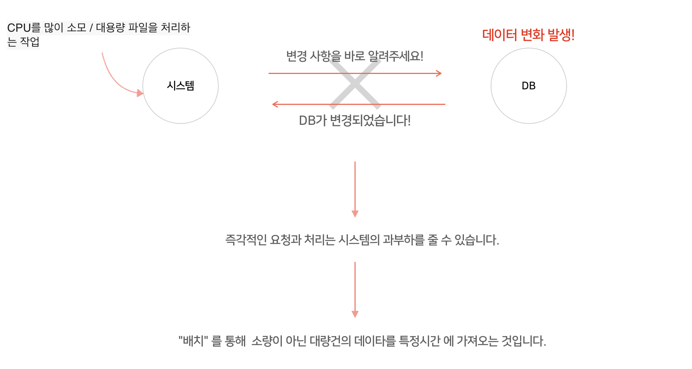

### 배치 프로그램 (Batch Processing)

사전적 의미로 <b>일괄 처리</b>를 뜻하며, 컴퓨터 프로그램 흐름에 따라 순차적으로 자료를 처리하는 방식을 뜻합니다.

> 개별적으로 어떤 요청이 있을 때마다 실시간으로 통신하는 것이 아닌 한꺼번에 일괄적으로 대량 건을 처리하는 것 입니다. 즉, 대량의 데이터를 처리하는 작업을 하는 시스템에 경우 적절한 프로세싱 입니다. 특히 배치는 정해진 특정한 시간에 실행됩니다.

#### 배치의 특징

- 대량건의 데이터를 처리한다.
- 특정 시간에 실행된다.
- 일괄적으로 처리한다.

#### 그러면 배치프로그램을 왜써야 할까요?

> 업무의 효율성과 비효율적인 시스템의 과부하를 줄이기 위해서 입니다. 대규모 시스템에서 배치는 필수 입니다.

 

---

Reference  

[Batch Processing](https://limkydev.tistory.com/m/140) 

