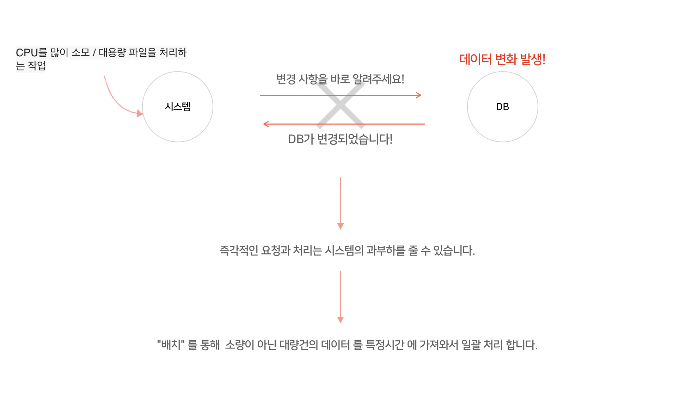

## 배치 프로그램 (Batch Processing)

사전적 의미로 <b>일괄 처리</b>를 뜻하며, 컴퓨터 프로그램 흐름에 따라 순차적으로 자료를 처리하는 방식을 뜻합니다.

> 개별적으로 어떤 요청이 있을 때마다 실시간으로 통신하는 것이 아닌 한꺼번에 일괄적으로 대량 건을 처리하는 것 입니다. 즉, 대량의 데이터를 처리하는 작업을 하는 시스템에 경우 적절한 프로세싱 입니다. 특히 배치는 정해진 특정한 시간에 실행됩니다.

### 배치의 특징

- 대량건의 데이터를 처리한다.
- 특정 시간에 실행된다.
- 일괄적으로 처리한다.

### 그러면 배치프로그램을 왜 써야 할까요?

> 업무의 효율성과 비효율적인 시스템의 과부하를 줄이기 위해서 입니다. 대규모 시스템에서 배치는 필수 입니다.

 

> <b> Airflow 는 배치 프로그램 인가요? </b>
> Airflow는 scheduler 로써 원하는 시간에 작동하고자 하는 코드를 대신 실행 시켜주는 배치 프로그램 입니다.

---

## 병렬처리

---

## 프레임워크 / 라이브러리 / 아키텍쳐 / 플랫폼

[개발용어](https://blog.gaerae.com/2016/11/what-is-library-and-framework-and-architecture-and-platform.html)

---

## 인터프리터 / 컴파일러

<b>[인터프리터](https://ko.wikipedia.org/wiki/%EC%9D%B8%ED%84%B0%ED%94%84%EB%A6%AC%ED%84%B0)</b>

> 인터프리터(interpreter, 문화어: 해석기)는 고급 언어로 작성된 원시코드 명령어들을 한번에 한 줄씩 읽어들여서 실행하는 프로그램입니다. 인터프리터는 종종 프로그램의 개발단계에서 사용되는데, 그것은 프로그래머가 한번에 적은 양의 내용을 추가하고 그것을 빠르게 테스트 해보길 원하기 때문입니다.

<b>[컴파일러](https://ko.wikipedia.org/wiki/%EC%BB%B4%ED%8C%8C%EC%9D%BC%EB%9F%AC)</b>

> 컴파일러(compiler, 순화 용어: 해석기, 번역기)는 특정 프로그래밍 언어로 쓰여 있는 문서를 다른 프로그래밍 언어로 옮기는 프로그램을 말합니다. 원래의 문서를 소스 코드 혹은 원시 코드라고 부르고, 출력된 문서를 목적 코드라고 부릅니다. 목적 코드는 주로 다른 프로그램이나 하드웨어가 처리하기에 용이한 형태로 출력되지만 사람이 읽을 수 있는 문서 파일이나 그림 파일 등으로 옮기는 경우도 있습니다. 원시 코드에서 목적 코드로 옮기는 과정을 컴파일 이라고 합니다.

---

Reference  

[Batch Processing](https://limkydev.tistory.com/m/140) 
[병렬처리](https://brunch.co.kr/@nsung/29) 

