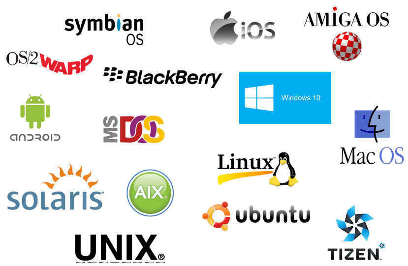

### Thread

> 어떠한 프로그램 내에서, 특히 프로세스 내에서 실행되는 흐름의 단위를 말한다. 일반적으로 한 프로그램은 하나의 스레드를 가지고 있지만, 프로그램 환경에 따라 둘 이상의 스레드를 동시에 실행할 수 있다. 이러한 실행 방식을 멀티스레드(multithread)라고 합니다.

---

### GUI & CLI

[GUI](https://namu.wiki/w/GUI)

> GUI - 그래픽 유저 인터페이스 | GUI는 점원에게 음식이 그려진 메뉴판에서 원하는 것을 가리키며 달라고 하는 것과 같다. 
> CLI - 커맨드 라인 인터페이스는 | 음식을 주문할 때 점원에게 말 또는 글로 주문하는 것이고

---

### Runtime & Script

---

### Serializable 직렬화 란?

직렬화(直列化) 또는 시리얼라이제이션(serialization)은 컴퓨터 과학의 데이터 스토리지 문맥에서 데이터 구조나 오브젝트 상태를 동일하거나 다른 컴퓨터 환경에 저장(이를테면 파일이나 메모리 버퍼에서, 또는 네트워크 연결 링크 간 전송)하고 나중에 재구성할 수 있는 포맷으로 변환하는 과정이다.[[wiki]](https://ko.wikipedia.org/wiki/%EC%A7%81%EB%A0%AC%ED%99%94)

설명이 매우 어렵습니다..  

[Serializable](https://hyeonstorage.tistory.com/252) 
[Django Serialize](https://leesoo7595.github.io/2018/07/31/serialization/)

---

Reference  

