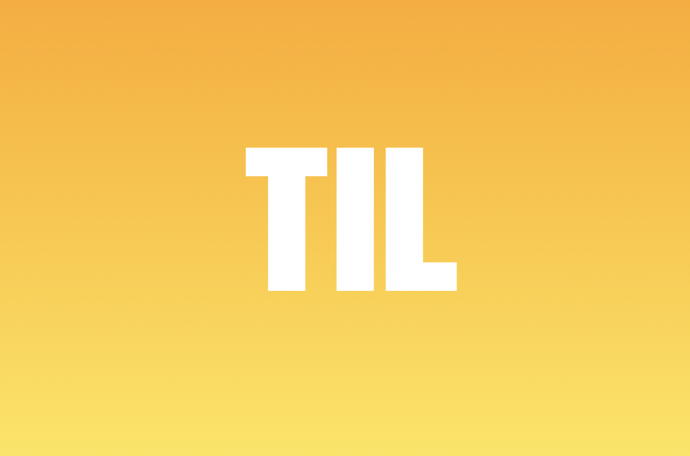

 

`> 질문` & `>> 답` 

---

<B>**[previously on the TIL](https://github.com/CgodL/TIL)**<B>

---

## 2019.11.16 토요일

### 오늘 한 일
#### 1. BLOG & RESUME SITE
    | RESUME SITE 번호 / 문구 및 이미지 (png to svg convert) 추가 and 수정 중
    | BLOG box-shadow / transition / margin / z-index 설정 and 수정 중
    | flex 설정 / md={12}, lg 페이지를 나눈다 비율 별로
    | 1. 포지션 2. CSS 겹쳤을 때 우선순위 (Inline 코드냐.. 등)

> [CSS_1](https://www.youtube.com/watch?v=jV8B24rSN5o) 
[CSS_2](https://www.youtube.com/watch?v=k4xA_Olo_Uo) 
[CSS_3](https://www.codingfactory.net/10529)

    
#### 2. DJANGO
    >  Django 모델 생성은 곧 DB를 생성하는 건데, 이는 곧 스키마를 정의 하는 것으로 생각하면 되는지 ?
    >> 
    >  Django 에서 model을 먼저 구현하여 admin 페이지를 구성하는데, admin 페이지의 정확한 역할은 ?
    >>  

### 해야할 일
#### 1. BLOG 기능 추가
    | BLOG 추가해야할 기능 - 검색기능 작동하도록 / 내비게이션 바 / 드롭박스 Resume 완성후 추가 / Font Setting
    | Resume 페이지 완성하기

### 총평
<b>아이패드 사야겠다.<b>

---

## 2019.11.17 일요일

### 오늘 한 일 

#### 1. IDEA
    IDEA : 구글 캘린더를 쓰는데, 캘린더에 오늘 할일을 계획 하고, 그걸 다시 TIL에 정리하는건 비효율적이지 않나 싶다. 
    구글 캘린더 연동 페이지를 만들어 보고 싶다. 먼저 가능한지 부터 고려해보기.
    구체적으로 생각해보면 구글 캘린더에 작성한 내용을 블로그에 옮길 수 있는지 가능성 체크
    먼저 입력받은 구글 캘린더 데이터 export를 해서 내 개츠비 서버로 받아와야 하는데 개츠비는 graphQL이고 ..

### 해야 할일
#### 1. 블로그에 알고리즘 페이지 만들기

### 총평

---
