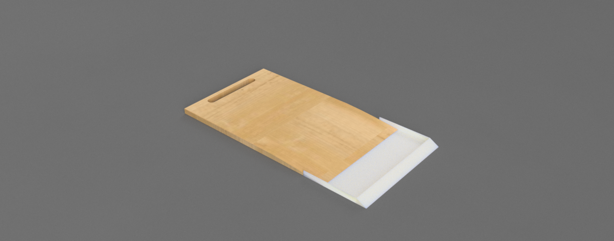
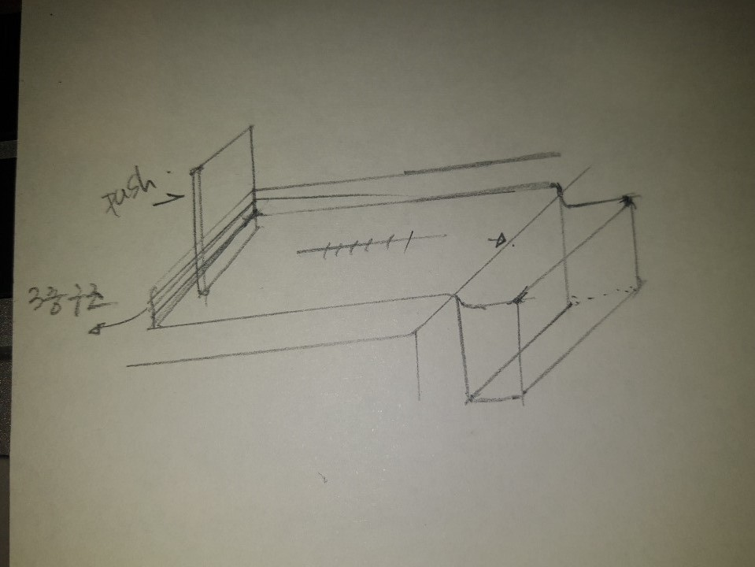
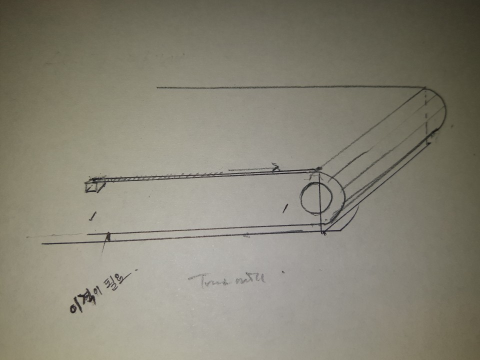
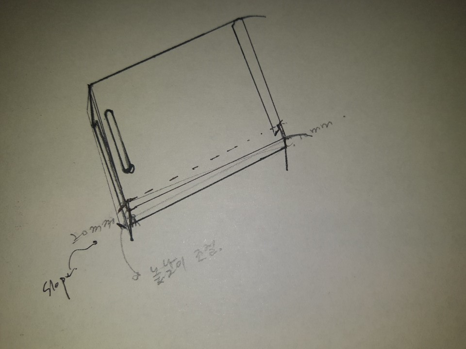
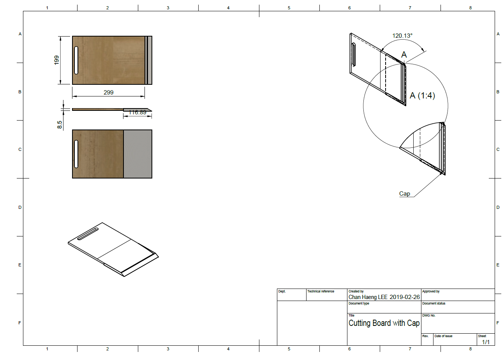

---

3D 모델링 / 그래픽 작업이 무언가를 창조하고 결과를 직접 만든다는 점에 메리트를 느껴 한때 빠져있던 적이 있습니다.  부족하지만 글도 써보고 개발을 제대로 시작하기 전에는 이랬던 것 같네요.

<iframe width="560" height="315" src="https://www.youtube.com/embed/CgeqX2v8a5A" frameborder="0" allow="accelerometer; autoplay; encrypted-media; gyroscope; picture-in-picture" allowfullscreen></iframe>

---

### 프리터의 점심은 항상 곤란하다.

 

프리터의 점심은 항상 곤란하다. 점심시간이 되면 항상 드는 생각이 있다. 뭘 먹을까, 편하고 맛있는 게 뭐가 있을까 등의 작은 고민이다.  물론, 사 먹는 게 제일이지만 돈을 아껴야 하는 프리터이므로, 집에 있는 재료로 요리를 해 먹기로 한다. 이날도 여느 때와 같이 메뉴를 고민하다가, 스치듯 본 TV 프로그램에서 나오던 토마토 스파게티를 만들기로 한다.

배꼽시계가 울린다, 고민할 것도 없이 냉장고 문을 열었다. 양파, 버섯, 토마토, 스팸 ... 스파게티를 만들기에 충분한 재료들이 차 있었다.  빠르게 머릿속으로 일의 순서를 정한다.

<b>첫 번째로</b>, 면을 삶을 적당량의 물을 올리고, 안에 소금을 풀어놓는다. 나는 알덴테 보단 벤코토의 면을 좋아해서 10분을 끓일 것이다.
 
<b>두 번째로,</b> 냉장고에 있는 재료를 모두 꺼내 먹기 좋은 크기로 다진다. 다진 재료를 그릇에 옮겨 닮는다. 나는 마늘, 양파가 입에 씹히지 않는 게 좋으므로 잘게 다진다.
 
<b>세 번째로,</b> 잘라 놓은 재료를 프라이팬에 옮겨 기름을 둘러 볶다가 토마토소스를 넣어 같이 섞는다. 하지만 이렇게만 섞게 되면 농도가 너무 되직하다. 이때 끓이던 면수를 넣어서 농도를 맞춰준다.
 
<b>네 번째로,</b> 재료들이 소스와 어느 정도 섞여 끓어가면 면을 넣어 잘 섞은 뒤 맛있게 먹는다.

과정은 완벽하다. 첫 번째 작업은 무리 없이 진행한다. 이제 두 번째 작업을 시작하는데, 문제가 발생했다. 가장 큰 문제는 내 비루한 칼질에 있지만, 또 다른 문제는 재료를 손질한 뒤 과정에서였다.

열심히 칼질하고 난 뒤, 도마를 보니 마늘, 양파, 버섯 등 재료들이 사방에 퍼져있다. 이 녀석들을 다른 접시에 담으려 칼에 받쳐 옮기다 보니 바닥에 떨어지고, 일의 소요 시간이 늘어난다. 도마를 든 채로 전부 옮기려 해도 힘이 든다.

문제를 해결해야 한다.  
<b>먼저</b>, 근본적으로 지금 당장 나의 칼질 실력을 늘릴 수 있는가? 불가능하다 
<b>그러면</b>, 도마를 들거나, 칼에 받쳐 재료를 옮긴다? 단순한 과정이 두 개의 과정으로 늘어나고, 또 힘이 든다. 탈락. 
몇개 지우고 나니 떠오르는 해결책이 없다. 이런.. 일단 면이 불으니, 요리를 완성하고 토마토 스파게티를 먹는다.

점심을 마치고, 이제 위의 문제를 해결하려는 새로운 방법을 고민해본다.
 

---

> 해결책으로 생각한 방법 중 첫 번째는, '담아서 옮긴다.' 에 초점을 맞춰, 도마를 모서리에 놓고 오른쪽 끝에 도마와 연결된 상자를 두고, 왼쪽에 있는 판으로 밀어서 담는 형태를 생각했었다.  하지만 이는 '모서리' 에서 만 사용해야 하는 불편함이 존재하여 포기했다.

---

> 두 번째로 생각한 것은,'밀어낸다'에 초점을 맞춰 Treadmill이나 conveyer belt처럼 끝에 롤러를 두고 돌려서 밀어내는 그림을 생각했다.하지만 막상 고민해보니 끝에 두어야 할 접시나, 그릇이 필요했고 바닥과 약간의 이격이 필요하여, 도마의 크기가 커진다는 문제점이 발생했다.

---

> 마지막으로, 둘을 합쳐 생각해 보았다.도마 자체에 일정 수준의 경사를 주고, 끝에 쓰레받기처럼 자른 재료들을 받칠 수 있게 하는 것이었다.  나는 위 세 번째 아이디어를 토대로 모델링 해보았다.

---

> 기능을 설명하자면, 칼로 재료를 썰고 동시에 경사면으로 밀어 Cap 쪽으로 담아낸다. 담은 재료들은 Cap을 빼서 원하는 곳에 옮기거나 사용한다. 자 이제 '들거나 받쳐 옮긴다.' 라는 귀찮은 과정을 줄이기 위한 나름의 방안이 완성되었다.

목업도 없고, 테스트 단계도 없는 부족한 아이디어 였다.  
하지만 '불편하다' 에서 오는 고민은 새로운 아이디어와 결과를 낳는다고 생각한다. 

프리터의 점심은 항상 곤란하다.

---

지금 다시 보니, 저걸 만든다고 하여서 과연 누군가 써줄까 라는 생각이 들기도 하네요.
이 글을 쓸 당시만 해도 모델링 과 같이 무언갈 만드는 작업은 갖고 있는 아이디어를 현실화 하기에 이상적인 부분이라고 생각했습니다. (사회가 무서운지도 모르고 까불었던것 같아요.) 다만 지금도 꿈은 같습니다. "모델링" 이라는 창의적인 분야 "개발" 이라는 더 넓은 분야로 넘어왔다고 생각합니다.
잘하는 것도 중요하지만, 좋아서 하는 것 만큼 보다 관심을 갖고 더 열정을 쏟을 수 있는 이 분야가 너무 좋은 것 같습니다. 창의적인 아이디어를 실제에 구체화 하는, 생각을 코드로 구현하는 개발자 이고 싶습니다.

---

