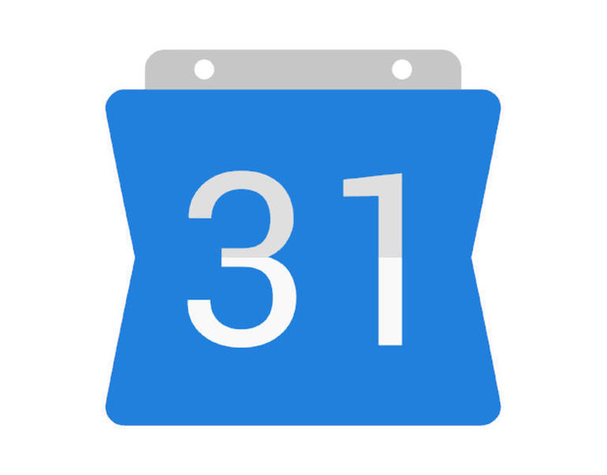
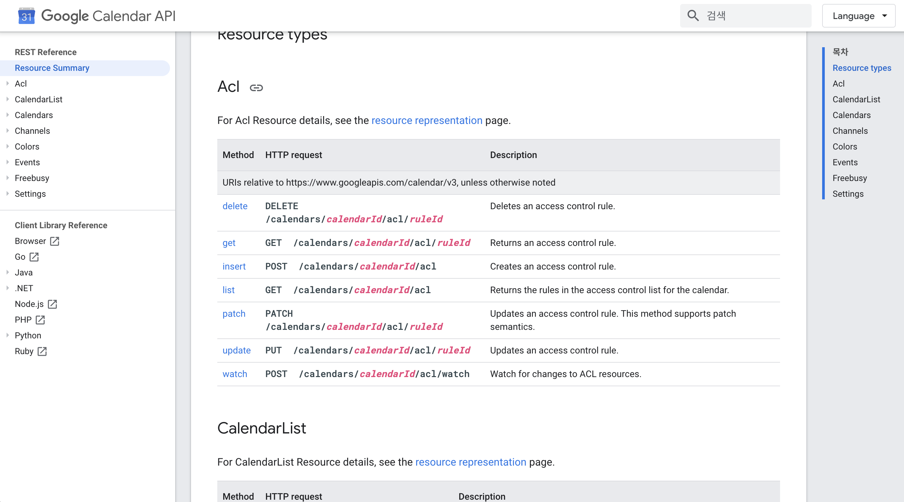

[2019.11.26 ~ 진행중]

### CONTENT

- 시작

- 구글 캘린더 API

### 시작

> 아이디어 : 구글 캘린더를 쓰는데, 캘린더에 오늘 할일을 계획 하고, 그걸 다시 TIL에 정리하는건 비효율적이지 않나 싶다.  
> 구글 캘린더 연동 페이지를 만들어 보고 싶다. 먼저 가능한지 부터 고려해보기.
> 구체적으로 생각해보면 구글 캘린더에 작성한 내용을 블로그에 옮길 수 있는지 가능성 체크
> 먼저 입력받은 구글 캘린더 데이터 export를 해서 내 개츠비 서버로 받아와야 하는데 개츠비는 graphQL이고 .. 
> 라는 생각에서 시작 된 캘린더 연동하기 .. 

> 처음에 얼마나 안일하게 생각했는지, 구글 캘린더 에서 달력 데이터 export 해서 그 데이터를 내 DB에 집어넣으면 되지 않겠나 라고 생각했는데, 왠걸 export한 데이터 타입이 ics.. 어떻게 처리해야 하는건지도 모르겠고..
> 못하나보다 했는데, 알아보니까 <b>구글 캘린더 API</b>가 존재한다!!

---

### 구글 캘린더 API

레퍼런스도 쉽게 잘 설명이 되어 있다. 다만 문제가 있다면, 내 블로그 코드 구조에 있다.
이 블로그는 graphQL과 갯츠비 또 typescript로 이루어져있다.. 난 graphQL / typescript / 갯츠비 다 개념이 부족하다..

---

### ---

### ERROR | ISSUE

> <b> - </b>

Reference  
[Google Calendar API](https://developers.google.com/calendar/v3/reference) 
[Google Calendar NodeAPI](https://developers.google.com/calendar/quickstart/nodejs) 
[Google Calendar Node](https://googleapis.dev/nodejs/googleapis/latest/calendar/classes/Calendar.html) 
[Google Claendar Git](https://github.com/googleapis/google-api-nodejs-client#google-apis-nodejs-client) 
[캘린더](https://docfriends.github.io/DevStrory/2019-05-24/google-calendar/)

