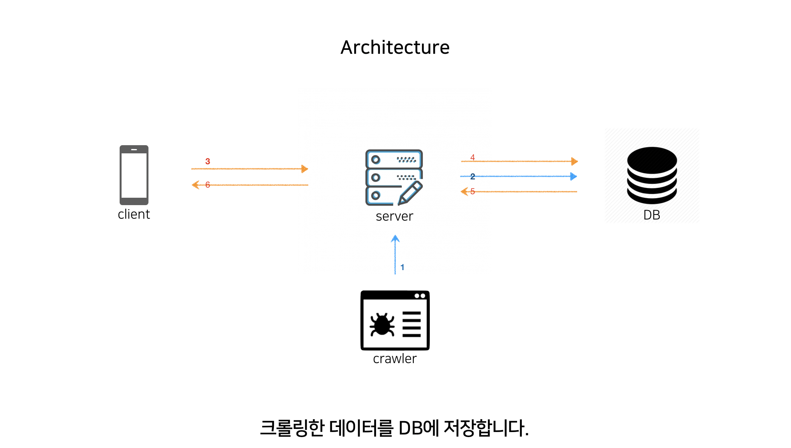

<center>

<b>[인스타그램 크롤링](https://developer-channing.com/blog/2019/10/29/channing/#%EB%8D%B0%EC%9D%B4%ED%84%B0-%EA%B0%80%EA%B3%B5%ED%95%98%EA%B8%B0)</b> 에서 시작된 <b>프로젝트 서버와 DB 만들기 편</b> 입니다!

</center>

### GOAL

> 목표는 크롤링한 데이터를 효과적으로 관리하기 위한 <b>DB 선택 과 이에 맞는 서버를 선택 및 구현</b>하는 것 입니다. <br>
> 먼저 서버를 선택 한다면 리액트 Django 또는 Node.js를 선택할텐데 각각의 장단점이 분명하다고 생각합니다. <br> 저는 나중을 생각해서 Node.js를 통해 서버를 구축하겠습니다. <br>DB 같은 경우는, NoSQL | SQL 중에 MongoDB를 활용하는 대신 필요에 따라 Mongoose를 활용하는 쪽으로 가도록 하겠습니다.

---

### ARCHITECTURE



---

### STACK

- Node.js (Express.js | Koa.js)
- MongoDB

---

### REQUIREMENTS

- git init
- npm init
- eslint --init
- dotenv 설치
- babel 세팅
- express 설치
- nodemon 설치
- Mongoose 설치

---

### Babel 세팅

ES6 문법 (import) 를 사용하기 위해 바벨 세팅을 합니다.

```js
npm install @bable/node
npm install @babel/preset-env
npm install --save-dev @babel/cli

$ .babelrc 생성
// preset 추가
{
  "presets": ["@babel/preset-env"]
}

$ package.json
"scripts": {
  "test": "echo \"Error: no test specified\" && exit 1",
  "start": "nodemon --exec babel-node index.js"
}

nodemon 설정
npm start 실행
```

---

### Express 서버 만들기

후다닥 서버가 작동하는지 확인해보도록 하겠습니다. 바벨설정을 따로 해주지 않아서 `require`를 사용합니다. 아래처럼 서버를 만든 뒤, nodemon 을 통해 실행합니다.

```js
const express = require('express');
http = require('http');

let app = express();
app.set('port', process.env.PORT || 3000);

http.createServer(app).listen(app.get('port'), function() {
  console.log('익스프레스 서버를 시작했습니다 : ' + app.get('port'));
});
```

<center>

잘 실행 됩니다.

</center>

---

### Mongoose BASIC

<center>

<b>[Mongoose](https://developer-channing.com/blog/2019/09/19/channing/#%EC%8A%A4%ED%82%A4%EB%A7%88-%EC%83%9D%EC%84%B1-%ED%85%8C%EC%8A%A4%ED%8A%B8)</b>

</center>

---

### Express 와 MongoDB 연동하기

<br>

```js
require('dotenv').config();
const express = require('express');
const mongoose = require('mongoose');

let app = express();
const port = process.env.PORT || 4500;

app.use(express.static('public'));
app.use(express.urlencoded({ extended: true }));
app.use(express.json());

mongoose
  .connect(process.env.MONGO_URI, {
    useUnifiedTopology: true,
    useNewUrlParser: true
  })
  .then(() => console.log('Successfully connected to mongodb'))
  .catch(e => console.error(e));

app.listen(port, () => console.log(`Server listening on post ${port}`));
```

---

### 프로젝트 스키마 생성

models 폴더를 생성하고, Schema가 될 파일을 생성합니다.

> 고려할 사항이 몇가지 있어 보입니다. POST를 통해 DB에 데이터를 저장할텐데, 어떤 타입을 줄지에 대해서도 고려해야 하며 제가 갖고 있는 데이터는 배열이라는 점도 있습니다.

```js
$ models > hashtag.js

const mongoose = require("mongoose");

// Schema
const hashTagSchema = new mongoose.Schema({
  // id: { type: Number, required: true, unique: true } 이런식으로 구성
});

module.exports = mongoose.model("Hashtag", hashTagSchema);

```

---

### CRUD(Create, Retrieve, Update, Delete)

**REST API**

POST 요청이 필요할지 ..

> 크롤링을 클라이언트 단 에서 하지 않기 때문에, 크롤링 데이터가 POST를 통한 추가로 이뤄지지 않습니다. 서버 단에서 크롤링한 데이터를 바로 추가하도록 하겠습니다.

---

<center>

### ---

### ERROR | ISSUE

</center>

>

<hr />
<center>

Reference <br>
[POIEMA](https://poiemaweb.com/mongoose)<br>
[express](https://developer-channing.com/blog/2019/10/24/channing)<br>
[mongoose](https://mongoosejs.com/docs/index.html)

</center>
