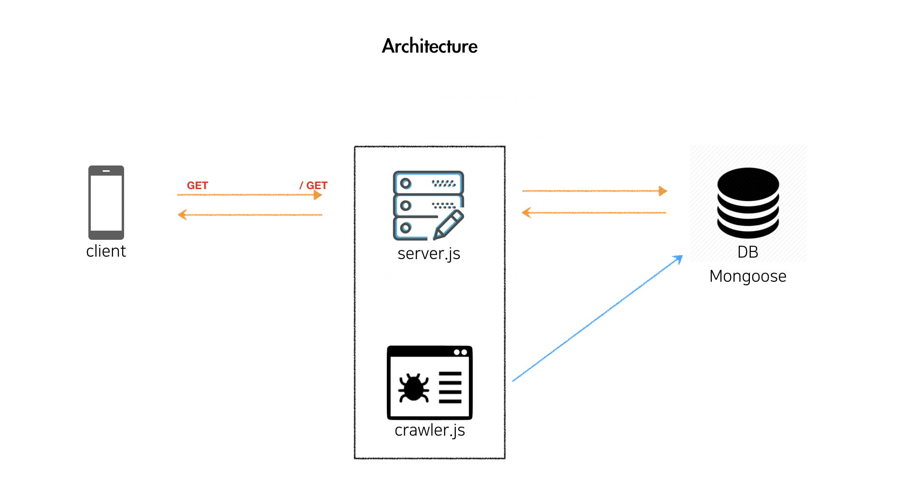

<center>

<b>[인스타그램 크롤링](https://developer-channing.com/blog/2019/10/29/channing/#%EB%8D%B0%EC%9D%B4%ED%84%B0-%EA%B0%80%EA%B3%B5%ED%95%98%EA%B8%B0)</b> 에서 시작된 <b>프로젝트 서버와 DB 만들기 편</b> 입니다!

</center>

### GOAL

> 목표는 크롤링한 데이터를 효과적으로 관리하기 위한 <b>DB 선택 과 이에 맞는 서버를 선택 및 구현</b>하는 것 입니다. <br>
> 먼저 서버를 선택 한다면 리액트 Django 또는 Node.js를 선택할텐데 각각의 장단점이 분명하다고 생각합니다. <br> 저는 나중을 생각해서 Node.js를 통해 서버를 구축하겠습니다. <br>DB 같은 경우는, NoSQL | SQL 중에 MongoDB를 활용하는 대신 필요에 따라 Mongoose를 활용하는 쪽으로 가도록 하겠습니다.

---

### ARCHITECTURE



---

### STACK

- Node.js (Express.js | Koa.js)
- MongoDB

---

### REQUIREMENTS

- git init
- npm init
- eslint --init
- dotenv 설치
- babel 세팅
- express 설치
- nodemon 설치
- Mongoose 설치

---

### Babel 세팅

ES6 문법 (import) 를 사용하기 위해 바벨 세팅을 합니다.

```js
npm install @bable/node
npm install @babel/preset-env
npm install --save-dev @babel/cli

$ .babelrc 생성
// preset 추가
{
  "presets": ["@babel/preset-env"]
}

$ package.json
"scripts": {
  "test": "echo \"Error: no test specified\" && exit 1",
  "start": "nodemon --exec babel-node index.js"
}

nodemon 설정
npm start 실행
```

---

### Express 서버 만들기

후다닥 서버가 작동하는지 확인해보도록 하겠습니다. 바벨설정을 따로 해주지 않아서 `require`를 사용합니다. 아래처럼 서버를 만든 뒤, nodemon 을 통해 실행합니다.

```js
const express = require('express');
http = require('http');

let app = express();
app.set('port', process.env.PORT || 3000);

http.createServer(app).listen(app.get('port'), function() {
  console.log('익스프레스 서버를 시작했습니다 : ' + app.get('port'));
});
```

<center>

잘 실행 됩니다.

</center>

---

### Mongoose BASIC

<center>

<b>[Mongoose](https://developer-channing.com/blog/2019/09/19/channing/#%EC%8A%A4%ED%82%A4%EB%A7%88-%EC%83%9D%EC%84%B1-%ED%85%8C%EC%8A%A4%ED%8A%B8)</b>

</center>

---

### Express 와 MongoDB 연동하기

<br>

```js
require('dotenv').config();
const express = require('express');
const mongoose = require('mongoose');

let app = express();
const port = process.env.PORT || 4500;

app.use(express.static('public'));
app.use(express.urlencoded({ extended: true }));
app.use(express.json());

mongoose
  .connect(process.env.MONGO_URI, {
    useUnifiedTopology: true,
    useNewUrlParser: true
  })
  .then(() => console.log('Successfully connected to mongodb'))
  .catch(e => console.error(e));

app.listen(port, () => console.log(`Server listening on post ${port}`));
```

---

### 프로젝트 스키마 생성

models 폴더를 생성하고, Schema가 될 파일을 생성합니다.

> 고려할 사항이 몇가지 있어 보입니다. POST를 통해 DB에 데이터를 저장할텐데, 어떤 타입을 줄지에 대해서도 고려해야 하며 제가 갖고 있는 데이터는 배열이라는 점도 있습니다.

```js
$ models > hashtag.js

const mongoose = require("mongoose");

// Schema
const hashTagSchema = new mongoose.Schema({
  // id: { type: Number, required: true, unique: true } 이런식으로 구성
});

module.exports = mongoose.model("Hashtag", hashTagSchema);

```

> 스키마를 만들고 정의한 타입에 데이터를 저장하면, 몽고 디비에서 객체의 형태로 저장되어집니다. 저는 저장되어 있는 데이터를 통해 CSV 파일을 생성하는데요, 현재 코드상에서 JSON 타입으로 변환 및 이를 CSV로 생성하는 과정 까지 구현해둔 코드를 통해서 실행합니다.
> 하지만 만약 몽구스에서 바로 CSV파일로 변환이 가능하다면 위에 구현한 코드대신에 보다 편한 방법으로 CSV로 export할 수 있을 것 같습니다. 따라서 고려해야할 사항으로, 정의한 데이터 타입에 스트링으로 집어 넣는것이 맞을지 아니면 배열로 넣어야 할지 등을 고려해야 합니다.

> 로직은, 데이터를 모두 스트링으로 넣고, count가 필요할때 전처리를 하는식으로 코드를 구현하겠습니다.

---

### 데이터 전처리

데이터 전처리를 서버단에서 해주는게 나을 것 같아서 서버단에서 해주겠습니다.

> 원래 생각은, DB에 저장한 데이터를 다시 꺼내 가공을 한뒤에 DB에 다시 저장하거나 / 클라이언트로 전송하는 것 이었는데 문제가 생겼습니다. Mongoose에 저장한 데이터를 서버단에서 전처리를 하고 싶어서 전역변수에 담아 가공한뒤에 이를 클라이언트에 보내주려했지만, 노드의 비동기적 특성으로 인해 전역변수에 담아내지 못하는 문제가 발생했습니다. 이를 처리하기 위해, 라우터에서 데이터를 바로 가공하여 return 해주는 식으로 로직을 변경해야했습니다.

---

### 모듈화

---

<center>

### ---

### ERROR | ISSUE

</center>

> <b>-</b> **dotenv 세팅 문제** : .env파일을 초기에 루트에두고 사용했는데, 폴더안에 들어있는 크롤링 코드를 서버 코드에 추가 후에, .env에 접근을 시도했더니 `text is not iterable` 이라는 오류가 발생하였다. 확인해보니 디렉토리를 찾지 못해서 .env 파일을 읽지 못하는 문제였고, 이를 해결하기 위해 경로 설정을 해주었다.
> `require("dotenv").config({ path: path.resolve(__dirname, "../config/.env") });` 이런식으로.. 잘 읽어온다.<br>[참조] : https://stackoverflow.com/questions/42335016/dotenv-file-is-not-loading-environment-variables

> <b>-</b> **router 문제** : 라우터를 세팅하고 postman으로 get요청을 날렸지만, cannot get response였다. 이유를 찾고보니 mongoose에 직접 연결하여(then) 라우터 세팅을 해주니 문제없이 실행됐다.
> 실행은 되는데, 현재 코드가 깔끔한 코드인지를 모르겠다.

<hr />
<center>

Reference <br>
[POIEMA](https://poiemaweb.com/mongoose)<br>
[express](https://developer-channing.com/blog/2019/10/24/channing)<br>
[mongoose](https://mongoosejs.com/docs/index.html)

</center>
