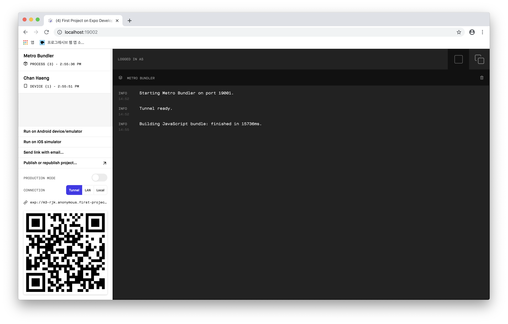

<center>
공식 홈페이지 레퍼런스를 보고 정리하면서 학습하겠습니다.
</center>

### 엑스포란?

엑스포는 프레임워크 이고 리액트 앱을 위한 플랫폼 입니다. 리액트 네이티브를 중심으로 구축된 툴 / 서비스 이며 자바스크립트/타입스크립트 코드 베이스에서 iOS, Android, web app 의 개발, 빌드, 배포 전 과정을 신속하게 도와주는 기능을 갖고 있습니다.

---

### WORKFLOWS

엑스포로 어플리케이션을 개발할때, "managed workflow" 와 "bare workflow" 두 가지 접근방식이 있습니다.

- "managed workflow"는 오직 JS/TS 와 Expo 도구와 서비스만으로 개발하는 workflow 입니다.

- "bare workflow"는 native 프로젝트의 모든 부분을 완벽하게 컨트롤 할 수 있으며, Expo 툴은 큰 역할을 차지하지 않습니다.
  > React Native를 Expo 없이 사용하는 워크플로우가 "bare workflow" 입니다.

---

### Managed Workflow

Managed workflow 는 리액트/리액트 네이티브의 CRA와 비슷합니다. `expo-cli`를 사용하여 개발하는 앱 입니다.<br> Apps are built with the managed workflow using the expo-cli, the Expo client on your mobile device, and our various services: push notifications, the build service, and over-the-air (OTA) updates. Expo tries to manage as much of the complexity of building apps for you as we can, which is why we call it the managed workflow. A developer using the managed workflow doesn't use Xcode or Android Studio, they just write JavaScript code and manage configuration for things like the app icon and splash screen through app.json. The Expo SDK exposes an increasingly comprehensive set of APIs that give you the power to access device capabilities like the camera, biometric authentication, file system, haptics, and so on.

> Managed 되는게 싫다면 `eject` 하면 됩니다! 선택은 본인의 몫.

엑스포 이전 버전과 현재 버전의 차이점은, 이전 버전의 경우 필요없는 모듈까지 전부 설치되어 있어서, 무거웠던 반면에 현재는 필요로 하는 모듈만을 Install 할 수 있어서, 보다 가벼워졌다는 장점이 있습니다.

---

### 설치

`Expo CLI` 를 통해서 엑스포를 설치해보겠습니다.

- 노드가 설치되어 있어야 합니다.
- Git repo를 생성해야 합니다.
- npm install -g expo-cli
- expo init
- Expo 앱을 설치 후 카메라로 QR코드를 스캔 합니다.<br><br>
  > 스캔후, 접속에러가 날 수 있는데요, 이와 같이 해결할 수 있습니다. <br> First, make sure that you are on the same wifi network on your computer and your device.
  > If it still doesn't work, it may be due to the router configuration — this is common for public networks.<br> You can work around this by <b>choosing the "Tunnel" connection type in Expo Dev Tools</b>, then scanning the QR code again.
  > 

---

### STRUCTURE 구성

- 로딩페이지 구성
- 라우터 세팅

---

### react-native-router-flux

리액트와 리액트 네이티브의 차이점은 라우터 세팅에 있습니다.
RN 같은 경우, 라우팅을 위해 `react-native-router-flux`과 `react-navigation`을 사용할 수 있는데, 저는 `react-native-router-flux`를 사용했습니다. 초기 페이지 구성을 고려하지 않고 코드를 작성하여, 꼬인부분이 있어 재설계후 라우터 세팅을 했습니다.

```js
$ App.js

import { Router, Scene } from 'react-native-router-flux';

<Router>
  <Scene key="root">
    <Scene key="Main" component={Main} title="Main" />
    <Scene key="jeju" component={Jeju} title="Jeju" />
  </Scene>
</Router>;
```

위와 같은 식으로, App.js 에서 라우터를 통해 페이지를 관리하는 식으로 페이지를 구성 해줍니다.
메인 페이지에서 버튼을 클릭하면 해당 페이지로 이동 렌더링 되도록 코드를 구성합니다.

---

### RN CSS

- paddingVertical
- paddingHorizontal
- fontSize

---

<center>

### ---

### ERROR | ISSUE

</center>

> `expo start` 이후, Run on iOS simulator를 실행 할 경우 에러 발생
> `Error installing or running app. SyntaxError: Unexpected token I in JSON at position 0` https://github.com/expo/expo-cli/issues/1164
>
> 1. Xcode를 업데이트 하던가.<br>
> 2. npm install -g expo-cli | expo-cli를 업데이트 하던가 https://github.com/expo/expo/issues/3585
> 3. rm -rf .expo 실행해서 expo를 제거한뒤 다시 실행하던가 https://github.com/expo/expo-cli/issues/1164 <br>
>    다 안된다. 일단 Xcode가 app store에서 업데이트 자체가 안된다. 뭐 이런 ㅡ.ㅡ
>    <br/><br/> 해결했다 방법은 이러하다. <b><br><br>
>    ‣ Xcode가 앱스토어에서 설치가 되지 않으므로, App developer 사이트에서 최신버전을 다운로드 한다.<br>
>    ‣ Xcode를 실행한다. <br>
>    ‣ 환경설정 에서 location 탭을 선택한다. <br>
>    ‣ Command Line Tools를 설치한 Xcode 최신버전으로 선택한다.<br>
>    ‣ expo start를 하고 run on ios simulator를 클릭하면 문제없이 실행된다.

> 

<hr />
<center>

Reference <br>
[Expo](https://docs.expo.io/versions/latest/)<br>

</center>
