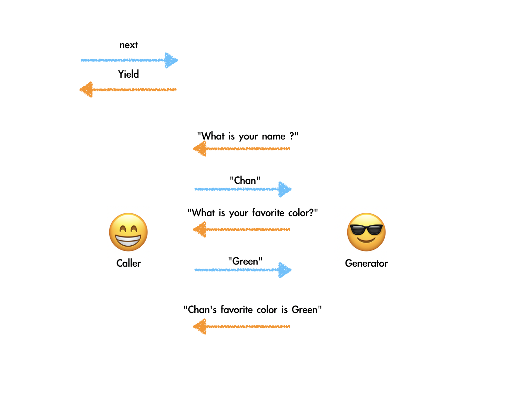

---

### 심볼

<b>Symbol</b>은 ES6에서 나온 number | string 과 같은 <b>원시 데이터 타입</b> 이며 자바스크립트의 새로운 타입 입니다.<br> 심볼은 불변이며 고유합니다 또 프로퍼티를 추가할 수 없습니다.

---

### 왜 필요한가요?

탄생 배경 을 알아보겠습니다.
만약, 많은 사람이 사용하는 JS 라이브러리가 있고, 우리는 그 라이브러리에 새로운 메소드가 있으면 좋겠다고 생각하여 메소드를 추가 하였습니다. 그런데 거기에 우리가 만든 메소드와 같은 이름의 어떤 메서드가 이미 존재한다면 이전에 존재한 메소드는 사라지고 우리가 새로 추가한 메소드로 덮어 씌어질 수 있습니다. 이에 따라서 Symbol이 탄생하게 되었습니다. <br>
또, JS 개발자들은 `for in loop` 나 `Object.keys` 같은 메소드에 걸러지지 않는 프로퍼티를 추가하는 작업(hidden 속성)이 필요해져서 생겼다고도 합니다.

예를 들어, 아래와 같은 객체가 있다고 가정했을때,

```js
var myObject = { firstName: 'raja', lastName: 'rao' };
Object.keys(myObject); // return [firstName, lastName]
```

이제 여기에 새로운 프로퍼티를 myObject에 추가하고, <b>Object.keys</b>를 실행하면 새롭게 추가된 프로퍼티가 포함된 배열이 반환될 것 입니다.

```js
myObject.middleName = 'blah';
Object.keys(myObject); // return ["firstName", "lastName", "middleName"]
```

그리고 JS 개발자들은 위와 같은 상황을 피하기 위해 Symbol을 만들었습니다.<br>
새로운 프로퍼티를 Symbol로 추가하면, Object.keys(myObject) 는 새로 추가된 프로퍼티를 무시하고 ["firstName", "lastName"] 만을 반환 합니다.

```js
var myObject = {};
myObject['firstName'] = 'Chan Haneg';
myObject['lastName'] = 'Lee';

var middleName = Symbol('middleName');

myObject[middleName] = 'blah';

Object.keys(myObject); // return  ["firstName", "lastName"]
console.log(Object.getOwnPropertySymbols(myObject)); //Object.getOwnPropertySymbols()를 통해서 Symbol에 대한 key에만 접근할 수 있습니다.
```

<br>


---

### Avoid name collisions

Symbol은 주로 다른 라이브러리와의 이름 충돌 위험이 없는 유일한 객체의 프로퍼티 키(property key)를 만들기 위해 사용한다고 되어있습니다.<br> 이 말은 즉, 새로운 프로퍼티를 이름 충돌에 대한 우려를 하지 않고 계속 추가할 수 있다는 말입니다.

예를 들면,
`Array.prototype`에 우리가 정의한 `toUpperCase`를 추가하여 사용하고 있었는데, ES2019같은 새로운 라이브러리에 Array.prototype.toUpperCase 추가 된다면 우리의 함수에 이름 충돌이 일어나게 됩니다. 이러한 이름 충돌을 방지하기 위해 Symbol을 사용합니다.

```js
Array.prototype.toUpperCase = function() {
  for (let i = 0; i < this.length; i++) {
    this[i] = this[i].toUpperCase();
  }
  return this;
};
var myArray = ['raja', 'rao'];
myArray.toUpperCase(); // return ["RAJA", "RAO"]
```

심볼을 사용하게 되면, 내부적으로 unique한 값을 생성하고, 이름 충돌에 대한 걱정을 하지 않고 프로퍼티를 추가할 수 있게 됩니다.

```js
var toUpperCase = Symbol('toUpperCase');
Array.prototype[toUpperCase] = function() {
  for (let i = 0; i < this.length; i++) {
    this[i] = this[i].toUpperCase();
  }
  return this;
};
var myArray = ['raja', 'rao'];
myArray[toUpperCase](); // return ['RAJA', 'RAO']

---

var includes = Symbol('will store custom includes method');
Array.prototype[includes] = () => console.log('inside includes func');
var arr = [1, 2, 3];
console.log(arr.includes(1)); // true
console.log(arr['includes'](1)); // true
console.log(arr[includes]()); // 'inside includes func'
```

---

### Well-known Symbol

여러분이 정의하는 심볼 외에, 자바스크립트는 ECMAScript 5와 그 이전 버전에서는 개발자에게 제공되지 않았던 언어 내부의 동작을 나타내는 내장(built-in) 심볼을 몇 가지 가지고 있습니다.

<br>


---

1.  Symbol은 메서드를 갖고 있어 객체 처럼 보이지만, 원시 타입 이며, Symbol 생성자를 호출하여 생성됩니다.

```js
const symbol0 = new Symbol(); // Symbol은 객체가 아닌 원시타입 이기 떄문에 new 연산자를 이용한 문법은 TypeError를 일으킵니다.
```

2. Symbols 은 “description” 을 가집니다.

```js
const symbol1 = Symbol('key'); // 'key'(parameter)는 optional 이며,  “description” 입니다.
```

3. Symbols는 unique합니다.

```js
const symbol1 = Symbol('key');
const symbol2 = Symbol('key');
const symbol3 = Symbol(3);

symbol1 === symbol2; // false
console.log(typeof symbol1); // datatype => "symbol"
console.log(symbol2.toString()); // Symbol(key);
```

4.  문자열과 마찬가지로 객체 프로퍼티의 키로 사용할 수 있습니다.

```js
let sym = Symbol();

let obj = {
  [sym]: 'value'
};

console.log(obj[sym]); //value
```

5. dot 연산자는 사용할 수 없습니다.

```js
let myCar = { name: 'BMW' };
let type = Symbol('store car type');
myCar[type] = 'Sedan';

console.log(type); // Symbol('store car type');
console.log(myCar[type]); // 'Sedan'
console.log(myCar.type); // undefined
```

---

### Iterable

이터러블 프로토콜을 준수한 객체를 이터러블이라 합니다. `Symbol.iterator`메소드를 소유합니다.

일반적인 for loop는 인덱스를 활용하여 순차적으로 해당하는 배열 요소에 접근할 수 있습니다.
그렇다면 for ... of 는 어떻게 작동하는 걸까요? 바로 이터레이터 덕분 입니다~
우리는 `for of loop` 와 `spread operator(...)` 같은 메서드를 활용하여 기존 array, strings 같은 표준 '객체'에서 데이터를 추출합니다. 하지만 Object 에서는 사용할 수 없습니다. 이터레이션 프로토콜을 준수한 객체는 위 메서드들로 순회할 수 있습니다.

```js
const Dog = {
  Bichon: 'Maum',
  Pug: 'blah'
};

for (let dog of Dog) {
  console.log(dog); // TypeError Dog is not iterable
}

// 배열은 Symbol.iterator 메소드를 소유하고 있습니다. 따라서 배열은 이터러블 프로토콜을 준수한 이터러블 입니다.
const array = [1, 2, 3];

console.log(Symbol.iterator in array); // true
for (const item of array) {
  console.log(item);
}

console.dir(array); // Symbol(Symbol.iterator)
```

일반 객체에서도 for...of 나 Spread 문법으로 순회하기 위해 새로운 방식을 만들지 않고 기존에 있는 방식을 활용하기로 했습니다. 따라서 이를 위해 규칙을 만들었습니다. 그리고 이러한 규칙에 따라 순회할 수 있는 객체를 'iterable'(반복 가능한 객체) 이라고 부르기로 했다고 합니다.

---

### Iteration protocol

이터레이션 프로토콜은 어떠한 객체든 특정 조건을 만족하면 Iterable 또는 Iterator로 평가 받을 수 있도록 하는 규약입니다.

1. 객체/클래스는 데이터를 저장해야 합니다.
2. 객체/클래스는 "well-known" symbol인 `Symbol.iterator`를 메서드로 갖고 있어야 하며, 3번, 6번에 따라 구현되어야 합니다.
3. `Symbol.iterator` 메서드는 “iterator” 객체를 반환해야합니다
4. iterator 객체는 반드시 next 메서드를 가져야 합니다.
5. next에는 1번에서 저장되어 있는 데이터에 접근 할 수 있어야합니다.
6. iterator 객체인 iteratorObj를 iteratorObj.next()하면 `{value:<stored data},done:false}` 1번 데이터가 추출 되며 전부다 순회했을 경우 `{done:false}` 가 반환되도록 합니다.

위 규칙을 전부 따르면, "iterable"이라고 부르며, 반환된 객체를 'iterator'라고 부릅니다. 표준 web api 와 generator, array, string 모두 다 위 규칙을 따르고 있습니다.

```js
class Users {
  // 1. 데이터를 저장해야 합니다.
  constructor(users) {
    this.users = users;
  }

  // 2. Symbol.iterator 를 메서드로 갖습니다.
  // Symbol.iterator 메소드는 이터레이터를 반환 합니다.
  [Symbol.iterator]() {
    let i = 0;
    let users = this.users;

    // 3.iterator객체를 반환해야 합니다. 여기서 반한되는 객체를 "iterator" 라고 합니다.
    return {
      // 4. next 메서드를 갖습니다.
      next() {
        if (i < users.length) {
          // 5. next 에서 users에 접근할 수 있습니다.
          return { done: false, value: users[i++] };
        }
        return { done: true };
      }
    };
  }
}

// allUsers는 'iterarable' 입니다.
const allUsers = new Users({
    {name: 'raja'},
    {name: 'john'},
    {name: 'matt'}
})

// allUsersIterator 는 'iterator' 입니다.
const allUsersIterator = allUsers[Symbol.iterator]()

// next 메서드는 저장된 다음 값을 반환합니다.
allUsersIterator.next() // { done: false, value: { name: 'raja' }}
allUsersIterator.next() // { done: false, value: { name: 'john' }}
allUsersIterator.next() // { done: false, value: { name: 'matt' }}

for(const u of allUsers){
    console.log(u.name)
}

console.log([...allUsers]);

```

---

### 이터레이션 프로토콜 왜 필요할까요?

<center>

[Iteration protocol](https://poiemaweb.com/es6-iteration-for-of)

</center>

---

### Iterator

이터레이터는 반복을 위해 설계된, 특별한 인터페이스를 가진 객체 입니다.
`next()`메소드를 갖습니다.

```js
// 배열은 이터러블 입니다.
const array = [1, 2, 3];
console.dir(array) // Symbol.iterator

// Symbo.iterator 메소드는 이터레이터를 반환합니다.
const iterator = array[Symbol.iterator]();

console.log('next' in iterator); // true

let iteratorResult = iterator.next();
console.log(iteratorResult); // {value: 1, done: false}
console.log(iterator.next()); // {value: 2, done: false}
console.log(iterator.next()); // {value: 3, done: false}
console.log(iterator.next()); // {value: undefined, done: true}
...
// value 프로퍼티는 현재 순회중인 이터러블의 값을 반환 합니다.
// done 프로퍼티는 이터러블의 순회 완료 여부를 반환 합니다.
```

---

### Generator

이터레이션 프로토콜을 준수하며 직접 Iterator/Iterable 객체를 만드는 것은 번거로운 일입니다. 그래서 자바스크립트는 손쉽게 well-formed iterable을 생성 할 수 있는 제네레이터 함수를 제공합니다. 제너레이터는 이터러블 이면서 동시에 이터레이터 입니다.

제너레이터 함수는 이터레이터를 사용해 자신의 실행을 제어하는 함수 입니다.
일반적인 함수는 한번 실행 하게 되면 처음부터 끝까지 실행이 완료되는 반면에, 제너레이터 함수는 사용자의 요구(yield | next) 를 통해 일시적으로 정지 및 재시작을 할 수 있습니다.
제너레이터 함수의 반환값으로 제너레이터가 반환 됩니다.
또한 제너레이터 함수는 비동기 처리에 유용합니다.

제너레이터는 두 가지 예외를 제외하면 일반적인 함수와 같습니다.

- 언제든 호출자에게 제어권을 넘길(yield) 수 있습니다.

* 제너레이터는 호출한 즉시 실행되지 않습니다. 대신 이터레이터를 반환하고, 이터레이터의 next 메서드를 호출함에 따라 실행됩니다.

```js
function* rainbow() {
  yield 'red';
  yield 'orange';
  yield 'yellow';
  yield 'green';
  yield 'blue';
  yield 'indigo';
  yield 'violet';
}

const it = rainbow(); // 제너레이터를 호출하면 이터레이터를 얻습니다.
it.next(); // { value: 'red', done: false }
it.next(); // { value: 'oragne', done: false }
it.next();
it.next();
it.next();
it.next();
it.next(); // { value: 'violet', done: false }
it.next(); // { value: undefined , done: true }

// 이터레이터를 반환하므로 for...of 루프에서 사용가능 합니다.
for (let color of rainbow()) {
  console.log(color);
}
```

제너레이터는 실행될때 이터레이터를 반환합니다. 이터레이터는 next() 메소드를 갖고 있습니다.
next()가 호출될 때마다 호출되는 곳의 위치를 기억한 채로 실행됩니다. 그리고 함수에서 `yield`를 만날 때마다 기억해둔 위치로 이동합니다. 해당 함수가 끝날때까지 반복됩니다.

---

### yield 표현식과 양방향 통신

제너레이터와 호출자 사이에서 양방향 통신이 가능합니다.
next()와 yield가 서로 데이터를 주고 받을 수 도 있습니다. yield 뒤의 값이 value의 프로퍼티로 들어갑니다. 이를 활용하여 반대로 제너레이터에 값을 전달할 수 있습니다.

```js
function* interrogate() {
  const name = yield 'What is your name?';
  const color = yield 'What is your favorite color?';
  return `${name}'s favorite color is ${color}`;
}
```

위 제너레이터 함수를 호출하면 이터레이터를 얻습니다. 그리고 `next`를 호출하면 제너레이터는 첫 번째 행을 실행하려 합니다. 하지만 그 행 에는 `yield` 표현식이 들어있으므로 제너레이터는 반드시 제어권을 호출자에게 넘겨야 합니다. 제너레이터의 첫번째 행이 완료 되려면 호출자가 다시 `next`를 호출해야 합니다. 그러면 name은 next에서 전달하는 값을 받습니다.

```js
const it = interrogate();
it.next(); // {value: "What is your name?" , done :false}
it.next('chan'); // {value: "What is your favorite color?", done: false}
it.next('green'); // {value: "Chan's favorite color is green", done: true}
```

<br>

<center>

실행 흐름 입니다.

</center>




```js
1. 제너레이터는 이터레이터를 반환 하고 일시 정지한 상태로 시작합니다.

function* interrogate(){    // let it = interrogate();
    let name = yield "What is your name?" // it.next();
    let color = yield 'What is your favorite color?'; // it.next('chan')
    return `${name}'s favorite color is ${color}`; // it.next('green')
}

2. undefined 를 제너레이터에 넘깁니다. 제너레이터는 "What is your name?"을 yield 하고 일시 정지합니다.
3. "Chan"을 제너레이터에 넘깁니다. 제너레이터는 "What is your favorite color?"를 넘기고 일시 정지합니다.
4. "Green"을 제너레이터에 넘깁니다. 제너레이터는 "Chan's favorite color is Green"을 반환하고 멈춥니다.

```

---

### 비동기에서의 제너레이터

제너레이터는 동기적 성격을 가졌지만, 프로미스와 결합하면 비동기 코드를 효율적으로 관리할 수 있습니다.

파일 세개를 읽고 1분을 기다린 후 내용을 합쳐서 네번째 파일에 쓰는 수도 코드 입니다.

```js
dataA = read contents of 'a.txt'
dataB = read contents of 'b.txt'
dataC = read contetns of 'c.txt'
wait 60 seconds
write dataA + dataB + dataC to 'd.txt'
```

위와 같은 사고가, 비동기적 사고가 아닌 일반적인 생각입니다. 그리고 제너레이터는 이런 자연스러운 발상과 비슷한 코드를 작성할 수 있게 해줍니다.

---

<center>

Reference <br>
[TypeScript-Symbol](https://fettblog.eu/symbols-in-javascript-and-typescript/)<br>
[Symbol](https://www.freecodecamp.org/news/some-of-javascripts-most-useful-features-can-be-tricky-let-me-explain-them-4003d7bbed32/)<br>
[Symbol2](https://medium.com/sjk5766/es-6-symbol-%EC%9D%B4%EB%9E%80-48c2ad5b054c)<br>
[Symbol3](https://developer.mozilla.org/ko/docs/Web/JavaScript/Reference/Global_Objects/Symbol)<br>
[Iterator](https://poiemaweb.com/es6-iteration-for-of)<br>
[Generator](https://meetup.toast.com/posts/73)<br>
[Generator2](https://medium.com/@jooyunghan/%EC%9E%90%EB%B0%94%EC%8A%A4%ED%81%AC%EB%A6%BD%ED%8A%B8-%EC%A0%9C%EB%84%88%EB%A0%88%EC%9D%B4%ED%84%B0%EC%9D%98-%EC%9E%AC%EB%AF%B8-246553cadfbd)<br>
[Generator3](http://hacks.mozilla.or.kr/2015/08/es6-in-depth-generators/)<br>
러닝자바스크립트

</center>
